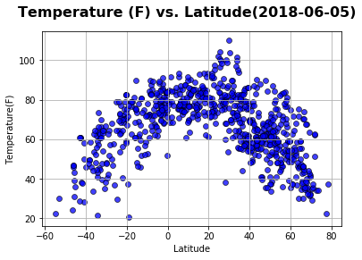
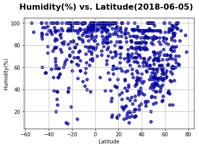
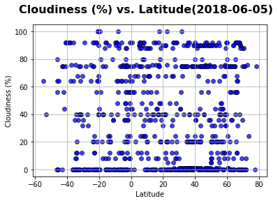
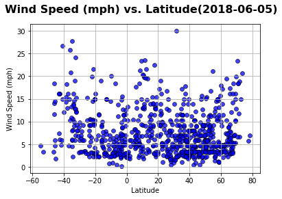

# Analysis
This time (06/04/2018), northern hemisphere is summer while southern now is winter season so:
 - Temperature ranges in Northern Hemisphere are greater than the southern ranges at corresponding latitudes.Northern Hemisphere is also higher temperature than southern
 - Humidity ranges in Northern Hemisphere are greater than the southern ranges at corresponding latitudes.Northern Hemisphere's Humidity is also higher than southern
 - Wind speed ranges in Northern Hemisphere are greater than the southern ranges at corresponding latitudes.Northern Hemisphere's wind speed is also stronger than southern


```python
!pip install citipy
```

    Requirement already satisfied: citipy in c:\users\vpdinh\anaconda3\lib\site-packages
    Requirement already satisfied: kdtree>=0.12 in c:\users\vpdinh\anaconda3\lib\site-packages (from citipy)
    

    You are using pip version 9.0.1, however version 10.0.1 is available.
    You should consider upgrading via the 'python -m pip install --upgrade pip' command.
    


```python
import csv
import matplotlib.pyplot as plt
import openweathermapy as ow
import pandas as pd
from citipy import citipy
import random
import sys
import math
from config import api_key
import json
import requests
import numpy
from datetime import datetime
```


```python
#Create latitude & longitude
lat = []
lon=[]
for i in range(1,10000):                 #number of Lat Long (in this case 10000) to be generated
 lat.append(float("{:.2f}".format(random.uniform(-90.0,90.0))))
 lon.append(float("{:.2f}".format(random.uniform(-180.0,180.0))))
```


```python
#Create a list of cities match with lat & long
cities = []
name = []
country_code = []
for k in range(len(lat)):
    cities.append(citipy.nearest_city(lat[k], lon[k]))
for city in cities:
    country_code.append(city.country_code)
    name.append(city.city_name)
    #print(f"The country code of {name} is '{country_code}'.")
cities_df = pd.DataFrame({"Lat":lat,"Lon":lon,"City Name":name,"Country Code":country_code})
#Drop duplicate Cities by using City Name
cities_df.drop_duplicates(subset=['City Name'],inplace=True)
cities_df.to_csv("nearestcities.csv", index = False)
len(cities_df)
```


    2245


```python
url = "http://api.openweathermap.org/data/2.5/weather?"
units="imperial" # to get weather data in Fahrenheit degree and wind speed in MPH
temp=[]
humidity=[]
cloud=[]
wind=[]
cityname=[]
countrycode=[]
lati=[]
long=[]
check=""
citinumber = 1
# Build partial query URL
query_url =  f"{url}appid={api_key}&units={units}&q="
i=0
print("Beginning Data Retrieval")
print("------------------------")
while i <= len(cities_df):
    try:
        response = requests.get(query_url + cities_df['City Name'][i]).json()
        response["main"]["temp"] #checking if wrong City Name, will only show KeyError once we look for a index,example 'main' index
    except KeyError:
        check = "KeyError"
        pass
    if check != "KeyError": # to make sure same length of each column, if try to push "withdrawing data" in Try then length of column will not same or have to use DROPNA,as able to fetching columns' NaN values
        print(f"Processing Record {citinumber} of Set {citinumber} | {cities_df['City Name'][i]}")
        print(f"{query_url}{cities_df['City Name'][i]}")
        cityname.append(cities_df['City Name'][i])
        countrycode.append(cities_df['Country Code'][i])
        lati.append(response["coord"]["lat"])
        long.append(response["coord"]["lon"])
        temp.append(response["main"]["temp"])
        humidity.append(response["main"]["humidity"])
        cloud.append(response["clouds"]["all"])
        wind.append(response["wind"]["speed"])
        citinumber=citinumber+1
    i=i+1
    check = "check"
final_df= pd.DataFrame({"City Name":cityname,"Country Code":countrycode,"Latitude":lati,"Longitude":long,"Temperature":temp,"Humidity":humidity,"Cloudness":cloud,"Wind":wind})
#Again execute a drop duplicate command on City Name to make sure this dataframe will only contain  unique cities
final_df.drop_duplicates(subset=['City Name'],inplace=True)
final_df.to_csv("weather.csv", index = False)
print(citinumber-1)
print(len(final_df))
final_df.head()
```

    Beginning Data Retrieval
    ------------------------
    Processing Record 1 of Set 1 | nouakchott
    http://api.openweathermap.org/data/2.5/weather?appid=25bc90a1196e6f153eece0bc0b0fc9eb&units=imperial&q=nouakchott
    Processing Record 2 of Set 2 | takanabe
    http://api.openweathermap.org/data/2.5/weather?appid=25bc90a1196e6f153eece0bc0b0fc9eb&units=imperial&q=takanabe
    Processing Record 3 of Set 3 | emerald
    http://api.openweathermap.org/data/2.5/weather?appid=25bc90a1196e6f153eece0bc0b0fc9eb&units=imperial&q=emerald
    Processing Record 4 of Set 4 | sao joao da barra
    http://api.openweathermap.org/data/2.5/weather?appid=25bc90a1196e6f153eece0bc0b0fc9eb&units=imperial&q=sao joao da barra
    Processing Record 5 of Set 5 | rikitea
    http://api.openweathermap.org/data/2.5/weather?appid=25bc90a1196e6f153eece0bc0b0fc9eb&units=imperial&q=rikitea
    Processing Record 6 of Set 6 | muros
    http://api.openweathermap.org/data/2.5/weather?appid=25bc90a1196e6f153eece0bc0b0fc9eb&units=imperial&q=muros
    Processing Record 7 of Set 7 | nizwa
    http://api.openweathermap.org/data/2.5/weather?appid=25bc90a1196e6f153eece0bc0b0fc9eb&units=imperial&q=nizwa
    Processing Record 8 of Set 8 | souillac
    http://api.openweathermap.org/data/2.5/weather?appid=25bc90a1196e6f153eece0bc0b0fc9eb&units=imperial&q=souillac
    Processing Record 9 of Set 9 | hithadhoo
    http://api.openweathermap.org/data/2.5/weather?appid=25bc90a1196e6f153eece0bc0b0fc9eb&units=imperial&q=hithadhoo
    Processing Record 10 of Set 10 | kapaa
    http://api.openweathermap.org/data/2.5/weather?appid=25bc90a1196e6f153eece0bc0b0fc9eb&units=imperial&q=kapaa
    Processing Record 11 of Set 11 | albany
    http://api.openweathermap.org/data/2.5/weather?appid=25bc90a1196e6f153eece0bc0b0fc9eb&units=imperial&q=albany
    Processing Record 12 of Set 12 | ushuaia
    http://api.openweathermap.org/data/2.5/weather?appid=25bc90a1196e6f153eece0bc0b0fc9eb&units=imperial&q=ushuaia
    Processing Record 13 of Set 13 | punta arenas
    http://api.openweathermap.org/data/2.5/weather?appid=25bc90a1196e6f153eece0bc0b0fc9eb&units=imperial&q=punta arenas
    Processing Record 14 of Set 14 | mizdah
    http://api.openweathermap.org/data/2.5/weather?appid=25bc90a1196e6f153eece0bc0b0fc9eb&units=imperial&q=mizdah
    Processing Record 15 of Set 15 | hermanus
    http://api.openweathermap.org/data/2.5/weather?appid=25bc90a1196e6f153eece0bc0b0fc9eb&units=imperial&q=hermanus
    Processing Record 16 of Set 16 | busselton
    http://api.openweathermap.org/data/2.5/weather?appid=25bc90a1196e6f153eece0bc0b0fc9eb&units=imperial&q=busselton
    Processing Record 17 of Set 17 | nanortalik
    http://api.openweathermap.org/data/2.5/weather?appid=25bc90a1196e6f153eece0bc0b0fc9eb&units=imperial&q=nanortalik
    Processing Record 18 of Set 18 | zonguldak
    http://api.openweathermap.org/data/2.5/weather?appid=25bc90a1196e6f153eece0bc0b0fc9eb&units=imperial&q=zonguldak
    Processing Record 19 of Set 19 | saldanha
    http://api.openweathermap.org/data/2.5/weather?appid=25bc90a1196e6f153eece0bc0b0fc9eb&units=imperial&q=saldanha
    Processing Record 20 of Set 20 | dali
    http://api.openweathermap.org/data/2.5/weather?appid=25bc90a1196e6f153eece0bc0b0fc9eb&units=imperial&q=dali
    Processing Record 21 of Set 21 | durango
    http://api.openweathermap.org/data/2.5/weather?appid=25bc90a1196e6f153eece0bc0b0fc9eb&units=imperial&q=durango
    Processing Record 22 of Set 22 | pangkalanbuun
    http://api.openweathermap.org/data/2.5/weather?appid=25bc90a1196e6f153eece0bc0b0fc9eb&units=imperial&q=pangkalanbuun
    Processing Record 23 of Set 23 | faanui
    http://api.openweathermap.org/data/2.5/weather?appid=25bc90a1196e6f153eece0bc0b0fc9eb&units=imperial&q=faanui
    Processing Record 24 of Set 24 | mar del plata
    http://api.openweathermap.org/data/2.5/weather?appid=25bc90a1196e6f153eece0bc0b0fc9eb&units=imperial&q=mar del plata
    Processing Record 25 of Set 25 | saint-pierre
    http://api.openweathermap.org/data/2.5/weather?appid=25bc90a1196e6f153eece0bc0b0fc9eb&units=imperial&q=saint-pierre
    Processing Record 26 of Set 26 | korem
    http://api.openweathermap.org/data/2.5/weather?appid=25bc90a1196e6f153eece0bc0b0fc9eb&units=imperial&q=korem
    Processing Record 27 of Set 27 | mataura
    http://api.openweathermap.org/data/2.5/weather?appid=25bc90a1196e6f153eece0bc0b0fc9eb&units=imperial&q=mataura
    Processing Record 28 of Set 28 | inuvik
    http://api.openweathermap.org/data/2.5/weather?appid=25bc90a1196e6f153eece0bc0b0fc9eb&units=imperial&q=inuvik
    Processing Record 29 of Set 29 | novoderevyankovskaya
    http://api.openweathermap.org/data/2.5/weather?appid=25bc90a1196e6f153eece0bc0b0fc9eb&units=imperial&q=novoderevyankovskaya
    Processing Record 30 of Set 30 | husavik
    http://api.openweathermap.org/data/2.5/weather?appid=25bc90a1196e6f153eece0bc0b0fc9eb&units=imperial&q=husavik
    Processing Record 31 of Set 31 | tual
    http://api.openweathermap.org/data/2.5/weather?appid=25bc90a1196e6f153eece0bc0b0fc9eb&units=imperial&q=tual
    Processing Record 32 of Set 32 | cape town
    http://api.openweathermap.org/data/2.5/weather?appid=25bc90a1196e6f153eece0bc0b0fc9eb&units=imperial&q=cape town
    Processing Record 33 of Set 33 | chiang klang
    http://api.openweathermap.org/data/2.5/weather?appid=25bc90a1196e6f153eece0bc0b0fc9eb&units=imperial&q=chiang klang
    Processing Record 34 of Set 34 | nelson bay
    http://api.openweathermap.org/data/2.5/weather?appid=25bc90a1196e6f153eece0bc0b0fc9eb&units=imperial&q=nelson bay
    Processing Record 35 of Set 35 | nikolskoye
    http://api.openweathermap.org/data/2.5/weather?appid=25bc90a1196e6f153eece0bc0b0fc9eb&units=imperial&q=nikolskoye
    Processing Record 36 of Set 36 | east london
    http://api.openweathermap.org/data/2.5/weather?appid=25bc90a1196e6f153eece0bc0b0fc9eb&units=imperial&q=east london
    Processing Record 37 of Set 37 | aitape
    http://api.openweathermap.org/data/2.5/weather?appid=25bc90a1196e6f153eece0bc0b0fc9eb&units=imperial&q=aitape
    Processing Record 38 of Set 38 | nazarovo
    http://api.openweathermap.org/data/2.5/weather?appid=25bc90a1196e6f153eece0bc0b0fc9eb&units=imperial&q=nazarovo
    Processing Record 39 of Set 39 | hilo
    http://api.openweathermap.org/data/2.5/weather?appid=25bc90a1196e6f153eece0bc0b0fc9eb&units=imperial&q=hilo
    Processing Record 40 of Set 40 | yarada
    http://api.openweathermap.org/data/2.5/weather?appid=25bc90a1196e6f153eece0bc0b0fc9eb&units=imperial&q=yarada
    Processing Record 41 of Set 41 | bluff
    http://api.openweathermap.org/data/2.5/weather?appid=25bc90a1196e6f153eece0bc0b0fc9eb&units=imperial&q=bluff
    Processing Record 42 of Set 42 | barrow
    http://api.openweathermap.org/data/2.5/weather?appid=25bc90a1196e6f153eece0bc0b0fc9eb&units=imperial&q=barrow
    Processing Record 43 of Set 43 | tasiilaq
    http://api.openweathermap.org/data/2.5/weather?appid=25bc90a1196e6f153eece0bc0b0fc9eb&units=imperial&q=tasiilaq
    Processing Record 44 of Set 44 | saskylakh
    http://api.openweathermap.org/data/2.5/weather?appid=25bc90a1196e6f153eece0bc0b0fc9eb&units=imperial&q=saskylakh
    Processing Record 45 of Set 45 | kalengwa
    http://api.openweathermap.org/data/2.5/weather?appid=25bc90a1196e6f153eece0bc0b0fc9eb&units=imperial&q=kalengwa
    Processing Record 46 of Set 46 | maungaturoto
    http://api.openweathermap.org/data/2.5/weather?appid=25bc90a1196e6f153eece0bc0b0fc9eb&units=imperial&q=maungaturoto
    Processing Record 47 of Set 47 | tvrdonice
    http://api.openweathermap.org/data/2.5/weather?appid=25bc90a1196e6f153eece0bc0b0fc9eb&units=imperial&q=tvrdonice
    Processing Record 48 of Set 48 | pacific grove
    http://api.openweathermap.org/data/2.5/weather?appid=25bc90a1196e6f153eece0bc0b0fc9eb&units=imperial&q=pacific grove
    Processing Record 49 of Set 49 | bismarck
    http://api.openweathermap.org/data/2.5/weather?appid=25bc90a1196e6f153eece0bc0b0fc9eb&units=imperial&q=bismarck
    Processing Record 50 of Set 50 | selma
    http://api.openweathermap.org/data/2.5/weather?appid=25bc90a1196e6f153eece0bc0b0fc9eb&units=imperial&q=selma
    Processing Record 51 of Set 51 | sabha
    http://api.openweathermap.org/data/2.5/weather?appid=25bc90a1196e6f153eece0bc0b0fc9eb&units=imperial&q=sabha
    Processing Record 52 of Set 52 | bambanglipuro
    http://api.openweathermap.org/data/2.5/weather?appid=25bc90a1196e6f153eece0bc0b0fc9eb&units=imperial&q=bambanglipuro
    Processing Record 53 of Set 53 | morros
    http://api.openweathermap.org/data/2.5/weather?appid=25bc90a1196e6f153eece0bc0b0fc9eb&units=imperial&q=morros
    Processing Record 54 of Set 54 | esperance
    http://api.openweathermap.org/data/2.5/weather?appid=25bc90a1196e6f153eece0bc0b0fc9eb&units=imperial&q=esperance
    Processing Record 55 of Set 55 | victoria
    http://api.openweathermap.org/data/2.5/weather?appid=25bc90a1196e6f153eece0bc0b0fc9eb&units=imperial&q=victoria
    Processing Record 56 of Set 56 | platanos
    http://api.openweathermap.org/data/2.5/weather?appid=25bc90a1196e6f153eece0bc0b0fc9eb&units=imperial&q=platanos
    Processing Record 57 of Set 57 | guerrero negro
    http://api.openweathermap.org/data/2.5/weather?appid=25bc90a1196e6f153eece0bc0b0fc9eb&units=imperial&q=guerrero negro
    Processing Record 58 of Set 58 | yulara
    http://api.openweathermap.org/data/2.5/weather?appid=25bc90a1196e6f153eece0bc0b0fc9eb&units=imperial&q=yulara
    Processing Record 59 of Set 59 | cockburn town
    http://api.openweathermap.org/data/2.5/weather?appid=25bc90a1196e6f153eece0bc0b0fc9eb&units=imperial&q=cockburn town
    Processing Record 60 of Set 60 | muncar
    http://api.openweathermap.org/data/2.5/weather?appid=25bc90a1196e6f153eece0bc0b0fc9eb&units=imperial&q=muncar
    Processing Record 61 of Set 61 | iqaluit
    http://api.openweathermap.org/data/2.5/weather?appid=25bc90a1196e6f153eece0bc0b0fc9eb&units=imperial&q=iqaluit
    Processing Record 62 of Set 62 | clyde river
    http://api.openweathermap.org/data/2.5/weather?appid=25bc90a1196e6f153eece0bc0b0fc9eb&units=imperial&q=clyde river
    Processing Record 63 of Set 63 | komsomolskiy
    http://api.openweathermap.org/data/2.5/weather?appid=25bc90a1196e6f153eece0bc0b0fc9eb&units=imperial&q=komsomolskiy
    Processing Record 64 of Set 64 | puerto ayora
    http://api.openweathermap.org/data/2.5/weather?appid=25bc90a1196e6f153eece0bc0b0fc9eb&units=imperial&q=puerto ayora
    Processing Record 65 of Set 65 | vila franca do campo
    http://api.openweathermap.org/data/2.5/weather?appid=25bc90a1196e6f153eece0bc0b0fc9eb&units=imperial&q=vila franca do campo
    Processing Record 66 of Set 66 | caravelas
    http://api.openweathermap.org/data/2.5/weather?appid=25bc90a1196e6f153eece0bc0b0fc9eb&units=imperial&q=caravelas
    Processing Record 67 of Set 67 | nortelandia
    http://api.openweathermap.org/data/2.5/weather?appid=25bc90a1196e6f153eece0bc0b0fc9eb&units=imperial&q=nortelandia
    Processing Record 68 of Set 68 | lebu
    http://api.openweathermap.org/data/2.5/weather?appid=25bc90a1196e6f153eece0bc0b0fc9eb&units=imperial&q=lebu
    Processing Record 69 of Set 69 | constitucion
    http://api.openweathermap.org/data/2.5/weather?appid=25bc90a1196e6f153eece0bc0b0fc9eb&units=imperial&q=constitucion
    Processing Record 70 of Set 70 | nishihara
    http://api.openweathermap.org/data/2.5/weather?appid=25bc90a1196e6f153eece0bc0b0fc9eb&units=imperial&q=nishihara
    Processing Record 71 of Set 71 | atuona
    http://api.openweathermap.org/data/2.5/weather?appid=25bc90a1196e6f153eece0bc0b0fc9eb&units=imperial&q=atuona
    Processing Record 72 of Set 72 | sandakan
    http://api.openweathermap.org/data/2.5/weather?appid=25bc90a1196e6f153eece0bc0b0fc9eb&units=imperial&q=sandakan
    Processing Record 73 of Set 73 | bayir
    http://api.openweathermap.org/data/2.5/weather?appid=25bc90a1196e6f153eece0bc0b0fc9eb&units=imperial&q=bayir
    Processing Record 74 of Set 74 | necochea
    http://api.openweathermap.org/data/2.5/weather?appid=25bc90a1196e6f153eece0bc0b0fc9eb&units=imperial&q=necochea
    Processing Record 75 of Set 75 | vaini
    http://api.openweathermap.org/data/2.5/weather?appid=25bc90a1196e6f153eece0bc0b0fc9eb&units=imperial&q=vaini
    Processing Record 76 of Set 76 | mata
    http://api.openweathermap.org/data/2.5/weather?appid=25bc90a1196e6f153eece0bc0b0fc9eb&units=imperial&q=mata
    Processing Record 77 of Set 77 | butaritari
    http://api.openweathermap.org/data/2.5/weather?appid=25bc90a1196e6f153eece0bc0b0fc9eb&units=imperial&q=butaritari
    Processing Record 78 of Set 78 | talnakh
    http://api.openweathermap.org/data/2.5/weather?appid=25bc90a1196e6f153eece0bc0b0fc9eb&units=imperial&q=talnakh
    Processing Record 79 of Set 79 | viedma
    http://api.openweathermap.org/data/2.5/weather?appid=25bc90a1196e6f153eece0bc0b0fc9eb&units=imperial&q=viedma
    Processing Record 80 of Set 80 | deputatskiy
    http://api.openweathermap.org/data/2.5/weather?appid=25bc90a1196e6f153eece0bc0b0fc9eb&units=imperial&q=deputatskiy
    Processing Record 81 of Set 81 | port lincoln
    http://api.openweathermap.org/data/2.5/weather?appid=25bc90a1196e6f153eece0bc0b0fc9eb&units=imperial&q=port lincoln
    Processing Record 82 of Set 82 | flinders
    http://api.openweathermap.org/data/2.5/weather?appid=25bc90a1196e6f153eece0bc0b0fc9eb&units=imperial&q=flinders
    Processing Record 83 of Set 83 | bredasdorp
    http://api.openweathermap.org/data/2.5/weather?appid=25bc90a1196e6f153eece0bc0b0fc9eb&units=imperial&q=bredasdorp
    Processing Record 84 of Set 84 | peno
    http://api.openweathermap.org/data/2.5/weather?appid=25bc90a1196e6f153eece0bc0b0fc9eb&units=imperial&q=peno
    Processing Record 85 of Set 85 | upernavik
    http://api.openweathermap.org/data/2.5/weather?appid=25bc90a1196e6f153eece0bc0b0fc9eb&units=imperial&q=upernavik
    Processing Record 86 of Set 86 | taoudenni
    http://api.openweathermap.org/data/2.5/weather?appid=25bc90a1196e6f153eece0bc0b0fc9eb&units=imperial&q=taoudenni
    Processing Record 87 of Set 87 | mayumba
    http://api.openweathermap.org/data/2.5/weather?appid=25bc90a1196e6f153eece0bc0b0fc9eb&units=imperial&q=mayumba
    Processing Record 88 of Set 88 | norman wells
    http://api.openweathermap.org/data/2.5/weather?appid=25bc90a1196e6f153eece0bc0b0fc9eb&units=imperial&q=norman wells
    Processing Record 89 of Set 89 | vestmannaeyjar
    http://api.openweathermap.org/data/2.5/weather?appid=25bc90a1196e6f153eece0bc0b0fc9eb&units=imperial&q=vestmannaeyjar
    Processing Record 90 of Set 90 | ust-nera
    http://api.openweathermap.org/data/2.5/weather?appid=25bc90a1196e6f153eece0bc0b0fc9eb&units=imperial&q=ust-nera
    Processing Record 91 of Set 91 | gatesville
    http://api.openweathermap.org/data/2.5/weather?appid=25bc90a1196e6f153eece0bc0b0fc9eb&units=imperial&q=gatesville
    Processing Record 92 of Set 92 | thompson
    http://api.openweathermap.org/data/2.5/weather?appid=25bc90a1196e6f153eece0bc0b0fc9eb&units=imperial&q=thompson
    Processing Record 93 of Set 93 | goderich
    http://api.openweathermap.org/data/2.5/weather?appid=25bc90a1196e6f153eece0bc0b0fc9eb&units=imperial&q=goderich
    Processing Record 94 of Set 94 | kiboga
    http://api.openweathermap.org/data/2.5/weather?appid=25bc90a1196e6f153eece0bc0b0fc9eb&units=imperial&q=kiboga
    Processing Record 95 of Set 95 | gamba
    http://api.openweathermap.org/data/2.5/weather?appid=25bc90a1196e6f153eece0bc0b0fc9eb&units=imperial&q=gamba
    Processing Record 96 of Set 96 | cayenne
    http://api.openweathermap.org/data/2.5/weather?appid=25bc90a1196e6f153eece0bc0b0fc9eb&units=imperial&q=cayenne
    Processing Record 97 of Set 97 | san quintin
    http://api.openweathermap.org/data/2.5/weather?appid=25bc90a1196e6f153eece0bc0b0fc9eb&units=imperial&q=san quintin
    Processing Record 98 of Set 98 | lompoc
    http://api.openweathermap.org/data/2.5/weather?appid=25bc90a1196e6f153eece0bc0b0fc9eb&units=imperial&q=lompoc
    Processing Record 99 of Set 99 | yellowknife
    http://api.openweathermap.org/data/2.5/weather?appid=25bc90a1196e6f153eece0bc0b0fc9eb&units=imperial&q=yellowknife
    Processing Record 100 of Set 100 | karasjok
    http://api.openweathermap.org/data/2.5/weather?appid=25bc90a1196e6f153eece0bc0b0fc9eb&units=imperial&q=karasjok
    Processing Record 101 of Set 101 | sharjah
    http://api.openweathermap.org/data/2.5/weather?appid=25bc90a1196e6f153eece0bc0b0fc9eb&units=imperial&q=sharjah
    Processing Record 102 of Set 102 | tanout
    http://api.openweathermap.org/data/2.5/weather?appid=25bc90a1196e6f153eece0bc0b0fc9eb&units=imperial&q=tanout
    Processing Record 103 of Set 103 | portales
    http://api.openweathermap.org/data/2.5/weather?appid=25bc90a1196e6f153eece0bc0b0fc9eb&units=imperial&q=portales
    Processing Record 104 of Set 104 | suluq
    http://api.openweathermap.org/data/2.5/weather?appid=25bc90a1196e6f153eece0bc0b0fc9eb&units=imperial&q=suluq
    Processing Record 105 of Set 105 | port alfred
    http://api.openweathermap.org/data/2.5/weather?appid=25bc90a1196e6f153eece0bc0b0fc9eb&units=imperial&q=port alfred
    Processing Record 106 of Set 106 | porbandar
    http://api.openweathermap.org/data/2.5/weather?appid=25bc90a1196e6f153eece0bc0b0fc9eb&units=imperial&q=porbandar
    Processing Record 107 of Set 107 | seymchan
    http://api.openweathermap.org/data/2.5/weather?appid=25bc90a1196e6f153eece0bc0b0fc9eb&units=imperial&q=seymchan
    Processing Record 108 of Set 108 | luganville
    http://api.openweathermap.org/data/2.5/weather?appid=25bc90a1196e6f153eece0bc0b0fc9eb&units=imperial&q=luganville
    Processing Record 109 of Set 109 | leningradskiy
    http://api.openweathermap.org/data/2.5/weather?appid=25bc90a1196e6f153eece0bc0b0fc9eb&units=imperial&q=leningradskiy
    Processing Record 110 of Set 110 | pithiviers
    http://api.openweathermap.org/data/2.5/weather?appid=25bc90a1196e6f153eece0bc0b0fc9eb&units=imperial&q=pithiviers
    Processing Record 111 of Set 111 | ribeira grande
    http://api.openweathermap.org/data/2.5/weather?appid=25bc90a1196e6f153eece0bc0b0fc9eb&units=imperial&q=ribeira grande
    Processing Record 112 of Set 112 | georgetown
    http://api.openweathermap.org/data/2.5/weather?appid=25bc90a1196e6f153eece0bc0b0fc9eb&units=imperial&q=georgetown
    Processing Record 113 of Set 113 | alexandria
    http://api.openweathermap.org/data/2.5/weather?appid=25bc90a1196e6f153eece0bc0b0fc9eb&units=imperial&q=alexandria
    Processing Record 114 of Set 114 | dikson
    http://api.openweathermap.org/data/2.5/weather?appid=25bc90a1196e6f153eece0bc0b0fc9eb&units=imperial&q=dikson
    Processing Record 115 of Set 115 | luderitz
    http://api.openweathermap.org/data/2.5/weather?appid=25bc90a1196e6f153eece0bc0b0fc9eb&units=imperial&q=luderitz
    Processing Record 116 of Set 116 | hami
    http://api.openweathermap.org/data/2.5/weather?appid=25bc90a1196e6f153eece0bc0b0fc9eb&units=imperial&q=hami
    Processing Record 117 of Set 117 | nyimba
    http://api.openweathermap.org/data/2.5/weather?appid=25bc90a1196e6f153eece0bc0b0fc9eb&units=imperial&q=nyimba
    Processing Record 118 of Set 118 | grimshaw
    http://api.openweathermap.org/data/2.5/weather?appid=25bc90a1196e6f153eece0bc0b0fc9eb&units=imperial&q=grimshaw
    Processing Record 119 of Set 119 | altayskoye
    http://api.openweathermap.org/data/2.5/weather?appid=25bc90a1196e6f153eece0bc0b0fc9eb&units=imperial&q=altayskoye
    Processing Record 120 of Set 120 | pevek
    http://api.openweathermap.org/data/2.5/weather?appid=25bc90a1196e6f153eece0bc0b0fc9eb&units=imperial&q=pevek
    Processing Record 121 of Set 121 | padang
    http://api.openweathermap.org/data/2.5/weather?appid=25bc90a1196e6f153eece0bc0b0fc9eb&units=imperial&q=padang
    Processing Record 122 of Set 122 | cabo san lucas
    http://api.openweathermap.org/data/2.5/weather?appid=25bc90a1196e6f153eece0bc0b0fc9eb&units=imperial&q=cabo san lucas
    Processing Record 123 of Set 123 | pangody
    http://api.openweathermap.org/data/2.5/weather?appid=25bc90a1196e6f153eece0bc0b0fc9eb&units=imperial&q=pangody
    Processing Record 124 of Set 124 | qaanaaq
    http://api.openweathermap.org/data/2.5/weather?appid=25bc90a1196e6f153eece0bc0b0fc9eb&units=imperial&q=qaanaaq
    Processing Record 125 of Set 125 | periyapatti
    http://api.openweathermap.org/data/2.5/weather?appid=25bc90a1196e6f153eece0bc0b0fc9eb&units=imperial&q=periyapatti
    Processing Record 126 of Set 126 | oranjemund
    http://api.openweathermap.org/data/2.5/weather?appid=25bc90a1196e6f153eece0bc0b0fc9eb&units=imperial&q=oranjemund
    Processing Record 127 of Set 127 | crotone
    http://api.openweathermap.org/data/2.5/weather?appid=25bc90a1196e6f153eece0bc0b0fc9eb&units=imperial&q=crotone
    Processing Record 128 of Set 128 | coquimbo
    http://api.openweathermap.org/data/2.5/weather?appid=25bc90a1196e6f153eece0bc0b0fc9eb&units=imperial&q=coquimbo
    Processing Record 129 of Set 129 | gouloure
    http://api.openweathermap.org/data/2.5/weather?appid=25bc90a1196e6f153eece0bc0b0fc9eb&units=imperial&q=gouloure
    Processing Record 130 of Set 130 | maniitsoq
    http://api.openweathermap.org/data/2.5/weather?appid=25bc90a1196e6f153eece0bc0b0fc9eb&units=imperial&q=maniitsoq
    Processing Record 131 of Set 131 | katsuura
    http://api.openweathermap.org/data/2.5/weather?appid=25bc90a1196e6f153eece0bc0b0fc9eb&units=imperial&q=katsuura
    Processing Record 132 of Set 132 | kalabo
    http://api.openweathermap.org/data/2.5/weather?appid=25bc90a1196e6f153eece0bc0b0fc9eb&units=imperial&q=kalabo
    Processing Record 133 of Set 133 | praia
    http://api.openweathermap.org/data/2.5/weather?appid=25bc90a1196e6f153eece0bc0b0fc9eb&units=imperial&q=praia
    Processing Record 134 of Set 134 | yumen
    http://api.openweathermap.org/data/2.5/weather?appid=25bc90a1196e6f153eece0bc0b0fc9eb&units=imperial&q=yumen
    Processing Record 135 of Set 135 | airai
    http://api.openweathermap.org/data/2.5/weather?appid=25bc90a1196e6f153eece0bc0b0fc9eb&units=imperial&q=airai
    Processing Record 136 of Set 136 | tocopilla
    http://api.openweathermap.org/data/2.5/weather?appid=25bc90a1196e6f153eece0bc0b0fc9eb&units=imperial&q=tocopilla
    Processing Record 137 of Set 137 | riyadh
    http://api.openweathermap.org/data/2.5/weather?appid=25bc90a1196e6f153eece0bc0b0fc9eb&units=imperial&q=riyadh
    Processing Record 138 of Set 138 | lakeside
    http://api.openweathermap.org/data/2.5/weather?appid=25bc90a1196e6f153eece0bc0b0fc9eb&units=imperial&q=lakeside
    Processing Record 139 of Set 139 | dalvik
    http://api.openweathermap.org/data/2.5/weather?appid=25bc90a1196e6f153eece0bc0b0fc9eb&units=imperial&q=dalvik
    Processing Record 140 of Set 140 | yakeshi
    http://api.openweathermap.org/data/2.5/weather?appid=25bc90a1196e6f153eece0bc0b0fc9eb&units=imperial&q=yakeshi
    Processing Record 141 of Set 141 | rotenburg
    http://api.openweathermap.org/data/2.5/weather?appid=25bc90a1196e6f153eece0bc0b0fc9eb&units=imperial&q=rotenburg
    Processing Record 142 of Set 142 | iguala
    http://api.openweathermap.org/data/2.5/weather?appid=25bc90a1196e6f153eece0bc0b0fc9eb&units=imperial&q=iguala
    Processing Record 143 of Set 143 | khorramshahr
    http://api.openweathermap.org/data/2.5/weather?appid=25bc90a1196e6f153eece0bc0b0fc9eb&units=imperial&q=khorramshahr
    Processing Record 144 of Set 144 | sangar
    http://api.openweathermap.org/data/2.5/weather?appid=25bc90a1196e6f153eece0bc0b0fc9eb&units=imperial&q=sangar
    Processing Record 145 of Set 145 | ust-tarka
    http://api.openweathermap.org/data/2.5/weather?appid=25bc90a1196e6f153eece0bc0b0fc9eb&units=imperial&q=ust-tarka
    Processing Record 146 of Set 146 | nantucket
    http://api.openweathermap.org/data/2.5/weather?appid=25bc90a1196e6f153eece0bc0b0fc9eb&units=imperial&q=nantucket
    Processing Record 147 of Set 147 | san cristobal
    http://api.openweathermap.org/data/2.5/weather?appid=25bc90a1196e6f153eece0bc0b0fc9eb&units=imperial&q=san cristobal
    Processing Record 148 of Set 148 | jamestown
    http://api.openweathermap.org/data/2.5/weather?appid=25bc90a1196e6f153eece0bc0b0fc9eb&units=imperial&q=jamestown
    Processing Record 149 of Set 149 | mount gambier
    http://api.openweathermap.org/data/2.5/weather?appid=25bc90a1196e6f153eece0bc0b0fc9eb&units=imperial&q=mount gambier
    Processing Record 150 of Set 150 | avera
    http://api.openweathermap.org/data/2.5/weather?appid=25bc90a1196e6f153eece0bc0b0fc9eb&units=imperial&q=avera
    Processing Record 151 of Set 151 | buala
    http://api.openweathermap.org/data/2.5/weather?appid=25bc90a1196e6f153eece0bc0b0fc9eb&units=imperial&q=buala
    Processing Record 152 of Set 152 | medicine hat
    http://api.openweathermap.org/data/2.5/weather?appid=25bc90a1196e6f153eece0bc0b0fc9eb&units=imperial&q=medicine hat
    Processing Record 153 of Set 153 | dwarka
    http://api.openweathermap.org/data/2.5/weather?appid=25bc90a1196e6f153eece0bc0b0fc9eb&units=imperial&q=dwarka
    Processing Record 154 of Set 154 | loa janan
    http://api.openweathermap.org/data/2.5/weather?appid=25bc90a1196e6f153eece0bc0b0fc9eb&units=imperial&q=loa janan
    Processing Record 155 of Set 155 | chambersburg
    http://api.openweathermap.org/data/2.5/weather?appid=25bc90a1196e6f153eece0bc0b0fc9eb&units=imperial&q=chambersburg
    Processing Record 156 of Set 156 | abha
    http://api.openweathermap.org/data/2.5/weather?appid=25bc90a1196e6f153eece0bc0b0fc9eb&units=imperial&q=abha
    Processing Record 157 of Set 157 | kodiak
    http://api.openweathermap.org/data/2.5/weather?appid=25bc90a1196e6f153eece0bc0b0fc9eb&units=imperial&q=kodiak
    Processing Record 158 of Set 158 | quelimane
    http://api.openweathermap.org/data/2.5/weather?appid=25bc90a1196e6f153eece0bc0b0fc9eb&units=imperial&q=quelimane
    Processing Record 159 of Set 159 | arman
    http://api.openweathermap.org/data/2.5/weather?appid=25bc90a1196e6f153eece0bc0b0fc9eb&units=imperial&q=arman
    Processing Record 160 of Set 160 | isabela
    http://api.openweathermap.org/data/2.5/weather?appid=25bc90a1196e6f153eece0bc0b0fc9eb&units=imperial&q=isabela
    Processing Record 161 of Set 161 | sisimiut
    http://api.openweathermap.org/data/2.5/weather?appid=25bc90a1196e6f153eece0bc0b0fc9eb&units=imperial&q=sisimiut
    Processing Record 162 of Set 162 | bandarbeyla
    http://api.openweathermap.org/data/2.5/weather?appid=25bc90a1196e6f153eece0bc0b0fc9eb&units=imperial&q=bandarbeyla
    Processing Record 163 of Set 163 | haapiti
    http://api.openweathermap.org/data/2.5/weather?appid=25bc90a1196e6f153eece0bc0b0fc9eb&units=imperial&q=haapiti
    Processing Record 164 of Set 164 | tevriz
    http://api.openweathermap.org/data/2.5/weather?appid=25bc90a1196e6f153eece0bc0b0fc9eb&units=imperial&q=tevriz
    Processing Record 165 of Set 165 | rio grande
    http://api.openweathermap.org/data/2.5/weather?appid=25bc90a1196e6f153eece0bc0b0fc9eb&units=imperial&q=rio grande
    Processing Record 166 of Set 166 | kloulklubed
    http://api.openweathermap.org/data/2.5/weather?appid=25bc90a1196e6f153eece0bc0b0fc9eb&units=imperial&q=kloulklubed
    Processing Record 167 of Set 167 | huarmey
    http://api.openweathermap.org/data/2.5/weather?appid=25bc90a1196e6f153eece0bc0b0fc9eb&units=imperial&q=huarmey
    Processing Record 168 of Set 168 | lucea
    http://api.openweathermap.org/data/2.5/weather?appid=25bc90a1196e6f153eece0bc0b0fc9eb&units=imperial&q=lucea
    Processing Record 169 of Set 169 | bykovo
    http://api.openweathermap.org/data/2.5/weather?appid=25bc90a1196e6f153eece0bc0b0fc9eb&units=imperial&q=bykovo
    Processing Record 170 of Set 170 | lewiston
    http://api.openweathermap.org/data/2.5/weather?appid=25bc90a1196e6f153eece0bc0b0fc9eb&units=imperial&q=lewiston
    Processing Record 171 of Set 171 | zhigansk
    http://api.openweathermap.org/data/2.5/weather?appid=25bc90a1196e6f153eece0bc0b0fc9eb&units=imperial&q=zhigansk
    Processing Record 172 of Set 172 | abnub
    http://api.openweathermap.org/data/2.5/weather?appid=25bc90a1196e6f153eece0bc0b0fc9eb&units=imperial&q=abnub
    Processing Record 173 of Set 173 | jumla
    http://api.openweathermap.org/data/2.5/weather?appid=25bc90a1196e6f153eece0bc0b0fc9eb&units=imperial&q=jumla
    Processing Record 174 of Set 174 | tuatapere
    http://api.openweathermap.org/data/2.5/weather?appid=25bc90a1196e6f153eece0bc0b0fc9eb&units=imperial&q=tuatapere
    Processing Record 175 of Set 175 | carnarvon
    http://api.openweathermap.org/data/2.5/weather?appid=25bc90a1196e6f153eece0bc0b0fc9eb&units=imperial&q=carnarvon
    Processing Record 176 of Set 176 | castro
    http://api.openweathermap.org/data/2.5/weather?appid=25bc90a1196e6f153eece0bc0b0fc9eb&units=imperial&q=castro
    Processing Record 177 of Set 177 | boueni
    http://api.openweathermap.org/data/2.5/weather?appid=25bc90a1196e6f153eece0bc0b0fc9eb&units=imperial&q=boueni
    Processing Record 178 of Set 178 | severo-kurilsk
    http://api.openweathermap.org/data/2.5/weather?appid=25bc90a1196e6f153eece0bc0b0fc9eb&units=imperial&q=severo-kurilsk
    Processing Record 179 of Set 179 | sunyani
    http://api.openweathermap.org/data/2.5/weather?appid=25bc90a1196e6f153eece0bc0b0fc9eb&units=imperial&q=sunyani
    Processing Record 180 of Set 180 | lira
    http://api.openweathermap.org/data/2.5/weather?appid=25bc90a1196e6f153eece0bc0b0fc9eb&units=imperial&q=lira
    Processing Record 181 of Set 181 | fremont
    http://api.openweathermap.org/data/2.5/weather?appid=25bc90a1196e6f153eece0bc0b0fc9eb&units=imperial&q=fremont
    Processing Record 182 of Set 182 | dangriga
    http://api.openweathermap.org/data/2.5/weather?appid=25bc90a1196e6f153eece0bc0b0fc9eb&units=imperial&q=dangriga
    Processing Record 183 of Set 183 | torbay
    http://api.openweathermap.org/data/2.5/weather?appid=25bc90a1196e6f153eece0bc0b0fc9eb&units=imperial&q=torbay
    Processing Record 184 of Set 184 | saint-philippe
    http://api.openweathermap.org/data/2.5/weather?appid=25bc90a1196e6f153eece0bc0b0fc9eb&units=imperial&q=saint-philippe
    Processing Record 185 of Set 185 | chhuikhadan
    http://api.openweathermap.org/data/2.5/weather?appid=25bc90a1196e6f153eece0bc0b0fc9eb&units=imperial&q=chhuikhadan
    Processing Record 186 of Set 186 | liaoyang
    http://api.openweathermap.org/data/2.5/weather?appid=25bc90a1196e6f153eece0bc0b0fc9eb&units=imperial&q=liaoyang
    Processing Record 187 of Set 187 | sorland
    http://api.openweathermap.org/data/2.5/weather?appid=25bc90a1196e6f153eece0bc0b0fc9eb&units=imperial&q=sorland
    Processing Record 188 of Set 188 | vardo
    http://api.openweathermap.org/data/2.5/weather?appid=25bc90a1196e6f153eece0bc0b0fc9eb&units=imperial&q=vardo
    Processing Record 189 of Set 189 | poya
    http://api.openweathermap.org/data/2.5/weather?appid=25bc90a1196e6f153eece0bc0b0fc9eb&units=imperial&q=poya
    Processing Record 190 of Set 190 | palmdale
    http://api.openweathermap.org/data/2.5/weather?appid=25bc90a1196e6f153eece0bc0b0fc9eb&units=imperial&q=palmdale
    Processing Record 191 of Set 191 | tadine
    http://api.openweathermap.org/data/2.5/weather?appid=25bc90a1196e6f153eece0bc0b0fc9eb&units=imperial&q=tadine
    Processing Record 192 of Set 192 | aykhal
    http://api.openweathermap.org/data/2.5/weather?appid=25bc90a1196e6f153eece0bc0b0fc9eb&units=imperial&q=aykhal
    Processing Record 193 of Set 193 | narsaq
    http://api.openweathermap.org/data/2.5/weather?appid=25bc90a1196e6f153eece0bc0b0fc9eb&units=imperial&q=narsaq
    Processing Record 194 of Set 194 | kahului
    http://api.openweathermap.org/data/2.5/weather?appid=25bc90a1196e6f153eece0bc0b0fc9eb&units=imperial&q=kahului
    Processing Record 195 of Set 195 | montbrison
    http://api.openweathermap.org/data/2.5/weather?appid=25bc90a1196e6f153eece0bc0b0fc9eb&units=imperial&q=montbrison
    Processing Record 196 of Set 196 | olinda
    http://api.openweathermap.org/data/2.5/weather?appid=25bc90a1196e6f153eece0bc0b0fc9eb&units=imperial&q=olinda
    Processing Record 197 of Set 197 | arraial do cabo
    http://api.openweathermap.org/data/2.5/weather?appid=25bc90a1196e6f153eece0bc0b0fc9eb&units=imperial&q=arraial do cabo
    Processing Record 198 of Set 198 | zeya
    http://api.openweathermap.org/data/2.5/weather?appid=25bc90a1196e6f153eece0bc0b0fc9eb&units=imperial&q=zeya
    Processing Record 199 of Set 199 | juba
    http://api.openweathermap.org/data/2.5/weather?appid=25bc90a1196e6f153eece0bc0b0fc9eb&units=imperial&q=juba
    Processing Record 200 of Set 200 | durusu
    http://api.openweathermap.org/data/2.5/weather?appid=25bc90a1196e6f153eece0bc0b0fc9eb&units=imperial&q=durusu
    Processing Record 201 of Set 201 | avarua
    http://api.openweathermap.org/data/2.5/weather?appid=25bc90a1196e6f153eece0bc0b0fc9eb&units=imperial&q=avarua
    Processing Record 202 of Set 202 | caucaia
    http://api.openweathermap.org/data/2.5/weather?appid=25bc90a1196e6f153eece0bc0b0fc9eb&units=imperial&q=caucaia
    Processing Record 203 of Set 203 | tongren
    http://api.openweathermap.org/data/2.5/weather?appid=25bc90a1196e6f153eece0bc0b0fc9eb&units=imperial&q=tongren
    Processing Record 204 of Set 204 | ostrovnoy
    http://api.openweathermap.org/data/2.5/weather?appid=25bc90a1196e6f153eece0bc0b0fc9eb&units=imperial&q=ostrovnoy
    Processing Record 205 of Set 205 | provideniya
    http://api.openweathermap.org/data/2.5/weather?appid=25bc90a1196e6f153eece0bc0b0fc9eb&units=imperial&q=provideniya
    Processing Record 206 of Set 206 | te anau
    http://api.openweathermap.org/data/2.5/weather?appid=25bc90a1196e6f153eece0bc0b0fc9eb&units=imperial&q=te anau
    Processing Record 207 of Set 207 | enid
    http://api.openweathermap.org/data/2.5/weather?appid=25bc90a1196e6f153eece0bc0b0fc9eb&units=imperial&q=enid
    Processing Record 208 of Set 208 | bara
    http://api.openweathermap.org/data/2.5/weather?appid=25bc90a1196e6f153eece0bc0b0fc9eb&units=imperial&q=bara
    Processing Record 209 of Set 209 | palmer
    http://api.openweathermap.org/data/2.5/weather?appid=25bc90a1196e6f153eece0bc0b0fc9eb&units=imperial&q=palmer
    Processing Record 210 of Set 210 | abu kamal
    http://api.openweathermap.org/data/2.5/weather?appid=25bc90a1196e6f153eece0bc0b0fc9eb&units=imperial&q=abu kamal
    Processing Record 211 of Set 211 | new norfolk
    http://api.openweathermap.org/data/2.5/weather?appid=25bc90a1196e6f153eece0bc0b0fc9eb&units=imperial&q=new norfolk
    Processing Record 212 of Set 212 | tuktoyaktuk
    http://api.openweathermap.org/data/2.5/weather?appid=25bc90a1196e6f153eece0bc0b0fc9eb&units=imperial&q=tuktoyaktuk
    Processing Record 213 of Set 213 | kokopo
    http://api.openweathermap.org/data/2.5/weather?appid=25bc90a1196e6f153eece0bc0b0fc9eb&units=imperial&q=kokopo
    Processing Record 214 of Set 214 | kavaratti
    http://api.openweathermap.org/data/2.5/weather?appid=25bc90a1196e6f153eece0bc0b0fc9eb&units=imperial&q=kavaratti
    Processing Record 215 of Set 215 | beira
    http://api.openweathermap.org/data/2.5/weather?appid=25bc90a1196e6f153eece0bc0b0fc9eb&units=imperial&q=beira
    Processing Record 216 of Set 216 | bauchi
    http://api.openweathermap.org/data/2.5/weather?appid=25bc90a1196e6f153eece0bc0b0fc9eb&units=imperial&q=bauchi
    Processing Record 217 of Set 217 | ishinomaki
    http://api.openweathermap.org/data/2.5/weather?appid=25bc90a1196e6f153eece0bc0b0fc9eb&units=imperial&q=ishinomaki
    Processing Record 218 of Set 218 | prescott
    http://api.openweathermap.org/data/2.5/weather?appid=25bc90a1196e6f153eece0bc0b0fc9eb&units=imperial&q=prescott
    Processing Record 219 of Set 219 | franklin
    http://api.openweathermap.org/data/2.5/weather?appid=25bc90a1196e6f153eece0bc0b0fc9eb&units=imperial&q=franklin
    Processing Record 220 of Set 220 | hobart
    http://api.openweathermap.org/data/2.5/weather?appid=25bc90a1196e6f153eece0bc0b0fc9eb&units=imperial&q=hobart
    Processing Record 221 of Set 221 | thinadhoo
    http://api.openweathermap.org/data/2.5/weather?appid=25bc90a1196e6f153eece0bc0b0fc9eb&units=imperial&q=thinadhoo
    Processing Record 222 of Set 222 | port elizabeth
    http://api.openweathermap.org/data/2.5/weather?appid=25bc90a1196e6f153eece0bc0b0fc9eb&units=imperial&q=port elizabeth
    Processing Record 223 of Set 223 | shelburne
    http://api.openweathermap.org/data/2.5/weather?appid=25bc90a1196e6f153eece0bc0b0fc9eb&units=imperial&q=shelburne
    Processing Record 224 of Set 224 | saint george
    http://api.openweathermap.org/data/2.5/weather?appid=25bc90a1196e6f153eece0bc0b0fc9eb&units=imperial&q=saint george
    Processing Record 225 of Set 225 | kafr sawm
    http://api.openweathermap.org/data/2.5/weather?appid=25bc90a1196e6f153eece0bc0b0fc9eb&units=imperial&q=kafr sawm
    Processing Record 226 of Set 226 | ilulissat
    http://api.openweathermap.org/data/2.5/weather?appid=25bc90a1196e6f153eece0bc0b0fc9eb&units=imperial&q=ilulissat
    Processing Record 227 of Set 227 | aklavik
    http://api.openweathermap.org/data/2.5/weather?appid=25bc90a1196e6f153eece0bc0b0fc9eb&units=imperial&q=aklavik
    Processing Record 228 of Set 228 | cherskiy
    http://api.openweathermap.org/data/2.5/weather?appid=25bc90a1196e6f153eece0bc0b0fc9eb&units=imperial&q=cherskiy
    Processing Record 229 of Set 229 | yablonovo
    http://api.openweathermap.org/data/2.5/weather?appid=25bc90a1196e6f153eece0bc0b0fc9eb&units=imperial&q=yablonovo
    Processing Record 230 of Set 230 | kaitangata
    http://api.openweathermap.org/data/2.5/weather?appid=25bc90a1196e6f153eece0bc0b0fc9eb&units=imperial&q=kaitangata
    Processing Record 231 of Set 231 | altamira
    http://api.openweathermap.org/data/2.5/weather?appid=25bc90a1196e6f153eece0bc0b0fc9eb&units=imperial&q=altamira
    Processing Record 232 of Set 232 | anadyr
    http://api.openweathermap.org/data/2.5/weather?appid=25bc90a1196e6f153eece0bc0b0fc9eb&units=imperial&q=anadyr
    Processing Record 233 of Set 233 | coahuayana
    http://api.openweathermap.org/data/2.5/weather?appid=25bc90a1196e6f153eece0bc0b0fc9eb&units=imperial&q=coahuayana
    Processing Record 234 of Set 234 | lorengau
    http://api.openweathermap.org/data/2.5/weather?appid=25bc90a1196e6f153eece0bc0b0fc9eb&units=imperial&q=lorengau
    Processing Record 235 of Set 235 | shulan
    http://api.openweathermap.org/data/2.5/weather?appid=25bc90a1196e6f153eece0bc0b0fc9eb&units=imperial&q=shulan
    Processing Record 236 of Set 236 | abu samrah
    http://api.openweathermap.org/data/2.5/weather?appid=25bc90a1196e6f153eece0bc0b0fc9eb&units=imperial&q=abu samrah
    Processing Record 237 of Set 237 | aras
    http://api.openweathermap.org/data/2.5/weather?appid=25bc90a1196e6f153eece0bc0b0fc9eb&units=imperial&q=aras
    Processing Record 238 of Set 238 | meulaboh
    http://api.openweathermap.org/data/2.5/weather?appid=25bc90a1196e6f153eece0bc0b0fc9eb&units=imperial&q=meulaboh
    Processing Record 239 of Set 239 | gari
    http://api.openweathermap.org/data/2.5/weather?appid=25bc90a1196e6f153eece0bc0b0fc9eb&units=imperial&q=gari
    Processing Record 240 of Set 240 | varhaug
    http://api.openweathermap.org/data/2.5/weather?appid=25bc90a1196e6f153eece0bc0b0fc9eb&units=imperial&q=varhaug
    Processing Record 241 of Set 241 | bathsheba
    http://api.openweathermap.org/data/2.5/weather?appid=25bc90a1196e6f153eece0bc0b0fc9eb&units=imperial&q=bathsheba
    Processing Record 242 of Set 242 | baiyin
    http://api.openweathermap.org/data/2.5/weather?appid=25bc90a1196e6f153eece0bc0b0fc9eb&units=imperial&q=baiyin
    Processing Record 243 of Set 243 | lasa
    http://api.openweathermap.org/data/2.5/weather?appid=25bc90a1196e6f153eece0bc0b0fc9eb&units=imperial&q=lasa
    Processing Record 244 of Set 244 | yaan
    http://api.openweathermap.org/data/2.5/weather?appid=25bc90a1196e6f153eece0bc0b0fc9eb&units=imperial&q=yaan
    Processing Record 245 of Set 245 | marawi
    http://api.openweathermap.org/data/2.5/weather?appid=25bc90a1196e6f153eece0bc0b0fc9eb&units=imperial&q=marawi
    Processing Record 246 of Set 246 | inhambane
    http://api.openweathermap.org/data/2.5/weather?appid=25bc90a1196e6f153eece0bc0b0fc9eb&units=imperial&q=inhambane
    Processing Record 247 of Set 247 | egvekinot
    http://api.openweathermap.org/data/2.5/weather?appid=25bc90a1196e6f153eece0bc0b0fc9eb&units=imperial&q=egvekinot
    Processing Record 248 of Set 248 | yuxia
    http://api.openweathermap.org/data/2.5/weather?appid=25bc90a1196e6f153eece0bc0b0fc9eb&units=imperial&q=yuxia
    Processing Record 249 of Set 249 | tornio
    http://api.openweathermap.org/data/2.5/weather?appid=25bc90a1196e6f153eece0bc0b0fc9eb&units=imperial&q=tornio
    Processing Record 250 of Set 250 | kushiro
    http://api.openweathermap.org/data/2.5/weather?appid=25bc90a1196e6f153eece0bc0b0fc9eb&units=imperial&q=kushiro
    Processing Record 251 of Set 251 | chicama
    http://api.openweathermap.org/data/2.5/weather?appid=25bc90a1196e6f153eece0bc0b0fc9eb&units=imperial&q=chicama
    Processing Record 252 of Set 252 | xichang
    http://api.openweathermap.org/data/2.5/weather?appid=25bc90a1196e6f153eece0bc0b0fc9eb&units=imperial&q=xichang
    Processing Record 253 of Set 253 | paramirim
    http://api.openweathermap.org/data/2.5/weather?appid=25bc90a1196e6f153eece0bc0b0fc9eb&units=imperial&q=paramirim
    Processing Record 254 of Set 254 | tupik
    http://api.openweathermap.org/data/2.5/weather?appid=25bc90a1196e6f153eece0bc0b0fc9eb&units=imperial&q=tupik
    Processing Record 255 of Set 255 | grindavik
    http://api.openweathermap.org/data/2.5/weather?appid=25bc90a1196e6f153eece0bc0b0fc9eb&units=imperial&q=grindavik
    Processing Record 256 of Set 256 | camacha
    http://api.openweathermap.org/data/2.5/weather?appid=25bc90a1196e6f153eece0bc0b0fc9eb&units=imperial&q=camacha
    Processing Record 257 of Set 257 | mahebourg
    http://api.openweathermap.org/data/2.5/weather?appid=25bc90a1196e6f153eece0bc0b0fc9eb&units=imperial&q=mahebourg
    Processing Record 258 of Set 258 | lavrentiya
    http://api.openweathermap.org/data/2.5/weather?appid=25bc90a1196e6f153eece0bc0b0fc9eb&units=imperial&q=lavrentiya
    Processing Record 259 of Set 259 | cidreira
    http://api.openweathermap.org/data/2.5/weather?appid=25bc90a1196e6f153eece0bc0b0fc9eb&units=imperial&q=cidreira
    Processing Record 260 of Set 260 | san patricio
    http://api.openweathermap.org/data/2.5/weather?appid=25bc90a1196e6f153eece0bc0b0fc9eb&units=imperial&q=san patricio
    Processing Record 261 of Set 261 | leshukonskoye
    http://api.openweathermap.org/data/2.5/weather?appid=25bc90a1196e6f153eece0bc0b0fc9eb&units=imperial&q=leshukonskoye
    Processing Record 262 of Set 262 | boralday
    http://api.openweathermap.org/data/2.5/weather?appid=25bc90a1196e6f153eece0bc0b0fc9eb&units=imperial&q=boralday
    Processing Record 263 of Set 263 | tessalit
    http://api.openweathermap.org/data/2.5/weather?appid=25bc90a1196e6f153eece0bc0b0fc9eb&units=imperial&q=tessalit
    Processing Record 264 of Set 264 | altay
    http://api.openweathermap.org/data/2.5/weather?appid=25bc90a1196e6f153eece0bc0b0fc9eb&units=imperial&q=altay
    Processing Record 265 of Set 265 | iaciara
    http://api.openweathermap.org/data/2.5/weather?appid=25bc90a1196e6f153eece0bc0b0fc9eb&units=imperial&q=iaciara
    Processing Record 266 of Set 266 | touros
    http://api.openweathermap.org/data/2.5/weather?appid=25bc90a1196e6f153eece0bc0b0fc9eb&units=imperial&q=touros
    Processing Record 267 of Set 267 | biltine
    http://api.openweathermap.org/data/2.5/weather?appid=25bc90a1196e6f153eece0bc0b0fc9eb&units=imperial&q=biltine
    Processing Record 268 of Set 268 | imbituba
    http://api.openweathermap.org/data/2.5/weather?appid=25bc90a1196e6f153eece0bc0b0fc9eb&units=imperial&q=imbituba
    Processing Record 269 of Set 269 | codrington
    http://api.openweathermap.org/data/2.5/weather?appid=25bc90a1196e6f153eece0bc0b0fc9eb&units=imperial&q=codrington
    Processing Record 270 of Set 270 | acari
    http://api.openweathermap.org/data/2.5/weather?appid=25bc90a1196e6f153eece0bc0b0fc9eb&units=imperial&q=acari
    Processing Record 271 of Set 271 | saint-joseph
    http://api.openweathermap.org/data/2.5/weather?appid=25bc90a1196e6f153eece0bc0b0fc9eb&units=imperial&q=saint-joseph
    Processing Record 272 of Set 272 | steamboat springs
    http://api.openweathermap.org/data/2.5/weather?appid=25bc90a1196e6f153eece0bc0b0fc9eb&units=imperial&q=steamboat springs
    Processing Record 273 of Set 273 | lata
    http://api.openweathermap.org/data/2.5/weather?appid=25bc90a1196e6f153eece0bc0b0fc9eb&units=imperial&q=lata
    Processing Record 274 of Set 274 | broome
    http://api.openweathermap.org/data/2.5/weather?appid=25bc90a1196e6f153eece0bc0b0fc9eb&units=imperial&q=broome
    Processing Record 275 of Set 275 | toamasina
    http://api.openweathermap.org/data/2.5/weather?appid=25bc90a1196e6f153eece0bc0b0fc9eb&units=imperial&q=toamasina
    Processing Record 276 of Set 276 | mabaruma
    http://api.openweathermap.org/data/2.5/weather?appid=25bc90a1196e6f153eece0bc0b0fc9eb&units=imperial&q=mabaruma
    Processing Record 277 of Set 277 | beringovskiy
    http://api.openweathermap.org/data/2.5/weather?appid=25bc90a1196e6f153eece0bc0b0fc9eb&units=imperial&q=beringovskiy
    Processing Record 278 of Set 278 | polson
    http://api.openweathermap.org/data/2.5/weather?appid=25bc90a1196e6f153eece0bc0b0fc9eb&units=imperial&q=polson
    Processing Record 279 of Set 279 | seoul
    http://api.openweathermap.org/data/2.5/weather?appid=25bc90a1196e6f153eece0bc0b0fc9eb&units=imperial&q=seoul
    Processing Record 280 of Set 280 | zhob
    http://api.openweathermap.org/data/2.5/weather?appid=25bc90a1196e6f153eece0bc0b0fc9eb&units=imperial&q=zhob
    Processing Record 281 of Set 281 | boguchany
    http://api.openweathermap.org/data/2.5/weather?appid=25bc90a1196e6f153eece0bc0b0fc9eb&units=imperial&q=boguchany
    Processing Record 282 of Set 282 | barra do garcas
    http://api.openweathermap.org/data/2.5/weather?appid=25bc90a1196e6f153eece0bc0b0fc9eb&units=imperial&q=barra do garcas
    Processing Record 283 of Set 283 | pasighat
    http://api.openweathermap.org/data/2.5/weather?appid=25bc90a1196e6f153eece0bc0b0fc9eb&units=imperial&q=pasighat
    Processing Record 284 of Set 284 | chokurdakh
    http://api.openweathermap.org/data/2.5/weather?appid=25bc90a1196e6f153eece0bc0b0fc9eb&units=imperial&q=chokurdakh
    Processing Record 285 of Set 285 | lagoa
    http://api.openweathermap.org/data/2.5/weather?appid=25bc90a1196e6f153eece0bc0b0fc9eb&units=imperial&q=lagoa
    Processing Record 286 of Set 286 | nichinan
    http://api.openweathermap.org/data/2.5/weather?appid=25bc90a1196e6f153eece0bc0b0fc9eb&units=imperial&q=nichinan
    Processing Record 287 of Set 287 | lancaster
    http://api.openweathermap.org/data/2.5/weather?appid=25bc90a1196e6f153eece0bc0b0fc9eb&units=imperial&q=lancaster
    Processing Record 288 of Set 288 | bethel
    http://api.openweathermap.org/data/2.5/weather?appid=25bc90a1196e6f153eece0bc0b0fc9eb&units=imperial&q=bethel
    Processing Record 289 of Set 289 | kasongo
    http://api.openweathermap.org/data/2.5/weather?appid=25bc90a1196e6f153eece0bc0b0fc9eb&units=imperial&q=kasongo
    Processing Record 290 of Set 290 | omsukchan
    http://api.openweathermap.org/data/2.5/weather?appid=25bc90a1196e6f153eece0bc0b0fc9eb&units=imperial&q=omsukchan
    Processing Record 291 of Set 291 | fortuna
    http://api.openweathermap.org/data/2.5/weather?appid=25bc90a1196e6f153eece0bc0b0fc9eb&units=imperial&q=fortuna
    Processing Record 292 of Set 292 | krasnovka
    http://api.openweathermap.org/data/2.5/weather?appid=25bc90a1196e6f153eece0bc0b0fc9eb&units=imperial&q=krasnovka
    Processing Record 293 of Set 293 | pasaco
    http://api.openweathermap.org/data/2.5/weather?appid=25bc90a1196e6f153eece0bc0b0fc9eb&units=imperial&q=pasaco
    Processing Record 294 of Set 294 | lazurne
    http://api.openweathermap.org/data/2.5/weather?appid=25bc90a1196e6f153eece0bc0b0fc9eb&units=imperial&q=lazurne
    Processing Record 295 of Set 295 | lagodekhi
    http://api.openweathermap.org/data/2.5/weather?appid=25bc90a1196e6f153eece0bc0b0fc9eb&units=imperial&q=lagodekhi
    Processing Record 296 of Set 296 | glace bay
    http://api.openweathermap.org/data/2.5/weather?appid=25bc90a1196e6f153eece0bc0b0fc9eb&units=imperial&q=glace bay
    Processing Record 297 of Set 297 | la ronge
    http://api.openweathermap.org/data/2.5/weather?appid=25bc90a1196e6f153eece0bc0b0fc9eb&units=imperial&q=la ronge
    Processing Record 298 of Set 298 | skibbereen
    http://api.openweathermap.org/data/2.5/weather?appid=25bc90a1196e6f153eece0bc0b0fc9eb&units=imperial&q=skibbereen
    Processing Record 299 of Set 299 | mandali
    http://api.openweathermap.org/data/2.5/weather?appid=25bc90a1196e6f153eece0bc0b0fc9eb&units=imperial&q=mandali
    Processing Record 300 of Set 300 | tura
    http://api.openweathermap.org/data/2.5/weather?appid=25bc90a1196e6f153eece0bc0b0fc9eb&units=imperial&q=tura
    Processing Record 301 of Set 301 | nador
    http://api.openweathermap.org/data/2.5/weather?appid=25bc90a1196e6f153eece0bc0b0fc9eb&units=imperial&q=nador
    Processing Record 302 of Set 302 | lazaro cardenas
    http://api.openweathermap.org/data/2.5/weather?appid=25bc90a1196e6f153eece0bc0b0fc9eb&units=imperial&q=lazaro cardenas
    Processing Record 303 of Set 303 | porangatu
    http://api.openweathermap.org/data/2.5/weather?appid=25bc90a1196e6f153eece0bc0b0fc9eb&units=imperial&q=porangatu
    Processing Record 304 of Set 304 | puerto leguizamo
    http://api.openweathermap.org/data/2.5/weather?appid=25bc90a1196e6f153eece0bc0b0fc9eb&units=imperial&q=puerto leguizamo
    Processing Record 305 of Set 305 | lehigh acres
    http://api.openweathermap.org/data/2.5/weather?appid=25bc90a1196e6f153eece0bc0b0fc9eb&units=imperial&q=lehigh acres
    Processing Record 306 of Set 306 | chuy
    http://api.openweathermap.org/data/2.5/weather?appid=25bc90a1196e6f153eece0bc0b0fc9eb&units=imperial&q=chuy
    Processing Record 307 of Set 307 | conde
    http://api.openweathermap.org/data/2.5/weather?appid=25bc90a1196e6f153eece0bc0b0fc9eb&units=imperial&q=conde
    Processing Record 308 of Set 308 | yar-sale
    http://api.openweathermap.org/data/2.5/weather?appid=25bc90a1196e6f153eece0bc0b0fc9eb&units=imperial&q=yar-sale
    Processing Record 309 of Set 309 | khatanga
    http://api.openweathermap.org/data/2.5/weather?appid=25bc90a1196e6f153eece0bc0b0fc9eb&units=imperial&q=khatanga
    Processing Record 310 of Set 310 | valparaiso
    http://api.openweathermap.org/data/2.5/weather?appid=25bc90a1196e6f153eece0bc0b0fc9eb&units=imperial&q=valparaiso
    Processing Record 311 of Set 311 | chimbote
    http://api.openweathermap.org/data/2.5/weather?appid=25bc90a1196e6f153eece0bc0b0fc9eb&units=imperial&q=chimbote
    Processing Record 312 of Set 312 | bam
    http://api.openweathermap.org/data/2.5/weather?appid=25bc90a1196e6f153eece0bc0b0fc9eb&units=imperial&q=bam
    Processing Record 313 of Set 313 | labuhan
    http://api.openweathermap.org/data/2.5/weather?appid=25bc90a1196e6f153eece0bc0b0fc9eb&units=imperial&q=labuhan
    Processing Record 314 of Set 314 | kununurra
    http://api.openweathermap.org/data/2.5/weather?appid=25bc90a1196e6f153eece0bc0b0fc9eb&units=imperial&q=kununurra
    Processing Record 315 of Set 315 | waipawa
    http://api.openweathermap.org/data/2.5/weather?appid=25bc90a1196e6f153eece0bc0b0fc9eb&units=imperial&q=waipawa
    Processing Record 316 of Set 316 | hambantota
    http://api.openweathermap.org/data/2.5/weather?appid=25bc90a1196e6f153eece0bc0b0fc9eb&units=imperial&q=hambantota
    Processing Record 317 of Set 317 | manokwari
    http://api.openweathermap.org/data/2.5/weather?appid=25bc90a1196e6f153eece0bc0b0fc9eb&units=imperial&q=manokwari
    Processing Record 318 of Set 318 | challapata
    http://api.openweathermap.org/data/2.5/weather?appid=25bc90a1196e6f153eece0bc0b0fc9eb&units=imperial&q=challapata
    Processing Record 319 of Set 319 | ulaangom
    http://api.openweathermap.org/data/2.5/weather?appid=25bc90a1196e6f153eece0bc0b0fc9eb&units=imperial&q=ulaangom
    Processing Record 320 of Set 320 | tabas
    http://api.openweathermap.org/data/2.5/weather?appid=25bc90a1196e6f153eece0bc0b0fc9eb&units=imperial&q=tabas
    Processing Record 321 of Set 321 | sept-iles
    http://api.openweathermap.org/data/2.5/weather?appid=25bc90a1196e6f153eece0bc0b0fc9eb&units=imperial&q=sept-iles
    Processing Record 322 of Set 322 | mana
    http://api.openweathermap.org/data/2.5/weather?appid=25bc90a1196e6f153eece0bc0b0fc9eb&units=imperial&q=mana
    Processing Record 323 of Set 323 | bulgan
    http://api.openweathermap.org/data/2.5/weather?appid=25bc90a1196e6f153eece0bc0b0fc9eb&units=imperial&q=bulgan
    Processing Record 324 of Set 324 | longyearbyen
    http://api.openweathermap.org/data/2.5/weather?appid=25bc90a1196e6f153eece0bc0b0fc9eb&units=imperial&q=longyearbyen
    Processing Record 325 of Set 325 | hamilton
    http://api.openweathermap.org/data/2.5/weather?appid=25bc90a1196e6f153eece0bc0b0fc9eb&units=imperial&q=hamilton
    Processing Record 326 of Set 326 | nelidovo
    http://api.openweathermap.org/data/2.5/weather?appid=25bc90a1196e6f153eece0bc0b0fc9eb&units=imperial&q=nelidovo
    Processing Record 327 of Set 327 | eureka
    http://api.openweathermap.org/data/2.5/weather?appid=25bc90a1196e6f153eece0bc0b0fc9eb&units=imperial&q=eureka
    Processing Record 328 of Set 328 | padampur
    http://api.openweathermap.org/data/2.5/weather?appid=25bc90a1196e6f153eece0bc0b0fc9eb&units=imperial&q=padampur
    Processing Record 329 of Set 329 | shaunavon
    http://api.openweathermap.org/data/2.5/weather?appid=25bc90a1196e6f153eece0bc0b0fc9eb&units=imperial&q=shaunavon
    Processing Record 330 of Set 330 | umarkot
    http://api.openweathermap.org/data/2.5/weather?appid=25bc90a1196e6f153eece0bc0b0fc9eb&units=imperial&q=umarkot
    Processing Record 331 of Set 331 | warmbad
    http://api.openweathermap.org/data/2.5/weather?appid=25bc90a1196e6f153eece0bc0b0fc9eb&units=imperial&q=warmbad
    Processing Record 332 of Set 332 | port hawkesbury
    http://api.openweathermap.org/data/2.5/weather?appid=25bc90a1196e6f153eece0bc0b0fc9eb&units=imperial&q=port hawkesbury
    Processing Record 333 of Set 333 | petropavlovsk-kamchatskiy
    http://api.openweathermap.org/data/2.5/weather?appid=25bc90a1196e6f153eece0bc0b0fc9eb&units=imperial&q=petropavlovsk-kamchatskiy
    Processing Record 334 of Set 334 | srednekolymsk
    http://api.openweathermap.org/data/2.5/weather?appid=25bc90a1196e6f153eece0bc0b0fc9eb&units=imperial&q=srednekolymsk
    Processing Record 335 of Set 335 | pingliang
    http://api.openweathermap.org/data/2.5/weather?appid=25bc90a1196e6f153eece0bc0b0fc9eb&units=imperial&q=pingliang
    Processing Record 336 of Set 336 | kijang
    http://api.openweathermap.org/data/2.5/weather?appid=25bc90a1196e6f153eece0bc0b0fc9eb&units=imperial&q=kijang
    Processing Record 337 of Set 337 | centenario do sul
    http://api.openweathermap.org/data/2.5/weather?appid=25bc90a1196e6f153eece0bc0b0fc9eb&units=imperial&q=centenario do sul
    Processing Record 338 of Set 338 | laguna
    http://api.openweathermap.org/data/2.5/weather?appid=25bc90a1196e6f153eece0bc0b0fc9eb&units=imperial&q=laguna
    Processing Record 339 of Set 339 | puerto escondido
    http://api.openweathermap.org/data/2.5/weather?appid=25bc90a1196e6f153eece0bc0b0fc9eb&units=imperial&q=puerto escondido
    Processing Record 340 of Set 340 | bassila
    http://api.openweathermap.org/data/2.5/weather?appid=25bc90a1196e6f153eece0bc0b0fc9eb&units=imperial&q=bassila
    Processing Record 341 of Set 341 | sitka
    http://api.openweathermap.org/data/2.5/weather?appid=25bc90a1196e6f153eece0bc0b0fc9eb&units=imperial&q=sitka
    Processing Record 342 of Set 342 | dandong
    http://api.openweathermap.org/data/2.5/weather?appid=25bc90a1196e6f153eece0bc0b0fc9eb&units=imperial&q=dandong
    Processing Record 343 of Set 343 | kangly
    http://api.openweathermap.org/data/2.5/weather?appid=25bc90a1196e6f153eece0bc0b0fc9eb&units=imperial&q=kangly
    Processing Record 344 of Set 344 | campbell river
    http://api.openweathermap.org/data/2.5/weather?appid=25bc90a1196e6f153eece0bc0b0fc9eb&units=imperial&q=campbell river
    Processing Record 345 of Set 345 | saint anthony
    http://api.openweathermap.org/data/2.5/weather?appid=25bc90a1196e6f153eece0bc0b0fc9eb&units=imperial&q=saint anthony
    Processing Record 346 of Set 346 | okhotsk
    http://api.openweathermap.org/data/2.5/weather?appid=25bc90a1196e6f153eece0bc0b0fc9eb&units=imperial&q=okhotsk
    Processing Record 347 of Set 347 | evora
    http://api.openweathermap.org/data/2.5/weather?appid=25bc90a1196e6f153eece0bc0b0fc9eb&units=imperial&q=evora
    Processing Record 348 of Set 348 | margate
    http://api.openweathermap.org/data/2.5/weather?appid=25bc90a1196e6f153eece0bc0b0fc9eb&units=imperial&q=margate
    Processing Record 349 of Set 349 | kangaatsiaq
    http://api.openweathermap.org/data/2.5/weather?appid=25bc90a1196e6f153eece0bc0b0fc9eb&units=imperial&q=kangaatsiaq
    Processing Record 350 of Set 350 | rio tercero
    http://api.openweathermap.org/data/2.5/weather?appid=25bc90a1196e6f153eece0bc0b0fc9eb&units=imperial&q=rio tercero
    Processing Record 351 of Set 351 | kibara
    http://api.openweathermap.org/data/2.5/weather?appid=25bc90a1196e6f153eece0bc0b0fc9eb&units=imperial&q=kibara
    Processing Record 352 of Set 352 | ahipara
    http://api.openweathermap.org/data/2.5/weather?appid=25bc90a1196e6f153eece0bc0b0fc9eb&units=imperial&q=ahipara
    Processing Record 353 of Set 353 | somogyvar
    http://api.openweathermap.org/data/2.5/weather?appid=25bc90a1196e6f153eece0bc0b0fc9eb&units=imperial&q=somogyvar
    Processing Record 354 of Set 354 | chumikan
    http://api.openweathermap.org/data/2.5/weather?appid=25bc90a1196e6f153eece0bc0b0fc9eb&units=imperial&q=chumikan
    Processing Record 355 of Set 355 | shingu
    http://api.openweathermap.org/data/2.5/weather?appid=25bc90a1196e6f153eece0bc0b0fc9eb&units=imperial&q=shingu
    Processing Record 356 of Set 356 | kapit
    http://api.openweathermap.org/data/2.5/weather?appid=25bc90a1196e6f153eece0bc0b0fc9eb&units=imperial&q=kapit
    Processing Record 357 of Set 357 | ketchikan
    http://api.openweathermap.org/data/2.5/weather?appid=25bc90a1196e6f153eece0bc0b0fc9eb&units=imperial&q=ketchikan
    Processing Record 358 of Set 358 | cabedelo
    http://api.openweathermap.org/data/2.5/weather?appid=25bc90a1196e6f153eece0bc0b0fc9eb&units=imperial&q=cabedelo
    Processing Record 359 of Set 359 | tynda
    http://api.openweathermap.org/data/2.5/weather?appid=25bc90a1196e6f153eece0bc0b0fc9eb&units=imperial&q=tynda
    Processing Record 360 of Set 360 | awjilah
    http://api.openweathermap.org/data/2.5/weather?appid=25bc90a1196e6f153eece0bc0b0fc9eb&units=imperial&q=awjilah
    Processing Record 361 of Set 361 | yerbogachen
    http://api.openweathermap.org/data/2.5/weather?appid=25bc90a1196e6f153eece0bc0b0fc9eb&units=imperial&q=yerbogachen
    Processing Record 362 of Set 362 | togur
    http://api.openweathermap.org/data/2.5/weather?appid=25bc90a1196e6f153eece0bc0b0fc9eb&units=imperial&q=togur
    Processing Record 363 of Set 363 | alekseyevsk
    http://api.openweathermap.org/data/2.5/weather?appid=25bc90a1196e6f153eece0bc0b0fc9eb&units=imperial&q=alekseyevsk
    Processing Record 364 of Set 364 | glenwood springs
    http://api.openweathermap.org/data/2.5/weather?appid=25bc90a1196e6f153eece0bc0b0fc9eb&units=imperial&q=glenwood springs
    Processing Record 365 of Set 365 | mackay
    http://api.openweathermap.org/data/2.5/weather?appid=25bc90a1196e6f153eece0bc0b0fc9eb&units=imperial&q=mackay
    Processing Record 366 of Set 366 | awbari
    http://api.openweathermap.org/data/2.5/weather?appid=25bc90a1196e6f153eece0bc0b0fc9eb&units=imperial&q=awbari
    Processing Record 367 of Set 367 | tiksi
    http://api.openweathermap.org/data/2.5/weather?appid=25bc90a1196e6f153eece0bc0b0fc9eb&units=imperial&q=tiksi
    Processing Record 368 of Set 368 | san ignacio
    http://api.openweathermap.org/data/2.5/weather?appid=25bc90a1196e6f153eece0bc0b0fc9eb&units=imperial&q=san ignacio
    Processing Record 369 of Set 369 | waounde
    http://api.openweathermap.org/data/2.5/weather?appid=25bc90a1196e6f153eece0bc0b0fc9eb&units=imperial&q=waounde
    Processing Record 370 of Set 370 | hirado
    http://api.openweathermap.org/data/2.5/weather?appid=25bc90a1196e6f153eece0bc0b0fc9eb&units=imperial&q=hirado
    Processing Record 371 of Set 371 | mangrol
    http://api.openweathermap.org/data/2.5/weather?appid=25bc90a1196e6f153eece0bc0b0fc9eb&units=imperial&q=mangrol
    Processing Record 372 of Set 372 | boda
    http://api.openweathermap.org/data/2.5/weather?appid=25bc90a1196e6f153eece0bc0b0fc9eb&units=imperial&q=boda
    Processing Record 373 of Set 373 | ancud
    http://api.openweathermap.org/data/2.5/weather?appid=25bc90a1196e6f153eece0bc0b0fc9eb&units=imperial&q=ancud
    Processing Record 374 of Set 374 | havelock
    http://api.openweathermap.org/data/2.5/weather?appid=25bc90a1196e6f153eece0bc0b0fc9eb&units=imperial&q=havelock
    Processing Record 375 of Set 375 | balassagyarmat
    http://api.openweathermap.org/data/2.5/weather?appid=25bc90a1196e6f153eece0bc0b0fc9eb&units=imperial&q=balassagyarmat
    Processing Record 376 of Set 376 | pratapgarh
    http://api.openweathermap.org/data/2.5/weather?appid=25bc90a1196e6f153eece0bc0b0fc9eb&units=imperial&q=pratapgarh
    Processing Record 377 of Set 377 | karratha
    http://api.openweathermap.org/data/2.5/weather?appid=25bc90a1196e6f153eece0bc0b0fc9eb&units=imperial&q=karratha
    Processing Record 378 of Set 378 | savannah bight
    http://api.openweathermap.org/data/2.5/weather?appid=25bc90a1196e6f153eece0bc0b0fc9eb&units=imperial&q=savannah bight
    Processing Record 379 of Set 379 | russell
    http://api.openweathermap.org/data/2.5/weather?appid=25bc90a1196e6f153eece0bc0b0fc9eb&units=imperial&q=russell
    Processing Record 380 of Set 380 | chapais
    http://api.openweathermap.org/data/2.5/weather?appid=25bc90a1196e6f153eece0bc0b0fc9eb&units=imperial&q=chapais
    Processing Record 381 of Set 381 | xining
    http://api.openweathermap.org/data/2.5/weather?appid=25bc90a1196e6f153eece0bc0b0fc9eb&units=imperial&q=xining
    Processing Record 382 of Set 382 | san rafael
    http://api.openweathermap.org/data/2.5/weather?appid=25bc90a1196e6f153eece0bc0b0fc9eb&units=imperial&q=san rafael
    Processing Record 383 of Set 383 | mezen
    http://api.openweathermap.org/data/2.5/weather?appid=25bc90a1196e6f153eece0bc0b0fc9eb&units=imperial&q=mezen
    Processing Record 384 of Set 384 | port-cartier
    http://api.openweathermap.org/data/2.5/weather?appid=25bc90a1196e6f153eece0bc0b0fc9eb&units=imperial&q=port-cartier
    Processing Record 385 of Set 385 | anloga
    http://api.openweathermap.org/data/2.5/weather?appid=25bc90a1196e6f153eece0bc0b0fc9eb&units=imperial&q=anloga
    Processing Record 386 of Set 386 | kourou
    http://api.openweathermap.org/data/2.5/weather?appid=25bc90a1196e6f153eece0bc0b0fc9eb&units=imperial&q=kourou
    Processing Record 387 of Set 387 | omboue
    http://api.openweathermap.org/data/2.5/weather?appid=25bc90a1196e6f153eece0bc0b0fc9eb&units=imperial&q=omboue
    Processing Record 388 of Set 388 | itarema
    http://api.openweathermap.org/data/2.5/weather?appid=25bc90a1196e6f153eece0bc0b0fc9eb&units=imperial&q=itarema
    Processing Record 389 of Set 389 | esso
    http://api.openweathermap.org/data/2.5/weather?appid=25bc90a1196e6f153eece0bc0b0fc9eb&units=imperial&q=esso
    Processing Record 390 of Set 390 | dukat
    http://api.openweathermap.org/data/2.5/weather?appid=25bc90a1196e6f153eece0bc0b0fc9eb&units=imperial&q=dukat
    Processing Record 391 of Set 391 | khani
    http://api.openweathermap.org/data/2.5/weather?appid=25bc90a1196e6f153eece0bc0b0fc9eb&units=imperial&q=khani
    Processing Record 392 of Set 392 | kavieng
    http://api.openweathermap.org/data/2.5/weather?appid=25bc90a1196e6f153eece0bc0b0fc9eb&units=imperial&q=kavieng
    Processing Record 393 of Set 393 | camacari
    http://api.openweathermap.org/data/2.5/weather?appid=25bc90a1196e6f153eece0bc0b0fc9eb&units=imperial&q=camacari
    Processing Record 394 of Set 394 | henties bay
    http://api.openweathermap.org/data/2.5/weather?appid=25bc90a1196e6f153eece0bc0b0fc9eb&units=imperial&q=henties bay
    Processing Record 395 of Set 395 | makurdi
    http://api.openweathermap.org/data/2.5/weather?appid=25bc90a1196e6f153eece0bc0b0fc9eb&units=imperial&q=makurdi
    Processing Record 396 of Set 396 | port blair
    http://api.openweathermap.org/data/2.5/weather?appid=25bc90a1196e6f153eece0bc0b0fc9eb&units=imperial&q=port blair
    Processing Record 397 of Set 397 | furmanov
    http://api.openweathermap.org/data/2.5/weather?appid=25bc90a1196e6f153eece0bc0b0fc9eb&units=imperial&q=furmanov
    Processing Record 398 of Set 398 | galesburg
    http://api.openweathermap.org/data/2.5/weather?appid=25bc90a1196e6f153eece0bc0b0fc9eb&units=imperial&q=galesburg
    Processing Record 399 of Set 399 | marrakesh
    http://api.openweathermap.org/data/2.5/weather?appid=25bc90a1196e6f153eece0bc0b0fc9eb&units=imperial&q=marrakesh
    Processing Record 400 of Set 400 | rocha
    http://api.openweathermap.org/data/2.5/weather?appid=25bc90a1196e6f153eece0bc0b0fc9eb&units=imperial&q=rocha
    Processing Record 401 of Set 401 | mathbaria
    http://api.openweathermap.org/data/2.5/weather?appid=25bc90a1196e6f153eece0bc0b0fc9eb&units=imperial&q=mathbaria
    Processing Record 402 of Set 402 | yuzhou
    http://api.openweathermap.org/data/2.5/weather?appid=25bc90a1196e6f153eece0bc0b0fc9eb&units=imperial&q=yuzhou
    Processing Record 403 of Set 403 | aksu
    http://api.openweathermap.org/data/2.5/weather?appid=25bc90a1196e6f153eece0bc0b0fc9eb&units=imperial&q=aksu
    Processing Record 404 of Set 404 | dingle
    http://api.openweathermap.org/data/2.5/weather?appid=25bc90a1196e6f153eece0bc0b0fc9eb&units=imperial&q=dingle
    Processing Record 405 of Set 405 | kondoa
    http://api.openweathermap.org/data/2.5/weather?appid=25bc90a1196e6f153eece0bc0b0fc9eb&units=imperial&q=kondoa
    Processing Record 406 of Set 406 | qaqortoq
    http://api.openweathermap.org/data/2.5/weather?appid=25bc90a1196e6f153eece0bc0b0fc9eb&units=imperial&q=qaqortoq
    Processing Record 407 of Set 407 | dzheguta
    http://api.openweathermap.org/data/2.5/weather?appid=25bc90a1196e6f153eece0bc0b0fc9eb&units=imperial&q=dzheguta
    Processing Record 408 of Set 408 | sao gabriel
    http://api.openweathermap.org/data/2.5/weather?appid=25bc90a1196e6f153eece0bc0b0fc9eb&units=imperial&q=sao gabriel
    Processing Record 409 of Set 409 | umm lajj
    http://api.openweathermap.org/data/2.5/weather?appid=25bc90a1196e6f153eece0bc0b0fc9eb&units=imperial&q=umm lajj
    Processing Record 410 of Set 410 | tombouctou
    http://api.openweathermap.org/data/2.5/weather?appid=25bc90a1196e6f153eece0bc0b0fc9eb&units=imperial&q=tombouctou
    Processing Record 411 of Set 411 | kutum
    http://api.openweathermap.org/data/2.5/weather?appid=25bc90a1196e6f153eece0bc0b0fc9eb&units=imperial&q=kutum
    Processing Record 412 of Set 412 | baykit
    http://api.openweathermap.org/data/2.5/weather?appid=25bc90a1196e6f153eece0bc0b0fc9eb&units=imperial&q=baykit
    Processing Record 413 of Set 413 | vanimo
    http://api.openweathermap.org/data/2.5/weather?appid=25bc90a1196e6f153eece0bc0b0fc9eb&units=imperial&q=vanimo
    Processing Record 414 of Set 414 | belmonte
    http://api.openweathermap.org/data/2.5/weather?appid=25bc90a1196e6f153eece0bc0b0fc9eb&units=imperial&q=belmonte
    Processing Record 415 of Set 415 | mandan
    http://api.openweathermap.org/data/2.5/weather?appid=25bc90a1196e6f153eece0bc0b0fc9eb&units=imperial&q=mandan
    Processing Record 416 of Set 416 | silopi
    http://api.openweathermap.org/data/2.5/weather?appid=25bc90a1196e6f153eece0bc0b0fc9eb&units=imperial&q=silopi
    Processing Record 417 of Set 417 | fukue
    http://api.openweathermap.org/data/2.5/weather?appid=25bc90a1196e6f153eece0bc0b0fc9eb&units=imperial&q=fukue
    Processing Record 418 of Set 418 | dharmabad
    http://api.openweathermap.org/data/2.5/weather?appid=25bc90a1196e6f153eece0bc0b0fc9eb&units=imperial&q=dharmabad
    Processing Record 419 of Set 419 | teguldet
    http://api.openweathermap.org/data/2.5/weather?appid=25bc90a1196e6f153eece0bc0b0fc9eb&units=imperial&q=teguldet
    Processing Record 420 of Set 420 | kuala terengganu
    http://api.openweathermap.org/data/2.5/weather?appid=25bc90a1196e6f153eece0bc0b0fc9eb&units=imperial&q=kuala terengganu
    Processing Record 421 of Set 421 | aleysk
    http://api.openweathermap.org/data/2.5/weather?appid=25bc90a1196e6f153eece0bc0b0fc9eb&units=imperial&q=aleysk
    Processing Record 422 of Set 422 | quesnel
    http://api.openweathermap.org/data/2.5/weather?appid=25bc90a1196e6f153eece0bc0b0fc9eb&units=imperial&q=quesnel
    Processing Record 423 of Set 423 | pauini
    http://api.openweathermap.org/data/2.5/weather?appid=25bc90a1196e6f153eece0bc0b0fc9eb&units=imperial&q=pauini
    Processing Record 424 of Set 424 | kisangani
    http://api.openweathermap.org/data/2.5/weather?appid=25bc90a1196e6f153eece0bc0b0fc9eb&units=imperial&q=kisangani
    Processing Record 425 of Set 425 | kazachinskoye
    http://api.openweathermap.org/data/2.5/weather?appid=25bc90a1196e6f153eece0bc0b0fc9eb&units=imperial&q=kazachinskoye
    Processing Record 426 of Set 426 | sola
    http://api.openweathermap.org/data/2.5/weather?appid=25bc90a1196e6f153eece0bc0b0fc9eb&units=imperial&q=sola
    Processing Record 427 of Set 427 | lyubytino
    http://api.openweathermap.org/data/2.5/weather?appid=25bc90a1196e6f153eece0bc0b0fc9eb&units=imperial&q=lyubytino
    Processing Record 428 of Set 428 | yeppoon
    http://api.openweathermap.org/data/2.5/weather?appid=25bc90a1196e6f153eece0bc0b0fc9eb&units=imperial&q=yeppoon
    Processing Record 429 of Set 429 | roebourne
    http://api.openweathermap.org/data/2.5/weather?appid=25bc90a1196e6f153eece0bc0b0fc9eb&units=imperial&q=roebourne
    Processing Record 430 of Set 430 | vila velha
    http://api.openweathermap.org/data/2.5/weather?appid=25bc90a1196e6f153eece0bc0b0fc9eb&units=imperial&q=vila velha
    Processing Record 431 of Set 431 | bambous virieux
    http://api.openweathermap.org/data/2.5/weather?appid=25bc90a1196e6f153eece0bc0b0fc9eb&units=imperial&q=bambous virieux
    Processing Record 432 of Set 432 | shu
    http://api.openweathermap.org/data/2.5/weather?appid=25bc90a1196e6f153eece0bc0b0fc9eb&units=imperial&q=shu
    Processing Record 433 of Set 433 | morondava
    http://api.openweathermap.org/data/2.5/weather?appid=25bc90a1196e6f153eece0bc0b0fc9eb&units=imperial&q=morondava
    Processing Record 434 of Set 434 | port macquarie
    http://api.openweathermap.org/data/2.5/weather?appid=25bc90a1196e6f153eece0bc0b0fc9eb&units=imperial&q=port macquarie
    Processing Record 435 of Set 435 | umba
    http://api.openweathermap.org/data/2.5/weather?appid=25bc90a1196e6f153eece0bc0b0fc9eb&units=imperial&q=umba
    Processing Record 436 of Set 436 | tecoanapa
    http://api.openweathermap.org/data/2.5/weather?appid=25bc90a1196e6f153eece0bc0b0fc9eb&units=imperial&q=tecoanapa
    Processing Record 437 of Set 437 | acapulco
    http://api.openweathermap.org/data/2.5/weather?appid=25bc90a1196e6f153eece0bc0b0fc9eb&units=imperial&q=acapulco
    Processing Record 438 of Set 438 | sin-le-noble
    http://api.openweathermap.org/data/2.5/weather?appid=25bc90a1196e6f153eece0bc0b0fc9eb&units=imperial&q=sin-le-noble
    Processing Record 439 of Set 439 | redmond
    http://api.openweathermap.org/data/2.5/weather?appid=25bc90a1196e6f153eece0bc0b0fc9eb&units=imperial&q=redmond
    Processing Record 440 of Set 440 | west richland
    http://api.openweathermap.org/data/2.5/weather?appid=25bc90a1196e6f153eece0bc0b0fc9eb&units=imperial&q=west richland
    Processing Record 441 of Set 441 | maltahohe
    http://api.openweathermap.org/data/2.5/weather?appid=25bc90a1196e6f153eece0bc0b0fc9eb&units=imperial&q=maltahohe
    Processing Record 442 of Set 442 | bull savanna
    http://api.openweathermap.org/data/2.5/weather?appid=25bc90a1196e6f153eece0bc0b0fc9eb&units=imperial&q=bull savanna
    Processing Record 443 of Set 443 | nizhniy kuranakh
    http://api.openweathermap.org/data/2.5/weather?appid=25bc90a1196e6f153eece0bc0b0fc9eb&units=imperial&q=nizhniy kuranakh
    Processing Record 444 of Set 444 | humberto de campos
    http://api.openweathermap.org/data/2.5/weather?appid=25bc90a1196e6f153eece0bc0b0fc9eb&units=imperial&q=humberto de campos
    Processing Record 445 of Set 445 | dicabisagan
    http://api.openweathermap.org/data/2.5/weather?appid=25bc90a1196e6f153eece0bc0b0fc9eb&units=imperial&q=dicabisagan
    Processing Record 446 of Set 446 | flin flon
    http://api.openweathermap.org/data/2.5/weather?appid=25bc90a1196e6f153eece0bc0b0fc9eb&units=imperial&q=flin flon
    Processing Record 447 of Set 447 | ibra
    http://api.openweathermap.org/data/2.5/weather?appid=25bc90a1196e6f153eece0bc0b0fc9eb&units=imperial&q=ibra
    Processing Record 448 of Set 448 | hasaki
    http://api.openweathermap.org/data/2.5/weather?appid=25bc90a1196e6f153eece0bc0b0fc9eb&units=imperial&q=hasaki
    Processing Record 449 of Set 449 | irtyshskiy
    http://api.openweathermap.org/data/2.5/weather?appid=25bc90a1196e6f153eece0bc0b0fc9eb&units=imperial&q=irtyshskiy
    Processing Record 450 of Set 450 | el real de santa maria
    http://api.openweathermap.org/data/2.5/weather?appid=25bc90a1196e6f153eece0bc0b0fc9eb&units=imperial&q=el real de santa maria
    Processing Record 451 of Set 451 | calamar
    http://api.openweathermap.org/data/2.5/weather?appid=25bc90a1196e6f153eece0bc0b0fc9eb&units=imperial&q=calamar
    Processing Record 452 of Set 452 | bejucal
    http://api.openweathermap.org/data/2.5/weather?appid=25bc90a1196e6f153eece0bc0b0fc9eb&units=imperial&q=bejucal
    Processing Record 453 of Set 453 | adrar
    http://api.openweathermap.org/data/2.5/weather?appid=25bc90a1196e6f153eece0bc0b0fc9eb&units=imperial&q=adrar
    Processing Record 454 of Set 454 | raudeberg
    http://api.openweathermap.org/data/2.5/weather?appid=25bc90a1196e6f153eece0bc0b0fc9eb&units=imperial&q=raudeberg
    Processing Record 455 of Set 455 | broken hill
    http://api.openweathermap.org/data/2.5/weather?appid=25bc90a1196e6f153eece0bc0b0fc9eb&units=imperial&q=broken hill
    Processing Record 456 of Set 456 | namatanai
    http://api.openweathermap.org/data/2.5/weather?appid=25bc90a1196e6f153eece0bc0b0fc9eb&units=imperial&q=namatanai
    Processing Record 457 of Set 457 | hopkinsville
    http://api.openweathermap.org/data/2.5/weather?appid=25bc90a1196e6f153eece0bc0b0fc9eb&units=imperial&q=hopkinsville
    Processing Record 458 of Set 458 | foix
    http://api.openweathermap.org/data/2.5/weather?appid=25bc90a1196e6f153eece0bc0b0fc9eb&units=imperial&q=foix
    Processing Record 459 of Set 459 | saint-augustin
    http://api.openweathermap.org/data/2.5/weather?appid=25bc90a1196e6f153eece0bc0b0fc9eb&units=imperial&q=saint-augustin
    Processing Record 460 of Set 460 | jalingo
    http://api.openweathermap.org/data/2.5/weather?appid=25bc90a1196e6f153eece0bc0b0fc9eb&units=imperial&q=jalingo
    Processing Record 461 of Set 461 | san carlos de bariloche
    http://api.openweathermap.org/data/2.5/weather?appid=25bc90a1196e6f153eece0bc0b0fc9eb&units=imperial&q=san carlos de bariloche
    Processing Record 462 of Set 462 | grand-lahou
    http://api.openweathermap.org/data/2.5/weather?appid=25bc90a1196e6f153eece0bc0b0fc9eb&units=imperial&q=grand-lahou
    Processing Record 463 of Set 463 | otjimbingwe
    http://api.openweathermap.org/data/2.5/weather?appid=25bc90a1196e6f153eece0bc0b0fc9eb&units=imperial&q=otjimbingwe
    Processing Record 464 of Set 464 | pedasi
    http://api.openweathermap.org/data/2.5/weather?appid=25bc90a1196e6f153eece0bc0b0fc9eb&units=imperial&q=pedasi
    Processing Record 465 of Set 465 | castro verde
    http://api.openweathermap.org/data/2.5/weather?appid=25bc90a1196e6f153eece0bc0b0fc9eb&units=imperial&q=castro verde
    Processing Record 466 of Set 466 | orthez
    http://api.openweathermap.org/data/2.5/weather?appid=25bc90a1196e6f153eece0bc0b0fc9eb&units=imperial&q=orthez
    Processing Record 467 of Set 467 | hojai
    http://api.openweathermap.org/data/2.5/weather?appid=25bc90a1196e6f153eece0bc0b0fc9eb&units=imperial&q=hojai
    Processing Record 468 of Set 468 | vao
    http://api.openweathermap.org/data/2.5/weather?appid=25bc90a1196e6f153eece0bc0b0fc9eb&units=imperial&q=vao
    Processing Record 469 of Set 469 | pisco
    http://api.openweathermap.org/data/2.5/weather?appid=25bc90a1196e6f153eece0bc0b0fc9eb&units=imperial&q=pisco
    Processing Record 470 of Set 470 | ahuimanu
    http://api.openweathermap.org/data/2.5/weather?appid=25bc90a1196e6f153eece0bc0b0fc9eb&units=imperial&q=ahuimanu
    Processing Record 471 of Set 471 | ballina
    http://api.openweathermap.org/data/2.5/weather?appid=25bc90a1196e6f153eece0bc0b0fc9eb&units=imperial&q=ballina
    Processing Record 472 of Set 472 | mandera
    http://api.openweathermap.org/data/2.5/weather?appid=25bc90a1196e6f153eece0bc0b0fc9eb&units=imperial&q=mandera
    Processing Record 473 of Set 473 | isangel
    http://api.openweathermap.org/data/2.5/weather?appid=25bc90a1196e6f153eece0bc0b0fc9eb&units=imperial&q=isangel
    Processing Record 474 of Set 474 | fort nelson
    http://api.openweathermap.org/data/2.5/weather?appid=25bc90a1196e6f153eece0bc0b0fc9eb&units=imperial&q=fort nelson
    Processing Record 475 of Set 475 | kruisfontein
    http://api.openweathermap.org/data/2.5/weather?appid=25bc90a1196e6f153eece0bc0b0fc9eb&units=imperial&q=kruisfontein
    Processing Record 476 of Set 476 | beaverlodge
    http://api.openweathermap.org/data/2.5/weather?appid=25bc90a1196e6f153eece0bc0b0fc9eb&units=imperial&q=beaverlodge
    Processing Record 477 of Set 477 | boyolangu
    http://api.openweathermap.org/data/2.5/weather?appid=25bc90a1196e6f153eece0bc0b0fc9eb&units=imperial&q=boyolangu
    Processing Record 478 of Set 478 | kenora
    http://api.openweathermap.org/data/2.5/weather?appid=25bc90a1196e6f153eece0bc0b0fc9eb&units=imperial&q=kenora
    Processing Record 479 of Set 479 | sioux lookout
    http://api.openweathermap.org/data/2.5/weather?appid=25bc90a1196e6f153eece0bc0b0fc9eb&units=imperial&q=sioux lookout
    Processing Record 480 of Set 480 | lakatoro
    http://api.openweathermap.org/data/2.5/weather?appid=25bc90a1196e6f153eece0bc0b0fc9eb&units=imperial&q=lakatoro
    Processing Record 481 of Set 481 | tautira
    http://api.openweathermap.org/data/2.5/weather?appid=25bc90a1196e6f153eece0bc0b0fc9eb&units=imperial&q=tautira
    Processing Record 482 of Set 482 | sambava
    http://api.openweathermap.org/data/2.5/weather?appid=25bc90a1196e6f153eece0bc0b0fc9eb&units=imperial&q=sambava
    Processing Record 483 of Set 483 | pervomayskoye
    http://api.openweathermap.org/data/2.5/weather?appid=25bc90a1196e6f153eece0bc0b0fc9eb&units=imperial&q=pervomayskoye
    Processing Record 484 of Set 484 | ginda
    http://api.openweathermap.org/data/2.5/weather?appid=25bc90a1196e6f153eece0bc0b0fc9eb&units=imperial&q=ginda
    Processing Record 485 of Set 485 | bereda
    http://api.openweathermap.org/data/2.5/weather?appid=25bc90a1196e6f153eece0bc0b0fc9eb&units=imperial&q=bereda
    Processing Record 486 of Set 486 | brownwood
    http://api.openweathermap.org/data/2.5/weather?appid=25bc90a1196e6f153eece0bc0b0fc9eb&units=imperial&q=brownwood
    Processing Record 487 of Set 487 | mujiayingzi
    http://api.openweathermap.org/data/2.5/weather?appid=25bc90a1196e6f153eece0bc0b0fc9eb&units=imperial&q=mujiayingzi
    Processing Record 488 of Set 488 | burnie
    http://api.openweathermap.org/data/2.5/weather?appid=25bc90a1196e6f153eece0bc0b0fc9eb&units=imperial&q=burnie
    Processing Record 489 of Set 489 | kaeo
    http://api.openweathermap.org/data/2.5/weather?appid=25bc90a1196e6f153eece0bc0b0fc9eb&units=imperial&q=kaeo
    Processing Record 490 of Set 490 | beja
    http://api.openweathermap.org/data/2.5/weather?appid=25bc90a1196e6f153eece0bc0b0fc9eb&units=imperial&q=beja
    Processing Record 491 of Set 491 | ca mau
    http://api.openweathermap.org/data/2.5/weather?appid=25bc90a1196e6f153eece0bc0b0fc9eb&units=imperial&q=ca mau
    Processing Record 492 of Set 492 | soyo
    http://api.openweathermap.org/data/2.5/weather?appid=25bc90a1196e6f153eece0bc0b0fc9eb&units=imperial&q=soyo
    Processing Record 493 of Set 493 | sorrento
    http://api.openweathermap.org/data/2.5/weather?appid=25bc90a1196e6f153eece0bc0b0fc9eb&units=imperial&q=sorrento
    Processing Record 494 of Set 494 | teya
    http://api.openweathermap.org/data/2.5/weather?appid=25bc90a1196e6f153eece0bc0b0fc9eb&units=imperial&q=teya
    Processing Record 495 of Set 495 | tutoia
    http://api.openweathermap.org/data/2.5/weather?appid=25bc90a1196e6f153eece0bc0b0fc9eb&units=imperial&q=tutoia
    Processing Record 496 of Set 496 | tandil
    http://api.openweathermap.org/data/2.5/weather?appid=25bc90a1196e6f153eece0bc0b0fc9eb&units=imperial&q=tandil
    Processing Record 497 of Set 497 | kolosovka
    http://api.openweathermap.org/data/2.5/weather?appid=25bc90a1196e6f153eece0bc0b0fc9eb&units=imperial&q=kolosovka
    Processing Record 498 of Set 498 | ambunti
    http://api.openweathermap.org/data/2.5/weather?appid=25bc90a1196e6f153eece0bc0b0fc9eb&units=imperial&q=ambunti
    Processing Record 499 of Set 499 | sorong
    http://api.openweathermap.org/data/2.5/weather?appid=25bc90a1196e6f153eece0bc0b0fc9eb&units=imperial&q=sorong
    Processing Record 500 of Set 500 | port hedland
    http://api.openweathermap.org/data/2.5/weather?appid=25bc90a1196e6f153eece0bc0b0fc9eb&units=imperial&q=port hedland
    Processing Record 501 of Set 501 | inta
    http://api.openweathermap.org/data/2.5/weather?appid=25bc90a1196e6f153eece0bc0b0fc9eb&units=imperial&q=inta
    Processing Record 502 of Set 502 | pundaguitan
    http://api.openweathermap.org/data/2.5/weather?appid=25bc90a1196e6f153eece0bc0b0fc9eb&units=imperial&q=pundaguitan
    Processing Record 503 of Set 503 | punta alta
    http://api.openweathermap.org/data/2.5/weather?appid=25bc90a1196e6f153eece0bc0b0fc9eb&units=imperial&q=punta alta
    Processing Record 504 of Set 504 | pirenopolis
    http://api.openweathermap.org/data/2.5/weather?appid=25bc90a1196e6f153eece0bc0b0fc9eb&units=imperial&q=pirenopolis
    Processing Record 505 of Set 505 | ust-kan
    http://api.openweathermap.org/data/2.5/weather?appid=25bc90a1196e6f153eece0bc0b0fc9eb&units=imperial&q=ust-kan
    Processing Record 506 of Set 506 | batagay-alyta
    http://api.openweathermap.org/data/2.5/weather?appid=25bc90a1196e6f153eece0bc0b0fc9eb&units=imperial&q=batagay-alyta
    Processing Record 507 of Set 507 | maragogi
    http://api.openweathermap.org/data/2.5/weather?appid=25bc90a1196e6f153eece0bc0b0fc9eb&units=imperial&q=maragogi
    Processing Record 508 of Set 508 | wakkanai
    http://api.openweathermap.org/data/2.5/weather?appid=25bc90a1196e6f153eece0bc0b0fc9eb&units=imperial&q=wakkanai
    Processing Record 509 of Set 509 | san policarpo
    http://api.openweathermap.org/data/2.5/weather?appid=25bc90a1196e6f153eece0bc0b0fc9eb&units=imperial&q=san policarpo
    Processing Record 510 of Set 510 | rincon
    http://api.openweathermap.org/data/2.5/weather?appid=25bc90a1196e6f153eece0bc0b0fc9eb&units=imperial&q=rincon
    Processing Record 511 of Set 511 | atasu
    http://api.openweathermap.org/data/2.5/weather?appid=25bc90a1196e6f153eece0bc0b0fc9eb&units=imperial&q=atasu
    Processing Record 512 of Set 512 | araouane
    http://api.openweathermap.org/data/2.5/weather?appid=25bc90a1196e6f153eece0bc0b0fc9eb&units=imperial&q=araouane
    Processing Record 513 of Set 513 | richards bay
    http://api.openweathermap.org/data/2.5/weather?appid=25bc90a1196e6f153eece0bc0b0fc9eb&units=imperial&q=richards bay
    Processing Record 514 of Set 514 | udachnyy
    http://api.openweathermap.org/data/2.5/weather?appid=25bc90a1196e6f153eece0bc0b0fc9eb&units=imperial&q=udachnyy
    Processing Record 515 of Set 515 | corowa
    http://api.openweathermap.org/data/2.5/weather?appid=25bc90a1196e6f153eece0bc0b0fc9eb&units=imperial&q=corowa
    Processing Record 516 of Set 516 | sinnamary
    http://api.openweathermap.org/data/2.5/weather?appid=25bc90a1196e6f153eece0bc0b0fc9eb&units=imperial&q=sinnamary
    Processing Record 517 of Set 517 | hauterive
    http://api.openweathermap.org/data/2.5/weather?appid=25bc90a1196e6f153eece0bc0b0fc9eb&units=imperial&q=hauterive
    Processing Record 518 of Set 518 | beyneu
    http://api.openweathermap.org/data/2.5/weather?appid=25bc90a1196e6f153eece0bc0b0fc9eb&units=imperial&q=beyneu
    Processing Record 519 of Set 519 | mallow
    http://api.openweathermap.org/data/2.5/weather?appid=25bc90a1196e6f153eece0bc0b0fc9eb&units=imperial&q=mallow
    Processing Record 520 of Set 520 | noumea
    http://api.openweathermap.org/data/2.5/weather?appid=25bc90a1196e6f153eece0bc0b0fc9eb&units=imperial&q=noumea
    Processing Record 521 of Set 521 | kiunga
    http://api.openweathermap.org/data/2.5/weather?appid=25bc90a1196e6f153eece0bc0b0fc9eb&units=imperial&q=kiunga
    Processing Record 522 of Set 522 | baghdad
    http://api.openweathermap.org/data/2.5/weather?appid=25bc90a1196e6f153eece0bc0b0fc9eb&units=imperial&q=baghdad
    Processing Record 523 of Set 523 | bowen
    http://api.openweathermap.org/data/2.5/weather?appid=25bc90a1196e6f153eece0bc0b0fc9eb&units=imperial&q=bowen
    Processing Record 524 of Set 524 | avila
    http://api.openweathermap.org/data/2.5/weather?appid=25bc90a1196e6f153eece0bc0b0fc9eb&units=imperial&q=avila
    Processing Record 525 of Set 525 | saint-georges
    http://api.openweathermap.org/data/2.5/weather?appid=25bc90a1196e6f153eece0bc0b0fc9eb&units=imperial&q=saint-georges
    Processing Record 526 of Set 526 | solntsevo
    http://api.openweathermap.org/data/2.5/weather?appid=25bc90a1196e6f153eece0bc0b0fc9eb&units=imperial&q=solntsevo
    Processing Record 527 of Set 527 | manjeri
    http://api.openweathermap.org/data/2.5/weather?appid=25bc90a1196e6f153eece0bc0b0fc9eb&units=imperial&q=manjeri
    Processing Record 528 of Set 528 | mount isa
    http://api.openweathermap.org/data/2.5/weather?appid=25bc90a1196e6f153eece0bc0b0fc9eb&units=imperial&q=mount isa
    Processing Record 529 of Set 529 | natal
    http://api.openweathermap.org/data/2.5/weather?appid=25bc90a1196e6f153eece0bc0b0fc9eb&units=imperial&q=natal
    Processing Record 530 of Set 530 | ippy
    http://api.openweathermap.org/data/2.5/weather?appid=25bc90a1196e6f153eece0bc0b0fc9eb&units=imperial&q=ippy
    Processing Record 531 of Set 531 | loukhi
    http://api.openweathermap.org/data/2.5/weather?appid=25bc90a1196e6f153eece0bc0b0fc9eb&units=imperial&q=loukhi
    Processing Record 532 of Set 532 | mulanje
    http://api.openweathermap.org/data/2.5/weather?appid=25bc90a1196e6f153eece0bc0b0fc9eb&units=imperial&q=mulanje
    Processing Record 533 of Set 533 | hun
    http://api.openweathermap.org/data/2.5/weather?appid=25bc90a1196e6f153eece0bc0b0fc9eb&units=imperial&q=hun
    Processing Record 534 of Set 534 | kedrovyy
    http://api.openweathermap.org/data/2.5/weather?appid=25bc90a1196e6f153eece0bc0b0fc9eb&units=imperial&q=kedrovyy
    Processing Record 535 of Set 535 | itacoatiara
    http://api.openweathermap.org/data/2.5/weather?appid=25bc90a1196e6f153eece0bc0b0fc9eb&units=imperial&q=itacoatiara
    Processing Record 536 of Set 536 | ola
    http://api.openweathermap.org/data/2.5/weather?appid=25bc90a1196e6f153eece0bc0b0fc9eb&units=imperial&q=ola
    Processing Record 537 of Set 537 | sechura
    http://api.openweathermap.org/data/2.5/weather?appid=25bc90a1196e6f153eece0bc0b0fc9eb&units=imperial&q=sechura
    Processing Record 538 of Set 538 | bata
    http://api.openweathermap.org/data/2.5/weather?appid=25bc90a1196e6f153eece0bc0b0fc9eb&units=imperial&q=bata
    Processing Record 539 of Set 539 | jilib
    http://api.openweathermap.org/data/2.5/weather?appid=25bc90a1196e6f153eece0bc0b0fc9eb&units=imperial&q=jilib
    Processing Record 540 of Set 540 | taicheng
    http://api.openweathermap.org/data/2.5/weather?appid=25bc90a1196e6f153eece0bc0b0fc9eb&units=imperial&q=taicheng
    Processing Record 541 of Set 541 | gazanjyk
    http://api.openweathermap.org/data/2.5/weather?appid=25bc90a1196e6f153eece0bc0b0fc9eb&units=imperial&q=gazanjyk
    Processing Record 542 of Set 542 | whitefish
    http://api.openweathermap.org/data/2.5/weather?appid=25bc90a1196e6f153eece0bc0b0fc9eb&units=imperial&q=whitefish
    Processing Record 543 of Set 543 | punta silum
    http://api.openweathermap.org/data/2.5/weather?appid=25bc90a1196e6f153eece0bc0b0fc9eb&units=imperial&q=punta silum
    Processing Record 544 of Set 544 | bacungan
    http://api.openweathermap.org/data/2.5/weather?appid=25bc90a1196e6f153eece0bc0b0fc9eb&units=imperial&q=bacungan
    Processing Record 545 of Set 545 | bogatoye
    http://api.openweathermap.org/data/2.5/weather?appid=25bc90a1196e6f153eece0bc0b0fc9eb&units=imperial&q=bogatoye
    Processing Record 546 of Set 546 | marienburg
    http://api.openweathermap.org/data/2.5/weather?appid=25bc90a1196e6f153eece0bc0b0fc9eb&units=imperial&q=marienburg
    Processing Record 547 of Set 547 | ati
    http://api.openweathermap.org/data/2.5/weather?appid=25bc90a1196e6f153eece0bc0b0fc9eb&units=imperial&q=ati
    Processing Record 548 of Set 548 | knysna
    http://api.openweathermap.org/data/2.5/weather?appid=25bc90a1196e6f153eece0bc0b0fc9eb&units=imperial&q=knysna
    Processing Record 549 of Set 549 | akdepe
    http://api.openweathermap.org/data/2.5/weather?appid=25bc90a1196e6f153eece0bc0b0fc9eb&units=imperial&q=akdepe
    Processing Record 550 of Set 550 | gijon
    http://api.openweathermap.org/data/2.5/weather?appid=25bc90a1196e6f153eece0bc0b0fc9eb&units=imperial&q=gijon
    Processing Record 551 of Set 551 | roald
    http://api.openweathermap.org/data/2.5/weather?appid=25bc90a1196e6f153eece0bc0b0fc9eb&units=imperial&q=roald
    Processing Record 552 of Set 552 | satara
    http://api.openweathermap.org/data/2.5/weather?appid=25bc90a1196e6f153eece0bc0b0fc9eb&units=imperial&q=satara
    Processing Record 553 of Set 553 | ilhabela
    http://api.openweathermap.org/data/2.5/weather?appid=25bc90a1196e6f153eece0bc0b0fc9eb&units=imperial&q=ilhabela
    Processing Record 554 of Set 554 | slave lake
    http://api.openweathermap.org/data/2.5/weather?appid=25bc90a1196e6f153eece0bc0b0fc9eb&units=imperial&q=slave lake
    Processing Record 555 of Set 555 | aksarka
    http://api.openweathermap.org/data/2.5/weather?appid=25bc90a1196e6f153eece0bc0b0fc9eb&units=imperial&q=aksarka
    Processing Record 556 of Set 556 | ponta do sol
    http://api.openweathermap.org/data/2.5/weather?appid=25bc90a1196e6f153eece0bc0b0fc9eb&units=imperial&q=ponta do sol
    Processing Record 557 of Set 557 | bossangoa
    http://api.openweathermap.org/data/2.5/weather?appid=25bc90a1196e6f153eece0bc0b0fc9eb&units=imperial&q=bossangoa
    Processing Record 558 of Set 558 | boende
    http://api.openweathermap.org/data/2.5/weather?appid=25bc90a1196e6f153eece0bc0b0fc9eb&units=imperial&q=boende
    Processing Record 559 of Set 559 | cedar city
    http://api.openweathermap.org/data/2.5/weather?appid=25bc90a1196e6f153eece0bc0b0fc9eb&units=imperial&q=cedar city
    Processing Record 560 of Set 560 | tilichiki
    http://api.openweathermap.org/data/2.5/weather?appid=25bc90a1196e6f153eece0bc0b0fc9eb&units=imperial&q=tilichiki
    Processing Record 561 of Set 561 | midland
    http://api.openweathermap.org/data/2.5/weather?appid=25bc90a1196e6f153eece0bc0b0fc9eb&units=imperial&q=midland
    Processing Record 562 of Set 562 | belyy yar
    http://api.openweathermap.org/data/2.5/weather?appid=25bc90a1196e6f153eece0bc0b0fc9eb&units=imperial&q=belyy yar
    Processing Record 563 of Set 563 | tarauaca
    http://api.openweathermap.org/data/2.5/weather?appid=25bc90a1196e6f153eece0bc0b0fc9eb&units=imperial&q=tarauaca
    Processing Record 564 of Set 564 | pocosol
    http://api.openweathermap.org/data/2.5/weather?appid=25bc90a1196e6f153eece0bc0b0fc9eb&units=imperial&q=pocosol
    Processing Record 565 of Set 565 | batagay
    http://api.openweathermap.org/data/2.5/weather?appid=25bc90a1196e6f153eece0bc0b0fc9eb&units=imperial&q=batagay
    Processing Record 566 of Set 566 | priargunsk
    http://api.openweathermap.org/data/2.5/weather?appid=25bc90a1196e6f153eece0bc0b0fc9eb&units=imperial&q=priargunsk
    Processing Record 567 of Set 567 | gat
    http://api.openweathermap.org/data/2.5/weather?appid=25bc90a1196e6f153eece0bc0b0fc9eb&units=imperial&q=gat
    Processing Record 568 of Set 568 | madison
    http://api.openweathermap.org/data/2.5/weather?appid=25bc90a1196e6f153eece0bc0b0fc9eb&units=imperial&q=madison
    Processing Record 569 of Set 569 | panjab
    http://api.openweathermap.org/data/2.5/weather?appid=25bc90a1196e6f153eece0bc0b0fc9eb&units=imperial&q=panjab
    Processing Record 570 of Set 570 | rochester
    http://api.openweathermap.org/data/2.5/weather?appid=25bc90a1196e6f153eece0bc0b0fc9eb&units=imperial&q=rochester
    Processing Record 571 of Set 571 | namibe
    http://api.openweathermap.org/data/2.5/weather?appid=25bc90a1196e6f153eece0bc0b0fc9eb&units=imperial&q=namibe
    Processing Record 572 of Set 572 | fujin
    http://api.openweathermap.org/data/2.5/weather?appid=25bc90a1196e6f153eece0bc0b0fc9eb&units=imperial&q=fujin
    Processing Record 573 of Set 573 | xian
    http://api.openweathermap.org/data/2.5/weather?appid=25bc90a1196e6f153eece0bc0b0fc9eb&units=imperial&q=xian
    Processing Record 574 of Set 574 | tucurui
    http://api.openweathermap.org/data/2.5/weather?appid=25bc90a1196e6f153eece0bc0b0fc9eb&units=imperial&q=tucurui
    Processing Record 575 of Set 575 | progreso
    http://api.openweathermap.org/data/2.5/weather?appid=25bc90a1196e6f153eece0bc0b0fc9eb&units=imperial&q=progreso
    Processing Record 576 of Set 576 | mahajanga
    http://api.openweathermap.org/data/2.5/weather?appid=25bc90a1196e6f153eece0bc0b0fc9eb&units=imperial&q=mahajanga
    Processing Record 577 of Set 577 | carballo
    http://api.openweathermap.org/data/2.5/weather?appid=25bc90a1196e6f153eece0bc0b0fc9eb&units=imperial&q=carballo
    Processing Record 578 of Set 578 | dharchula
    http://api.openweathermap.org/data/2.5/weather?appid=25bc90a1196e6f153eece0bc0b0fc9eb&units=imperial&q=dharchula
    Processing Record 579 of Set 579 | oga
    http://api.openweathermap.org/data/2.5/weather?appid=25bc90a1196e6f153eece0bc0b0fc9eb&units=imperial&q=oga
    Processing Record 580 of Set 580 | fonte boa
    http://api.openweathermap.org/data/2.5/weather?appid=25bc90a1196e6f153eece0bc0b0fc9eb&units=imperial&q=fonte boa
    Processing Record 581 of Set 581 | alofi
    http://api.openweathermap.org/data/2.5/weather?appid=25bc90a1196e6f153eece0bc0b0fc9eb&units=imperial&q=alofi
    Processing Record 582 of Set 582 | bilma
    http://api.openweathermap.org/data/2.5/weather?appid=25bc90a1196e6f153eece0bc0b0fc9eb&units=imperial&q=bilma
    Processing Record 583 of Set 583 | sobolevo
    http://api.openweathermap.org/data/2.5/weather?appid=25bc90a1196e6f153eece0bc0b0fc9eb&units=imperial&q=sobolevo
    Processing Record 584 of Set 584 | geraldton
    http://api.openweathermap.org/data/2.5/weather?appid=25bc90a1196e6f153eece0bc0b0fc9eb&units=imperial&q=geraldton
    Processing Record 585 of Set 585 | lodja
    http://api.openweathermap.org/data/2.5/weather?appid=25bc90a1196e6f153eece0bc0b0fc9eb&units=imperial&q=lodja
    Processing Record 586 of Set 586 | goulburn
    http://api.openweathermap.org/data/2.5/weather?appid=25bc90a1196e6f153eece0bc0b0fc9eb&units=imperial&q=goulburn
    Processing Record 587 of Set 587 | tsabong
    http://api.openweathermap.org/data/2.5/weather?appid=25bc90a1196e6f153eece0bc0b0fc9eb&units=imperial&q=tsabong
    Processing Record 588 of Set 588 | luau
    http://api.openweathermap.org/data/2.5/weather?appid=25bc90a1196e6f153eece0bc0b0fc9eb&units=imperial&q=luau
    Processing Record 589 of Set 589 | praya
    http://api.openweathermap.org/data/2.5/weather?appid=25bc90a1196e6f153eece0bc0b0fc9eb&units=imperial&q=praya
    Processing Record 590 of Set 590 | nabire
    http://api.openweathermap.org/data/2.5/weather?appid=25bc90a1196e6f153eece0bc0b0fc9eb&units=imperial&q=nabire
    Processing Record 591 of Set 591 | roma
    http://api.openweathermap.org/data/2.5/weather?appid=25bc90a1196e6f153eece0bc0b0fc9eb&units=imperial&q=roma
    Processing Record 592 of Set 592 | ongole
    http://api.openweathermap.org/data/2.5/weather?appid=25bc90a1196e6f153eece0bc0b0fc9eb&units=imperial&q=ongole
    Processing Record 593 of Set 593 | bonavista
    http://api.openweathermap.org/data/2.5/weather?appid=25bc90a1196e6f153eece0bc0b0fc9eb&units=imperial&q=bonavista
    Processing Record 594 of Set 594 | sanming
    http://api.openweathermap.org/data/2.5/weather?appid=25bc90a1196e6f153eece0bc0b0fc9eb&units=imperial&q=sanming
    Processing Record 595 of Set 595 | khromtau
    http://api.openweathermap.org/data/2.5/weather?appid=25bc90a1196e6f153eece0bc0b0fc9eb&units=imperial&q=khromtau
    Processing Record 596 of Set 596 | khandyga
    http://api.openweathermap.org/data/2.5/weather?appid=25bc90a1196e6f153eece0bc0b0fc9eb&units=imperial&q=khandyga
    Processing Record 597 of Set 597 | bonthe
    http://api.openweathermap.org/data/2.5/weather?appid=25bc90a1196e6f153eece0bc0b0fc9eb&units=imperial&q=bonthe
    Processing Record 598 of Set 598 | kamaishi
    http://api.openweathermap.org/data/2.5/weather?appid=25bc90a1196e6f153eece0bc0b0fc9eb&units=imperial&q=kamaishi
    Processing Record 599 of Set 599 | nome
    http://api.openweathermap.org/data/2.5/weather?appid=25bc90a1196e6f153eece0bc0b0fc9eb&units=imperial&q=nome
    Processing Record 600 of Set 600 | weston
    http://api.openweathermap.org/data/2.5/weather?appid=25bc90a1196e6f153eece0bc0b0fc9eb&units=imperial&q=weston
    Processing Record 601 of Set 601 | pringsewu
    http://api.openweathermap.org/data/2.5/weather?appid=25bc90a1196e6f153eece0bc0b0fc9eb&units=imperial&q=pringsewu
    Processing Record 602 of Set 602 | sao jose da coroa grande
    http://api.openweathermap.org/data/2.5/weather?appid=25bc90a1196e6f153eece0bc0b0fc9eb&units=imperial&q=sao jose da coroa grande
    Processing Record 603 of Set 603 | pimentel
    http://api.openweathermap.org/data/2.5/weather?appid=25bc90a1196e6f153eece0bc0b0fc9eb&units=imperial&q=pimentel
    Processing Record 604 of Set 604 | sri aman
    http://api.openweathermap.org/data/2.5/weather?appid=25bc90a1196e6f153eece0bc0b0fc9eb&units=imperial&q=sri aman
    Processing Record 605 of Set 605 | petropavlovka
    http://api.openweathermap.org/data/2.5/weather?appid=25bc90a1196e6f153eece0bc0b0fc9eb&units=imperial&q=petropavlovka
    Processing Record 606 of Set 606 | hosanagara
    http://api.openweathermap.org/data/2.5/weather?appid=25bc90a1196e6f153eece0bc0b0fc9eb&units=imperial&q=hosanagara
    Processing Record 607 of Set 607 | kailua
    http://api.openweathermap.org/data/2.5/weather?appid=25bc90a1196e6f153eece0bc0b0fc9eb&units=imperial&q=kailua
    Processing Record 608 of Set 608 | ponnampet
    http://api.openweathermap.org/data/2.5/weather?appid=25bc90a1196e6f153eece0bc0b0fc9eb&units=imperial&q=ponnampet
    Processing Record 609 of Set 609 | jiayuguan
    http://api.openweathermap.org/data/2.5/weather?appid=25bc90a1196e6f153eece0bc0b0fc9eb&units=imperial&q=jiayuguan
    Processing Record 610 of Set 610 | victoria point
    http://api.openweathermap.org/data/2.5/weather?appid=25bc90a1196e6f153eece0bc0b0fc9eb&units=imperial&q=victoria point
    Processing Record 611 of Set 611 | tahe
    http://api.openweathermap.org/data/2.5/weather?appid=25bc90a1196e6f153eece0bc0b0fc9eb&units=imperial&q=tahe
    Processing Record 612 of Set 612 | porto novo
    http://api.openweathermap.org/data/2.5/weather?appid=25bc90a1196e6f153eece0bc0b0fc9eb&units=imperial&q=porto novo
    Processing Record 613 of Set 613 | orlik
    http://api.openweathermap.org/data/2.5/weather?appid=25bc90a1196e6f153eece0bc0b0fc9eb&units=imperial&q=orlik
    Processing Record 614 of Set 614 | la rioja
    http://api.openweathermap.org/data/2.5/weather?appid=25bc90a1196e6f153eece0bc0b0fc9eb&units=imperial&q=la rioja
    Processing Record 615 of Set 615 | tshikapa
    http://api.openweathermap.org/data/2.5/weather?appid=25bc90a1196e6f153eece0bc0b0fc9eb&units=imperial&q=tshikapa
    Processing Record 616 of Set 616 | conway
    http://api.openweathermap.org/data/2.5/weather?appid=25bc90a1196e6f153eece0bc0b0fc9eb&units=imperial&q=conway
    Processing Record 617 of Set 617 | antofagasta
    http://api.openweathermap.org/data/2.5/weather?appid=25bc90a1196e6f153eece0bc0b0fc9eb&units=imperial&q=antofagasta
    Processing Record 618 of Set 618 | pochutla
    http://api.openweathermap.org/data/2.5/weather?appid=25bc90a1196e6f153eece0bc0b0fc9eb&units=imperial&q=pochutla
    Processing Record 619 of Set 619 | salalah
    http://api.openweathermap.org/data/2.5/weather?appid=25bc90a1196e6f153eece0bc0b0fc9eb&units=imperial&q=salalah
    Processing Record 620 of Set 620 | phan thiet
    http://api.openweathermap.org/data/2.5/weather?appid=25bc90a1196e6f153eece0bc0b0fc9eb&units=imperial&q=phan thiet
    Processing Record 621 of Set 621 | berlevag
    http://api.openweathermap.org/data/2.5/weather?appid=25bc90a1196e6f153eece0bc0b0fc9eb&units=imperial&q=berlevag
    Processing Record 622 of Set 622 | quatre cocos
    http://api.openweathermap.org/data/2.5/weather?appid=25bc90a1196e6f153eece0bc0b0fc9eb&units=imperial&q=quatre cocos
    Processing Record 623 of Set 623 | tazovskiy
    http://api.openweathermap.org/data/2.5/weather?appid=25bc90a1196e6f153eece0bc0b0fc9eb&units=imperial&q=tazovskiy
    Processing Record 624 of Set 624 | alice springs
    http://api.openweathermap.org/data/2.5/weather?appid=25bc90a1196e6f153eece0bc0b0fc9eb&units=imperial&q=alice springs
    Processing Record 625 of Set 625 | vagay
    http://api.openweathermap.org/data/2.5/weather?appid=25bc90a1196e6f153eece0bc0b0fc9eb&units=imperial&q=vagay
    Processing Record 626 of Set 626 | chirongui
    http://api.openweathermap.org/data/2.5/weather?appid=25bc90a1196e6f153eece0bc0b0fc9eb&units=imperial&q=chirongui
    Processing Record 627 of Set 627 | buraydah
    http://api.openweathermap.org/data/2.5/weather?appid=25bc90a1196e6f153eece0bc0b0fc9eb&units=imperial&q=buraydah
    Processing Record 628 of Set 628 | mazamari
    http://api.openweathermap.org/data/2.5/weather?appid=25bc90a1196e6f153eece0bc0b0fc9eb&units=imperial&q=mazamari
    Processing Record 629 of Set 629 | gornopravdinsk
    http://api.openweathermap.org/data/2.5/weather?appid=25bc90a1196e6f153eece0bc0b0fc9eb&units=imperial&q=gornopravdinsk
    Processing Record 630 of Set 630 | sterling
    http://api.openweathermap.org/data/2.5/weather?appid=25bc90a1196e6f153eece0bc0b0fc9eb&units=imperial&q=sterling
    Processing Record 631 of Set 631 | manaus
    http://api.openweathermap.org/data/2.5/weather?appid=25bc90a1196e6f153eece0bc0b0fc9eb&units=imperial&q=manaus
    Processing Record 632 of Set 632 | pabianice
    http://api.openweathermap.org/data/2.5/weather?appid=25bc90a1196e6f153eece0bc0b0fc9eb&units=imperial&q=pabianice
    Processing Record 633 of Set 633 | castrovillari
    http://api.openweathermap.org/data/2.5/weather?appid=25bc90a1196e6f153eece0bc0b0fc9eb&units=imperial&q=castrovillari
    Processing Record 634 of Set 634 | pangnirtung
    http://api.openweathermap.org/data/2.5/weather?appid=25bc90a1196e6f153eece0bc0b0fc9eb&units=imperial&q=pangnirtung
    Processing Record 635 of Set 635 | chichibu
    http://api.openweathermap.org/data/2.5/weather?appid=25bc90a1196e6f153eece0bc0b0fc9eb&units=imperial&q=chichibu
    Processing Record 636 of Set 636 | boa vista
    http://api.openweathermap.org/data/2.5/weather?appid=25bc90a1196e6f153eece0bc0b0fc9eb&units=imperial&q=boa vista
    Processing Record 637 of Set 637 | middle island
    http://api.openweathermap.org/data/2.5/weather?appid=25bc90a1196e6f153eece0bc0b0fc9eb&units=imperial&q=middle island
    Processing Record 638 of Set 638 | taree
    http://api.openweathermap.org/data/2.5/weather?appid=25bc90a1196e6f153eece0bc0b0fc9eb&units=imperial&q=taree
    Processing Record 639 of Set 639 | bulungu
    http://api.openweathermap.org/data/2.5/weather?appid=25bc90a1196e6f153eece0bc0b0fc9eb&units=imperial&q=bulungu
    Processing Record 640 of Set 640 | hervey bay
    http://api.openweathermap.org/data/2.5/weather?appid=25bc90a1196e6f153eece0bc0b0fc9eb&units=imperial&q=hervey bay
    Processing Record 641 of Set 641 | aswan
    http://api.openweathermap.org/data/2.5/weather?appid=25bc90a1196e6f153eece0bc0b0fc9eb&units=imperial&q=aswan
    Processing Record 642 of Set 642 | south lake tahoe
    http://api.openweathermap.org/data/2.5/weather?appid=25bc90a1196e6f153eece0bc0b0fc9eb&units=imperial&q=south lake tahoe
    Processing Record 643 of Set 643 | kanniyakumari
    http://api.openweathermap.org/data/2.5/weather?appid=25bc90a1196e6f153eece0bc0b0fc9eb&units=imperial&q=kanniyakumari
    Processing Record 644 of Set 644 | adre
    http://api.openweathermap.org/data/2.5/weather?appid=25bc90a1196e6f153eece0bc0b0fc9eb&units=imperial&q=adre
    Processing Record 645 of Set 645 | pokrovsk
    http://api.openweathermap.org/data/2.5/weather?appid=25bc90a1196e6f153eece0bc0b0fc9eb&units=imperial&q=pokrovsk
    Processing Record 646 of Set 646 | sur
    http://api.openweathermap.org/data/2.5/weather?appid=25bc90a1196e6f153eece0bc0b0fc9eb&units=imperial&q=sur
    Processing Record 647 of Set 647 | lexington
    http://api.openweathermap.org/data/2.5/weather?appid=25bc90a1196e6f153eece0bc0b0fc9eb&units=imperial&q=lexington
    Processing Record 648 of Set 648 | victor harbor
    http://api.openweathermap.org/data/2.5/weather?appid=25bc90a1196e6f153eece0bc0b0fc9eb&units=imperial&q=victor harbor
    Processing Record 649 of Set 649 | vidim
    http://api.openweathermap.org/data/2.5/weather?appid=25bc90a1196e6f153eece0bc0b0fc9eb&units=imperial&q=vidim
    Processing Record 650 of Set 650 | taksimo
    http://api.openweathermap.org/data/2.5/weather?appid=25bc90a1196e6f153eece0bc0b0fc9eb&units=imperial&q=taksimo
    Processing Record 651 of Set 651 | ossora
    http://api.openweathermap.org/data/2.5/weather?appid=25bc90a1196e6f153eece0bc0b0fc9eb&units=imperial&q=ossora
    Processing Record 652 of Set 652 | grootfontein
    http://api.openweathermap.org/data/2.5/weather?appid=25bc90a1196e6f153eece0bc0b0fc9eb&units=imperial&q=grootfontein
    Processing Record 653 of Set 653 | lincoln
    http://api.openweathermap.org/data/2.5/weather?appid=25bc90a1196e6f153eece0bc0b0fc9eb&units=imperial&q=lincoln
    Processing Record 654 of Set 654 | aparecida do taboado
    http://api.openweathermap.org/data/2.5/weather?appid=25bc90a1196e6f153eece0bc0b0fc9eb&units=imperial&q=aparecida do taboado
    Processing Record 655 of Set 655 | westport
    http://api.openweathermap.org/data/2.5/weather?appid=25bc90a1196e6f153eece0bc0b0fc9eb&units=imperial&q=westport
    Processing Record 656 of Set 656 | sistranda
    http://api.openweathermap.org/data/2.5/weather?appid=25bc90a1196e6f153eece0bc0b0fc9eb&units=imperial&q=sistranda
    Processing Record 657 of Set 657 | carutapera
    http://api.openweathermap.org/data/2.5/weather?appid=25bc90a1196e6f153eece0bc0b0fc9eb&units=imperial&q=carutapera
    Processing Record 658 of Set 658 | muzhi
    http://api.openweathermap.org/data/2.5/weather?appid=25bc90a1196e6f153eece0bc0b0fc9eb&units=imperial&q=muzhi
    Processing Record 659 of Set 659 | havre-saint-pierre
    http://api.openweathermap.org/data/2.5/weather?appid=25bc90a1196e6f153eece0bc0b0fc9eb&units=imperial&q=havre-saint-pierre
    Processing Record 660 of Set 660 | sapele
    http://api.openweathermap.org/data/2.5/weather?appid=25bc90a1196e6f153eece0bc0b0fc9eb&units=imperial&q=sapele
    Processing Record 661 of Set 661 | baraboo
    http://api.openweathermap.org/data/2.5/weather?appid=25bc90a1196e6f153eece0bc0b0fc9eb&units=imperial&q=baraboo
    Processing Record 662 of Set 662 | poim
    http://api.openweathermap.org/data/2.5/weather?appid=25bc90a1196e6f153eece0bc0b0fc9eb&units=imperial&q=poim
    Processing Record 663 of Set 663 | lubango
    http://api.openweathermap.org/data/2.5/weather?appid=25bc90a1196e6f153eece0bc0b0fc9eb&units=imperial&q=lubango
    Processing Record 664 of Set 664 | chabahar
    http://api.openweathermap.org/data/2.5/weather?appid=25bc90a1196e6f153eece0bc0b0fc9eb&units=imperial&q=chabahar
    Processing Record 665 of Set 665 | dunedin
    http://api.openweathermap.org/data/2.5/weather?appid=25bc90a1196e6f153eece0bc0b0fc9eb&units=imperial&q=dunedin
    Processing Record 666 of Set 666 | morro bay
    http://api.openweathermap.org/data/2.5/weather?appid=25bc90a1196e6f153eece0bc0b0fc9eb&units=imperial&q=morro bay
    Processing Record 667 of Set 667 | faya
    http://api.openweathermap.org/data/2.5/weather?appid=25bc90a1196e6f153eece0bc0b0fc9eb&units=imperial&q=faya
    Processing Record 668 of Set 668 | sao filipe
    http://api.openweathermap.org/data/2.5/weather?appid=25bc90a1196e6f153eece0bc0b0fc9eb&units=imperial&q=sao filipe
    Processing Record 669 of Set 669 | fairbanks
    http://api.openweathermap.org/data/2.5/weather?appid=25bc90a1196e6f153eece0bc0b0fc9eb&units=imperial&q=fairbanks
    Processing Record 670 of Set 670 | sokoni
    http://api.openweathermap.org/data/2.5/weather?appid=25bc90a1196e6f153eece0bc0b0fc9eb&units=imperial&q=sokoni
    Processing Record 671 of Set 671 | hualmay
    http://api.openweathermap.org/data/2.5/weather?appid=25bc90a1196e6f153eece0bc0b0fc9eb&units=imperial&q=hualmay
    Processing Record 672 of Set 672 | schwerte
    http://api.openweathermap.org/data/2.5/weather?appid=25bc90a1196e6f153eece0bc0b0fc9eb&units=imperial&q=schwerte
    Processing Record 673 of Set 673 | manono
    http://api.openweathermap.org/data/2.5/weather?appid=25bc90a1196e6f153eece0bc0b0fc9eb&units=imperial&q=manono
    Processing Record 674 of Set 674 | gornyy
    http://api.openweathermap.org/data/2.5/weather?appid=25bc90a1196e6f153eece0bc0b0fc9eb&units=imperial&q=gornyy
    Processing Record 675 of Set 675 | urengoy
    http://api.openweathermap.org/data/2.5/weather?appid=25bc90a1196e6f153eece0bc0b0fc9eb&units=imperial&q=urengoy
    Processing Record 676 of Set 676 | coihaique
    http://api.openweathermap.org/data/2.5/weather?appid=25bc90a1196e6f153eece0bc0b0fc9eb&units=imperial&q=coihaique
    Processing Record 677 of Set 677 | baft
    http://api.openweathermap.org/data/2.5/weather?appid=25bc90a1196e6f153eece0bc0b0fc9eb&units=imperial&q=baft
    Processing Record 678 of Set 678 | santa rosa
    http://api.openweathermap.org/data/2.5/weather?appid=25bc90a1196e6f153eece0bc0b0fc9eb&units=imperial&q=santa rosa
    Processing Record 679 of Set 679 | mbigou
    http://api.openweathermap.org/data/2.5/weather?appid=25bc90a1196e6f153eece0bc0b0fc9eb&units=imperial&q=mbigou
    Processing Record 680 of Set 680 | komae
    http://api.openweathermap.org/data/2.5/weather?appid=25bc90a1196e6f153eece0bc0b0fc9eb&units=imperial&q=komae
    Processing Record 681 of Set 681 | salzkotten
    http://api.openweathermap.org/data/2.5/weather?appid=25bc90a1196e6f153eece0bc0b0fc9eb&units=imperial&q=salzkotten
    Processing Record 682 of Set 682 | tarnogskiy gorodok
    http://api.openweathermap.org/data/2.5/weather?appid=25bc90a1196e6f153eece0bc0b0fc9eb&units=imperial&q=tarnogskiy gorodok
    Processing Record 683 of Set 683 | yanam
    http://api.openweathermap.org/data/2.5/weather?appid=25bc90a1196e6f153eece0bc0b0fc9eb&units=imperial&q=yanam
    Processing Record 684 of Set 684 | tateyama
    http://api.openweathermap.org/data/2.5/weather?appid=25bc90a1196e6f153eece0bc0b0fc9eb&units=imperial&q=tateyama
    Processing Record 685 of Set 685 | singaraja
    http://api.openweathermap.org/data/2.5/weather?appid=25bc90a1196e6f153eece0bc0b0fc9eb&units=imperial&q=singaraja
    Processing Record 686 of Set 686 | port hardy
    http://api.openweathermap.org/data/2.5/weather?appid=25bc90a1196e6f153eece0bc0b0fc9eb&units=imperial&q=port hardy
    Processing Record 687 of Set 687 | college
    http://api.openweathermap.org/data/2.5/weather?appid=25bc90a1196e6f153eece0bc0b0fc9eb&units=imperial&q=college
    Processing Record 688 of Set 688 | moron
    http://api.openweathermap.org/data/2.5/weather?appid=25bc90a1196e6f153eece0bc0b0fc9eb&units=imperial&q=moron
    Processing Record 689 of Set 689 | loandjili
    http://api.openweathermap.org/data/2.5/weather?appid=25bc90a1196e6f153eece0bc0b0fc9eb&units=imperial&q=loandjili
    Processing Record 690 of Set 690 | biak
    http://api.openweathermap.org/data/2.5/weather?appid=25bc90a1196e6f153eece0bc0b0fc9eb&units=imperial&q=biak
    Processing Record 691 of Set 691 | valdemarpils
    http://api.openweathermap.org/data/2.5/weather?appid=25bc90a1196e6f153eece0bc0b0fc9eb&units=imperial&q=valdemarpils
    Processing Record 692 of Set 692 | tomatlan
    http://api.openweathermap.org/data/2.5/weather?appid=25bc90a1196e6f153eece0bc0b0fc9eb&units=imperial&q=tomatlan
    Processing Record 693 of Set 693 | kungurtug
    http://api.openweathermap.org/data/2.5/weather?appid=25bc90a1196e6f153eece0bc0b0fc9eb&units=imperial&q=kungurtug
    Processing Record 694 of Set 694 | portland
    http://api.openweathermap.org/data/2.5/weather?appid=25bc90a1196e6f153eece0bc0b0fc9eb&units=imperial&q=portland
    Processing Record 695 of Set 695 | asyut
    http://api.openweathermap.org/data/2.5/weather?appid=25bc90a1196e6f153eece0bc0b0fc9eb&units=imperial&q=asyut
    Processing Record 696 of Set 696 | hays
    http://api.openweathermap.org/data/2.5/weather?appid=25bc90a1196e6f153eece0bc0b0fc9eb&units=imperial&q=hays
    Processing Record 697 of Set 697 | huilong
    http://api.openweathermap.org/data/2.5/weather?appid=25bc90a1196e6f153eece0bc0b0fc9eb&units=imperial&q=huilong
    Processing Record 698 of Set 698 | xuanzhou
    http://api.openweathermap.org/data/2.5/weather?appid=25bc90a1196e6f153eece0bc0b0fc9eb&units=imperial&q=xuanzhou
    Processing Record 699 of Set 699 | deogarh
    http://api.openweathermap.org/data/2.5/weather?appid=25bc90a1196e6f153eece0bc0b0fc9eb&units=imperial&q=deogarh
    Processing Record 700 of Set 700 | narrabri
    http://api.openweathermap.org/data/2.5/weather?appid=25bc90a1196e6f153eece0bc0b0fc9eb&units=imperial&q=narrabri
    Processing Record 701 of Set 701 | las navas
    http://api.openweathermap.org/data/2.5/weather?appid=25bc90a1196e6f153eece0bc0b0fc9eb&units=imperial&q=las navas
    Processing Record 702 of Set 702 | mehamn
    http://api.openweathermap.org/data/2.5/weather?appid=25bc90a1196e6f153eece0bc0b0fc9eb&units=imperial&q=mehamn
    Processing Record 703 of Set 703 | zhezkazgan
    http://api.openweathermap.org/data/2.5/weather?appid=25bc90a1196e6f153eece0bc0b0fc9eb&units=imperial&q=zhezkazgan
    Processing Record 704 of Set 704 | camocim
    http://api.openweathermap.org/data/2.5/weather?appid=25bc90a1196e6f153eece0bc0b0fc9eb&units=imperial&q=camocim
    Processing Record 705 of Set 705 | telma
    http://api.openweathermap.org/data/2.5/weather?appid=25bc90a1196e6f153eece0bc0b0fc9eb&units=imperial&q=telma
    Processing Record 706 of Set 706 | moses lake
    http://api.openweathermap.org/data/2.5/weather?appid=25bc90a1196e6f153eece0bc0b0fc9eb&units=imperial&q=moses lake
    Processing Record 707 of Set 707 | ugoofaaru
    http://api.openweathermap.org/data/2.5/weather?appid=25bc90a1196e6f153eece0bc0b0fc9eb&units=imperial&q=ugoofaaru
    Processing Record 708 of Set 708 | tezu
    http://api.openweathermap.org/data/2.5/weather?appid=25bc90a1196e6f153eece0bc0b0fc9eb&units=imperial&q=tezu
    Processing Record 709 of Set 709 | fort frances
    http://api.openweathermap.org/data/2.5/weather?appid=25bc90a1196e6f153eece0bc0b0fc9eb&units=imperial&q=fort frances
    Processing Record 710 of Set 710 | soto
    http://api.openweathermap.org/data/2.5/weather?appid=25bc90a1196e6f153eece0bc0b0fc9eb&units=imperial&q=soto
    Processing Record 711 of Set 711 | lithakia
    http://api.openweathermap.org/data/2.5/weather?appid=25bc90a1196e6f153eece0bc0b0fc9eb&units=imperial&q=lithakia
    Processing Record 712 of Set 712 | half moon bay
    http://api.openweathermap.org/data/2.5/weather?appid=25bc90a1196e6f153eece0bc0b0fc9eb&units=imperial&q=half moon bay
    Processing Record 713 of Set 713 | trairi
    http://api.openweathermap.org/data/2.5/weather?appid=25bc90a1196e6f153eece0bc0b0fc9eb&units=imperial&q=trairi
    Processing Record 714 of Set 714 | dunn
    http://api.openweathermap.org/data/2.5/weather?appid=25bc90a1196e6f153eece0bc0b0fc9eb&units=imperial&q=dunn
    Processing Record 715 of Set 715 | derzhavinsk
    http://api.openweathermap.org/data/2.5/weather?appid=25bc90a1196e6f153eece0bc0b0fc9eb&units=imperial&q=derzhavinsk
    Processing Record 716 of Set 716 | viareggio
    http://api.openweathermap.org/data/2.5/weather?appid=25bc90a1196e6f153eece0bc0b0fc9eb&units=imperial&q=viareggio
    Processing Record 717 of Set 717 | maceio
    http://api.openweathermap.org/data/2.5/weather?appid=25bc90a1196e6f153eece0bc0b0fc9eb&units=imperial&q=maceio
    Processing Record 718 of Set 718 | vostok
    http://api.openweathermap.org/data/2.5/weather?appid=25bc90a1196e6f153eece0bc0b0fc9eb&units=imperial&q=vostok
    Processing Record 719 of Set 719 | baglung
    http://api.openweathermap.org/data/2.5/weather?appid=25bc90a1196e6f153eece0bc0b0fc9eb&units=imperial&q=baglung
    Processing Record 720 of Set 720 | savyntsi
    http://api.openweathermap.org/data/2.5/weather?appid=25bc90a1196e6f153eece0bc0b0fc9eb&units=imperial&q=savyntsi
    Processing Record 721 of Set 721 | banjar
    http://api.openweathermap.org/data/2.5/weather?appid=25bc90a1196e6f153eece0bc0b0fc9eb&units=imperial&q=banjar
    Processing Record 722 of Set 722 | durban
    http://api.openweathermap.org/data/2.5/weather?appid=25bc90a1196e6f153eece0bc0b0fc9eb&units=imperial&q=durban
    Processing Record 723 of Set 723 | almeirim
    http://api.openweathermap.org/data/2.5/weather?appid=25bc90a1196e6f153eece0bc0b0fc9eb&units=imperial&q=almeirim
    Processing Record 724 of Set 724 | bandundu
    http://api.openweathermap.org/data/2.5/weather?appid=25bc90a1196e6f153eece0bc0b0fc9eb&units=imperial&q=bandundu
    Processing Record 725 of Set 725 | jos
    http://api.openweathermap.org/data/2.5/weather?appid=25bc90a1196e6f153eece0bc0b0fc9eb&units=imperial&q=jos
    Processing Record 726 of Set 726 | gisborne
    http://api.openweathermap.org/data/2.5/weather?appid=25bc90a1196e6f153eece0bc0b0fc9eb&units=imperial&q=gisborne
    Processing Record 727 of Set 727 | huittinen
    http://api.openweathermap.org/data/2.5/weather?appid=25bc90a1196e6f153eece0bc0b0fc9eb&units=imperial&q=huittinen
    Processing Record 728 of Set 728 | todos santos
    http://api.openweathermap.org/data/2.5/weather?appid=25bc90a1196e6f153eece0bc0b0fc9eb&units=imperial&q=todos santos
    Processing Record 729 of Set 729 | gorom-gorom
    http://api.openweathermap.org/data/2.5/weather?appid=25bc90a1196e6f153eece0bc0b0fc9eb&units=imperial&q=gorom-gorom
    Processing Record 730 of Set 730 | obo
    http://api.openweathermap.org/data/2.5/weather?appid=25bc90a1196e6f153eece0bc0b0fc9eb&units=imperial&q=obo
    Processing Record 731 of Set 731 | polovinnoye
    http://api.openweathermap.org/data/2.5/weather?appid=25bc90a1196e6f153eece0bc0b0fc9eb&units=imperial&q=polovinnoye
    Processing Record 732 of Set 732 | rawson
    http://api.openweathermap.org/data/2.5/weather?appid=25bc90a1196e6f153eece0bc0b0fc9eb&units=imperial&q=rawson
    Processing Record 733 of Set 733 | baturaja
    http://api.openweathermap.org/data/2.5/weather?appid=25bc90a1196e6f153eece0bc0b0fc9eb&units=imperial&q=baturaja
    Processing Record 734 of Set 734 | bryan
    http://api.openweathermap.org/data/2.5/weather?appid=25bc90a1196e6f153eece0bc0b0fc9eb&units=imperial&q=bryan
    Processing Record 735 of Set 735 | garowe
    http://api.openweathermap.org/data/2.5/weather?appid=25bc90a1196e6f153eece0bc0b0fc9eb&units=imperial&q=garowe
    Processing Record 736 of Set 736 | ulety
    http://api.openweathermap.org/data/2.5/weather?appid=25bc90a1196e6f153eece0bc0b0fc9eb&units=imperial&q=ulety
    Processing Record 737 of Set 737 | belem
    http://api.openweathermap.org/data/2.5/weather?appid=25bc90a1196e6f153eece0bc0b0fc9eb&units=imperial&q=belem
    Processing Record 738 of Set 738 | comodoro rivadavia
    http://api.openweathermap.org/data/2.5/weather?appid=25bc90a1196e6f153eece0bc0b0fc9eb&units=imperial&q=comodoro rivadavia
    Processing Record 739 of Set 739 | nouadhibou
    http://api.openweathermap.org/data/2.5/weather?appid=25bc90a1196e6f153eece0bc0b0fc9eb&units=imperial&q=nouadhibou
    Processing Record 740 of Set 740 | samarinda
    http://api.openweathermap.org/data/2.5/weather?appid=25bc90a1196e6f153eece0bc0b0fc9eb&units=imperial&q=samarinda
    Processing Record 741 of Set 741 | ko samui
    http://api.openweathermap.org/data/2.5/weather?appid=25bc90a1196e6f153eece0bc0b0fc9eb&units=imperial&q=ko samui
    Processing Record 742 of Set 742 | verkhnyaya inta
    http://api.openweathermap.org/data/2.5/weather?appid=25bc90a1196e6f153eece0bc0b0fc9eb&units=imperial&q=verkhnyaya inta
    Processing Record 743 of Set 743 | reconquista
    http://api.openweathermap.org/data/2.5/weather?appid=25bc90a1196e6f153eece0bc0b0fc9eb&units=imperial&q=reconquista
    Processing Record 744 of Set 744 | rumphi
    http://api.openweathermap.org/data/2.5/weather?appid=25bc90a1196e6f153eece0bc0b0fc9eb&units=imperial&q=rumphi
    Processing Record 745 of Set 745 | los llanos de aridane
    http://api.openweathermap.org/data/2.5/weather?appid=25bc90a1196e6f153eece0bc0b0fc9eb&units=imperial&q=los llanos de aridane
    Processing Record 746 of Set 746 | kathmandu
    http://api.openweathermap.org/data/2.5/weather?appid=25bc90a1196e6f153eece0bc0b0fc9eb&units=imperial&q=kathmandu
    Processing Record 747 of Set 747 | okha
    http://api.openweathermap.org/data/2.5/weather?appid=25bc90a1196e6f153eece0bc0b0fc9eb&units=imperial&q=okha
    Processing Record 748 of Set 748 | tuy hoa
    http://api.openweathermap.org/data/2.5/weather?appid=25bc90a1196e6f153eece0bc0b0fc9eb&units=imperial&q=tuy hoa
    Processing Record 749 of Set 749 | mtwara
    http://api.openweathermap.org/data/2.5/weather?appid=25bc90a1196e6f153eece0bc0b0fc9eb&units=imperial&q=mtwara
    Processing Record 750 of Set 750 | port augusta
    http://api.openweathermap.org/data/2.5/weather?appid=25bc90a1196e6f153eece0bc0b0fc9eb&units=imperial&q=port augusta
    Processing Record 751 of Set 751 | kysyl-syr
    http://api.openweathermap.org/data/2.5/weather?appid=25bc90a1196e6f153eece0bc0b0fc9eb&units=imperial&q=kysyl-syr
    Processing Record 752 of Set 752 | tubajon
    http://api.openweathermap.org/data/2.5/weather?appid=25bc90a1196e6f153eece0bc0b0fc9eb&units=imperial&q=tubajon
    Processing Record 753 of Set 753 | porto nacional
    http://api.openweathermap.org/data/2.5/weather?appid=25bc90a1196e6f153eece0bc0b0fc9eb&units=imperial&q=porto nacional
    Processing Record 754 of Set 754 | atar
    http://api.openweathermap.org/data/2.5/weather?appid=25bc90a1196e6f153eece0bc0b0fc9eb&units=imperial&q=atar
    Processing Record 755 of Set 755 | kenai
    http://api.openweathermap.org/data/2.5/weather?appid=25bc90a1196e6f153eece0bc0b0fc9eb&units=imperial&q=kenai
    Processing Record 756 of Set 756 | abalak
    http://api.openweathermap.org/data/2.5/weather?appid=25bc90a1196e6f153eece0bc0b0fc9eb&units=imperial&q=abalak
    756
    756
    


<div>
<style scoped>
    .dataframe tbody tr th:only-of-type {
        vertical-align: middle;
    }

    .dataframe tbody tr th {
        vertical-align: top;
    }

    .dataframe thead th {
        text-align: right;
    }
</style>
<table border="1" class="dataframe">
  <thead>
    <tr style="text-align: right;">
      <th></th>
      <th>City Name</th>
      <th>Cloudness</th>
      <th>Country Code</th>
      <th>Humidity</th>
      <th>Latitude</th>
      <th>Longitude</th>
      <th>Temperature</th>
      <th>Wind</th>
    </tr>
  </thead>
  <tbody>
    <tr>
      <th>0</th>
      <td>nouakchott</td>
      <td>0</td>
      <td>mr</td>
      <td>90</td>
      <td>18.08</td>
      <td>-15.98</td>
      <td>72.05</td>
      <td>13.15</td>
    </tr>
    <tr>
      <th>1</th>
      <td>takanabe</td>
      <td>75</td>
      <td>jp</td>
      <td>94</td>
      <td>32.13</td>
      <td>131.49</td>
      <td>73.40</td>
      <td>2.24</td>
    </tr>
    <tr>
      <th>2</th>
      <td>emerald</td>
      <td>0</td>
      <td>au</td>
      <td>38</td>
      <td>-23.53</td>
      <td>148.16</td>
      <td>72.50</td>
      <td>10.54</td>
    </tr>
    <tr>
      <th>3</th>
      <td>sao joao da barra</td>
      <td>56</td>
      <td>br</td>
      <td>100</td>
      <td>-21.64</td>
      <td>-41.05</td>
      <td>72.05</td>
      <td>10.36</td>
    </tr>
    <tr>
      <th>4</th>
      <td>rikitea</td>
      <td>12</td>
      <td>pf</td>
      <td>100</td>
      <td>-23.12</td>
      <td>-134.97</td>
      <td>70.70</td>
      <td>10.42</td>
    </tr>
  </tbody>
</table>
</div>


# Temperature (F) vs. Latitude


```python
plt.scatter(final_df['Latitude'],final_df['Temperature'],alpha=0.75,c='blue',edgecolor='black',linewidths=0.75)
now = datetime.now()
now = now.strftime("%Y-%m-%d")
plt.suptitle(f"Temperature (F) vs. Latitude({now})", fontsize = 16, fontweight="bold")
plt.xlabel('Latitude')
plt.ylabel('Temperature(F)')
plt.grid()
plt.savefig("Images/temperaturelatitude.png")
plt.show()
```





# Humidity (%) vs. Latitude


```python
plt.scatter( final_df['Latitude'],final_df['Humidity'],alpha=0.75,c='blue',edgecolor='black',linewidths=0.75)
plt.suptitle(f"Humidity(%) vs. Latitude({now})", fontsize = 16, fontweight="bold")
plt.xlabel('Latitude')
plt.ylabel('Humidity(%)')
plt.grid()
plt.savefig("Images/humiditylatitude.png")
plt.show()
```





# Cloudiness (%) vs. Latitude


```python
plt.scatter(final_df['Latitude'],final_df['Cloudness'],alpha=0.75,c='blue',edgecolor='black',linewidths=0.75)
plt.suptitle(f"Cloudiness (%) vs. Latitude({now})", fontsize = 16, fontweight="bold")
plt.xlabel('Latitude')
plt.ylabel('Cloudiness (%)')
plt.grid()
plt.savefig("Images/cloudinesslatitude.png")
plt.show()
```





# Wind Speed (mph) vs. Latitude


```python
plt.scatter(final_df['Latitude'],final_df['Wind'],alpha=0.75,c='blue',edgecolor='black',linewidths=0.75)
plt.suptitle(f"Wind Speed (mph) vs. Latitude({now})", fontsize = 16, fontweight="bold")
plt.xlabel('Latitude')
plt.ylabel('Wind Speed (mph)')
plt.grid()
plt.savefig("Images/windspeedlatitude.png")
plt.show()
```




