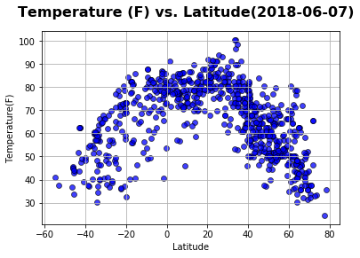

# Analysis
This time (06/04/2018), northern hemisphere is summer while southern now is winter season so:
 - Temperature ranges in Northern Hemisphere are greater than the southern ranges at corresponding latitudes.Northern Hemisphere is also higher temperature than southern now
 - Humidity ranges in Northern Hemisphere are greater than the southern ranges at corresponding latitudes.Northern Hemisphere's Humidity is also higher than southern now
 - Wind speed ranges in Northern Hemisphere are greater than the southern ranges at corresponding latitudes.Northern Hemisphere's wind speed is also stronger than southern now


```python
!pip install citipy
```


```python
import csv
import matplotlib.pyplot as plt
import openweathermapy as ow
import pandas as pd
from citipy import citipy
import random
import sys
import math
from config import api_key
import json
import requests
import numpy
```


```python
#Create latitude & longitude
lat = []
lon=[]
for i in range(1,10000):                 #number of Lat Long (in this case 10000) to be generated
 lat.append(float("{:.2f}".format(random.uniform(-90.0,90.0))))
 lon.append(float("{:.2f}".format(random.uniform(-180.0,180.0))))
```


```python
#Create a list of cities match with lat & long
cities = []
name = []
country_code = []
for k in range(len(lat)):
    cities.append(citipy.nearest_city(lat[k], lon[k]))
for city in cities:
    country_code.append(city.country_code)
    name.append(city.city_name)
    #print(f"The country code of {name} is '{country_code}'.")
cities_df = pd.DataFrame({"Lat":lat,"Lon":lon,"City Name":name,"Country Code":country_code})
#Drop duplicate Cities by using City Name
cities_df.drop_duplicates(subset=['City Name'],inplace=True)
cities_df.to_csv("nearestcities.csv", index = False)
len(cities_df)
```


    2235


```python
url = "http://api.openweathermap.org/data/2.5/weather?"
units="imperial" # to get weather data in Fahrenheit degree and wind speed in MPH
temp=[]
humidity=[]
cloud=[]
wind=[]
cityname=[]
countrycode=[]
lati=[]
long=[]
check=""
citinumber = 1
# Build partial query URL
query_url =  f"{url}appid={api_key}&units={units}&q="
i=0
print("Beginning Data Retrieval")
print("------------------------")
while i <= len(cities_df):
    try:
        response = requests.get(query_url + cities_df['City Name'][i]).json()
        response["main"]["temp"] #checking if wrong City Name, will only show KeyError once we look for a index,example 'main' index
    except KeyError:
        check = "KeyError"
        pass
    if check != "KeyError": # to make sure same length of each column, if try to push "withdrawing data" in Try then length of column will not same or have to use DROPNA,as able to fetching columns' NaN values
        print(f"Processing Record {citinumber} of Set {citinumber} | {cities_df['City Name'][i]}")
        print(f"{query_url}{cities_df['City Name'][i]}")
        cityname.append(cities_df['City Name'][i])
        countrycode.append(cities_df['Country Code'][i])
        lati.append(response["coord"]["lat"])
        long.append(response["coord"]["lon"])
        temp.append(response["main"]["temp"])
        humidity.append(response["main"]["humidity"])
        cloud.append(response["clouds"]["all"])
        wind.append(response["wind"]["speed"])
        citinumber=citinumber+1
    i=i+1
    check = "check"
final_df= pd.DataFrame({"City Name":cityname,"Country Code":countrycode,"Latitude":lati,"Longitude":long,"Temperature":temp,"Humidity":humidity,"Cloudness":cloud,"Wind":wind})
#Again execute a drop duplicate command on City Name to make sure this dataframe will only contain  unique cities
final_df.drop_duplicates(subset=['City Name'],inplace=True)
final_df.to_csv("weather.csv", index = False)
print(citinumber-1)
print(len(final_df))
final_df.head()
```

    Beginning Data Retrieval
    ------------------------
    Processing Record 1 of Set 1 | saldanha
    http://api.openweathermap.org/data/2.5/weather?appid=25bc90a1196e6f153eece0bc0b0fc9eb&units=imperial&q=saldanha
    Processing Record 2 of Set 2 | tiksi
    http://api.openweathermap.org/data/2.5/weather?appid=25bc90a1196e6f153eece0bc0b0fc9eb&units=imperial&q=tiksi
    Processing Record 3 of Set 3 | halifax
    http://api.openweathermap.org/data/2.5/weather?appid=25bc90a1196e6f153eece0bc0b0fc9eb&units=imperial&q=halifax
    Processing Record 4 of Set 4 | port elizabeth
    http://api.openweathermap.org/data/2.5/weather?appid=25bc90a1196e6f153eece0bc0b0fc9eb&units=imperial&q=port elizabeth
    Processing Record 5 of Set 5 | saskylakh
    http://api.openweathermap.org/data/2.5/weather?appid=25bc90a1196e6f153eece0bc0b0fc9eb&units=imperial&q=saskylakh
    Processing Record 6 of Set 6 | kalmunai
    http://api.openweathermap.org/data/2.5/weather?appid=25bc90a1196e6f153eece0bc0b0fc9eb&units=imperial&q=kalmunai
    Processing Record 7 of Set 7 | vaini
    http://api.openweathermap.org/data/2.5/weather?appid=25bc90a1196e6f153eece0bc0b0fc9eb&units=imperial&q=vaini
    Processing Record 8 of Set 8 | busselton
    http://api.openweathermap.org/data/2.5/weather?appid=25bc90a1196e6f153eece0bc0b0fc9eb&units=imperial&q=busselton
    Processing Record 9 of Set 9 | mataura
    http://api.openweathermap.org/data/2.5/weather?appid=25bc90a1196e6f153eece0bc0b0fc9eb&units=imperial&q=mataura
    Processing Record 10 of Set 10 | umm kaddadah
    http://api.openweathermap.org/data/2.5/weather?appid=25bc90a1196e6f153eece0bc0b0fc9eb&units=imperial&q=umm kaddadah
    Processing Record 11 of Set 11 | faanui
    http://api.openweathermap.org/data/2.5/weather?appid=25bc90a1196e6f153eece0bc0b0fc9eb&units=imperial&q=faanui
    Processing Record 12 of Set 12 | chuy
    http://api.openweathermap.org/data/2.5/weather?appid=25bc90a1196e6f153eece0bc0b0fc9eb&units=imperial&q=chuy
    Processing Record 13 of Set 13 | prince rupert
    http://api.openweathermap.org/data/2.5/weather?appid=25bc90a1196e6f153eece0bc0b0fc9eb&units=imperial&q=prince rupert
    Processing Record 14 of Set 14 | dudinka
    http://api.openweathermap.org/data/2.5/weather?appid=25bc90a1196e6f153eece0bc0b0fc9eb&units=imperial&q=dudinka
    Processing Record 15 of Set 15 | port alfred
    http://api.openweathermap.org/data/2.5/weather?appid=25bc90a1196e6f153eece0bc0b0fc9eb&units=imperial&q=port alfred
    Processing Record 16 of Set 16 | tuktoyaktuk
    http://api.openweathermap.org/data/2.5/weather?appid=25bc90a1196e6f153eece0bc0b0fc9eb&units=imperial&q=tuktoyaktuk
    Processing Record 17 of Set 17 | khalandrion
    http://api.openweathermap.org/data/2.5/weather?appid=25bc90a1196e6f153eece0bc0b0fc9eb&units=imperial&q=khalandrion
    Processing Record 18 of Set 18 | rehoboth
    http://api.openweathermap.org/data/2.5/weather?appid=25bc90a1196e6f153eece0bc0b0fc9eb&units=imperial&q=rehoboth
    Processing Record 19 of Set 19 | vanimo
    http://api.openweathermap.org/data/2.5/weather?appid=25bc90a1196e6f153eece0bc0b0fc9eb&units=imperial&q=vanimo
    Processing Record 20 of Set 20 | taltal
    http://api.openweathermap.org/data/2.5/weather?appid=25bc90a1196e6f153eece0bc0b0fc9eb&units=imperial&q=taltal
    Processing Record 21 of Set 21 | pacific grove
    http://api.openweathermap.org/data/2.5/weather?appid=25bc90a1196e6f153eece0bc0b0fc9eb&units=imperial&q=pacific grove
    Processing Record 22 of Set 22 | grand gaube
    http://api.openweathermap.org/data/2.5/weather?appid=25bc90a1196e6f153eece0bc0b0fc9eb&units=imperial&q=grand gaube
    Processing Record 23 of Set 23 | kapaa
    http://api.openweathermap.org/data/2.5/weather?appid=25bc90a1196e6f153eece0bc0b0fc9eb&units=imperial&q=kapaa
    Processing Record 24 of Set 24 | katherine
    http://api.openweathermap.org/data/2.5/weather?appid=25bc90a1196e6f153eece0bc0b0fc9eb&units=imperial&q=katherine
    Processing Record 25 of Set 25 | rikitea
    http://api.openweathermap.org/data/2.5/weather?appid=25bc90a1196e6f153eece0bc0b0fc9eb&units=imperial&q=rikitea
    Processing Record 26 of Set 26 | nizwa
    http://api.openweathermap.org/data/2.5/weather?appid=25bc90a1196e6f153eece0bc0b0fc9eb&units=imperial&q=nizwa
    Processing Record 27 of Set 27 | los llanos de aridane
    http://api.openweathermap.org/data/2.5/weather?appid=25bc90a1196e6f153eece0bc0b0fc9eb&units=imperial&q=los llanos de aridane
    Processing Record 28 of Set 28 | palu
    http://api.openweathermap.org/data/2.5/weather?appid=25bc90a1196e6f153eece0bc0b0fc9eb&units=imperial&q=palu
    Processing Record 29 of Set 29 | albany
    http://api.openweathermap.org/data/2.5/weather?appid=25bc90a1196e6f153eece0bc0b0fc9eb&units=imperial&q=albany
    Processing Record 30 of Set 30 | chicama
    http://api.openweathermap.org/data/2.5/weather?appid=25bc90a1196e6f153eece0bc0b0fc9eb&units=imperial&q=chicama
    Processing Record 31 of Set 31 | beckley
    http://api.openweathermap.org/data/2.5/weather?appid=25bc90a1196e6f153eece0bc0b0fc9eb&units=imperial&q=beckley
    Processing Record 32 of Set 32 | te anau
    http://api.openweathermap.org/data/2.5/weather?appid=25bc90a1196e6f153eece0bc0b0fc9eb&units=imperial&q=te anau
    Processing Record 33 of Set 33 | bilma
    http://api.openweathermap.org/data/2.5/weather?appid=25bc90a1196e6f153eece0bc0b0fc9eb&units=imperial&q=bilma
    Processing Record 34 of Set 34 | yellowknife
    http://api.openweathermap.org/data/2.5/weather?appid=25bc90a1196e6f153eece0bc0b0fc9eb&units=imperial&q=yellowknife
    Processing Record 35 of Set 35 | jamestown
    http://api.openweathermap.org/data/2.5/weather?appid=25bc90a1196e6f153eece0bc0b0fc9eb&units=imperial&q=jamestown
    Processing Record 36 of Set 36 | thompson
    http://api.openweathermap.org/data/2.5/weather?appid=25bc90a1196e6f153eece0bc0b0fc9eb&units=imperial&q=thompson
    Processing Record 37 of Set 37 | ambilobe
    http://api.openweathermap.org/data/2.5/weather?appid=25bc90a1196e6f153eece0bc0b0fc9eb&units=imperial&q=ambilobe
    Processing Record 38 of Set 38 | kichmengskiy gorodok
    http://api.openweathermap.org/data/2.5/weather?appid=25bc90a1196e6f153eece0bc0b0fc9eb&units=imperial&q=kichmengskiy gorodok
    Processing Record 39 of Set 39 | ferma
    http://api.openweathermap.org/data/2.5/weather?appid=25bc90a1196e6f153eece0bc0b0fc9eb&units=imperial&q=ferma
    Processing Record 40 of Set 40 | bluff
    http://api.openweathermap.org/data/2.5/weather?appid=25bc90a1196e6f153eece0bc0b0fc9eb&units=imperial&q=bluff
    Processing Record 41 of Set 41 | pangody
    http://api.openweathermap.org/data/2.5/weather?appid=25bc90a1196e6f153eece0bc0b0fc9eb&units=imperial&q=pangody
    Processing Record 42 of Set 42 | namibe
    http://api.openweathermap.org/data/2.5/weather?appid=25bc90a1196e6f153eece0bc0b0fc9eb&units=imperial&q=namibe
    Processing Record 43 of Set 43 | aiken
    http://api.openweathermap.org/data/2.5/weather?appid=25bc90a1196e6f153eece0bc0b0fc9eb&units=imperial&q=aiken
    Processing Record 44 of Set 44 | samut sakhon
    http://api.openweathermap.org/data/2.5/weather?appid=25bc90a1196e6f153eece0bc0b0fc9eb&units=imperial&q=samut sakhon
    Processing Record 45 of Set 45 | alice springs
    http://api.openweathermap.org/data/2.5/weather?appid=25bc90a1196e6f153eece0bc0b0fc9eb&units=imperial&q=alice springs
    Processing Record 46 of Set 46 | moussoro
    http://api.openweathermap.org/data/2.5/weather?appid=25bc90a1196e6f153eece0bc0b0fc9eb&units=imperial&q=moussoro
    Processing Record 47 of Set 47 | buraydah
    http://api.openweathermap.org/data/2.5/weather?appid=25bc90a1196e6f153eece0bc0b0fc9eb&units=imperial&q=buraydah
    Processing Record 48 of Set 48 | newport
    http://api.openweathermap.org/data/2.5/weather?appid=25bc90a1196e6f153eece0bc0b0fc9eb&units=imperial&q=newport
    Processing Record 49 of Set 49 | iqaluit
    http://api.openweathermap.org/data/2.5/weather?appid=25bc90a1196e6f153eece0bc0b0fc9eb&units=imperial&q=iqaluit
    Processing Record 50 of Set 50 | bethel
    http://api.openweathermap.org/data/2.5/weather?appid=25bc90a1196e6f153eece0bc0b0fc9eb&units=imperial&q=bethel
    Processing Record 51 of Set 51 | hobart
    http://api.openweathermap.org/data/2.5/weather?appid=25bc90a1196e6f153eece0bc0b0fc9eb&units=imperial&q=hobart
    Processing Record 52 of Set 52 | airai
    http://api.openweathermap.org/data/2.5/weather?appid=25bc90a1196e6f153eece0bc0b0fc9eb&units=imperial&q=airai
    Processing Record 53 of Set 53 | xining
    http://api.openweathermap.org/data/2.5/weather?appid=25bc90a1196e6f153eece0bc0b0fc9eb&units=imperial&q=xining
    Processing Record 54 of Set 54 | najran
    http://api.openweathermap.org/data/2.5/weather?appid=25bc90a1196e6f153eece0bc0b0fc9eb&units=imperial&q=najran
    Processing Record 55 of Set 55 | fortuna
    http://api.openweathermap.org/data/2.5/weather?appid=25bc90a1196e6f153eece0bc0b0fc9eb&units=imperial&q=fortuna
    Processing Record 56 of Set 56 | castro
    http://api.openweathermap.org/data/2.5/weather?appid=25bc90a1196e6f153eece0bc0b0fc9eb&units=imperial&q=castro
    Processing Record 57 of Set 57 | albania
    http://api.openweathermap.org/data/2.5/weather?appid=25bc90a1196e6f153eece0bc0b0fc9eb&units=imperial&q=albania
    Processing Record 58 of Set 58 | cherskiy
    http://api.openweathermap.org/data/2.5/weather?appid=25bc90a1196e6f153eece0bc0b0fc9eb&units=imperial&q=cherskiy
    Processing Record 59 of Set 59 | lompoc
    http://api.openweathermap.org/data/2.5/weather?appid=25bc90a1196e6f153eece0bc0b0fc9eb&units=imperial&q=lompoc
    Processing Record 60 of Set 60 | ha tinh
    http://api.openweathermap.org/data/2.5/weather?appid=25bc90a1196e6f153eece0bc0b0fc9eb&units=imperial&q=ha tinh
    Processing Record 61 of Set 61 | broome
    http://api.openweathermap.org/data/2.5/weather?appid=25bc90a1196e6f153eece0bc0b0fc9eb&units=imperial&q=broome
    Processing Record 62 of Set 62 | dingle
    http://api.openweathermap.org/data/2.5/weather?appid=25bc90a1196e6f153eece0bc0b0fc9eb&units=imperial&q=dingle
    Processing Record 63 of Set 63 | biak
    http://api.openweathermap.org/data/2.5/weather?appid=25bc90a1196e6f153eece0bc0b0fc9eb&units=imperial&q=biak
    Processing Record 64 of Set 64 | guerrero negro
    http://api.openweathermap.org/data/2.5/weather?appid=25bc90a1196e6f153eece0bc0b0fc9eb&units=imperial&q=guerrero negro
    Processing Record 65 of Set 65 | ler
    http://api.openweathermap.org/data/2.5/weather?appid=25bc90a1196e6f153eece0bc0b0fc9eb&units=imperial&q=ler
    Processing Record 66 of Set 66 | kitakata
    http://api.openweathermap.org/data/2.5/weather?appid=25bc90a1196e6f153eece0bc0b0fc9eb&units=imperial&q=kitakata
    Processing Record 67 of Set 67 | ushuaia
    http://api.openweathermap.org/data/2.5/weather?appid=25bc90a1196e6f153eece0bc0b0fc9eb&units=imperial&q=ushuaia
    Processing Record 68 of Set 68 | hun
    http://api.openweathermap.org/data/2.5/weather?appid=25bc90a1196e6f153eece0bc0b0fc9eb&units=imperial&q=hun
    Processing Record 69 of Set 69 | kaitangata
    http://api.openweathermap.org/data/2.5/weather?appid=25bc90a1196e6f153eece0bc0b0fc9eb&units=imperial&q=kaitangata
    Processing Record 70 of Set 70 | mackay
    http://api.openweathermap.org/data/2.5/weather?appid=25bc90a1196e6f153eece0bc0b0fc9eb&units=imperial&q=mackay
    Processing Record 71 of Set 71 | la ronge
    http://api.openweathermap.org/data/2.5/weather?appid=25bc90a1196e6f153eece0bc0b0fc9eb&units=imperial&q=la ronge
    Processing Record 72 of Set 72 | saint-philippe
    http://api.openweathermap.org/data/2.5/weather?appid=25bc90a1196e6f153eece0bc0b0fc9eb&units=imperial&q=saint-philippe
    Processing Record 73 of Set 73 | odienne
    http://api.openweathermap.org/data/2.5/weather?appid=25bc90a1196e6f153eece0bc0b0fc9eb&units=imperial&q=odienne
    Processing Record 74 of Set 74 | norrtalje
    http://api.openweathermap.org/data/2.5/weather?appid=25bc90a1196e6f153eece0bc0b0fc9eb&units=imperial&q=norrtalje
    Processing Record 75 of Set 75 | acapulco
    http://api.openweathermap.org/data/2.5/weather?appid=25bc90a1196e6f153eece0bc0b0fc9eb&units=imperial&q=acapulco
    Processing Record 76 of Set 76 | kloulklubed
    http://api.openweathermap.org/data/2.5/weather?appid=25bc90a1196e6f153eece0bc0b0fc9eb&units=imperial&q=kloulklubed
    Processing Record 77 of Set 77 | chapais
    http://api.openweathermap.org/data/2.5/weather?appid=25bc90a1196e6f153eece0bc0b0fc9eb&units=imperial&q=chapais
    Processing Record 78 of Set 78 | dunedin
    http://api.openweathermap.org/data/2.5/weather?appid=25bc90a1196e6f153eece0bc0b0fc9eb&units=imperial&q=dunedin
    Processing Record 79 of Set 79 | birao
    http://api.openweathermap.org/data/2.5/weather?appid=25bc90a1196e6f153eece0bc0b0fc9eb&units=imperial&q=birao
    Processing Record 80 of Set 80 | hermanus
    http://api.openweathermap.org/data/2.5/weather?appid=25bc90a1196e6f153eece0bc0b0fc9eb&units=imperial&q=hermanus
    Processing Record 81 of Set 81 | cape town
    http://api.openweathermap.org/data/2.5/weather?appid=25bc90a1196e6f153eece0bc0b0fc9eb&units=imperial&q=cape town
    Processing Record 82 of Set 82 | sao filipe
    http://api.openweathermap.org/data/2.5/weather?appid=25bc90a1196e6f153eece0bc0b0fc9eb&units=imperial&q=sao filipe
    Processing Record 83 of Set 83 | cochrane
    http://api.openweathermap.org/data/2.5/weather?appid=25bc90a1196e6f153eece0bc0b0fc9eb&units=imperial&q=cochrane
    Processing Record 84 of Set 84 | barrow
    http://api.openweathermap.org/data/2.5/weather?appid=25bc90a1196e6f153eece0bc0b0fc9eb&units=imperial&q=barrow
    Processing Record 85 of Set 85 | upernavik
    http://api.openweathermap.org/data/2.5/weather?appid=25bc90a1196e6f153eece0bc0b0fc9eb&units=imperial&q=upernavik
    Processing Record 86 of Set 86 | mandeville
    http://api.openweathermap.org/data/2.5/weather?appid=25bc90a1196e6f153eece0bc0b0fc9eb&units=imperial&q=mandeville
    Processing Record 87 of Set 87 | buchanan
    http://api.openweathermap.org/data/2.5/weather?appid=25bc90a1196e6f153eece0bc0b0fc9eb&units=imperial&q=buchanan
    Processing Record 88 of Set 88 | faya
    http://api.openweathermap.org/data/2.5/weather?appid=25bc90a1196e6f153eece0bc0b0fc9eb&units=imperial&q=faya
    Processing Record 89 of Set 89 | esperance
    http://api.openweathermap.org/data/2.5/weather?appid=25bc90a1196e6f153eece0bc0b0fc9eb&units=imperial&q=esperance
    Processing Record 90 of Set 90 | miri
    http://api.openweathermap.org/data/2.5/weather?appid=25bc90a1196e6f153eece0bc0b0fc9eb&units=imperial&q=miri
    Processing Record 91 of Set 91 | souillac
    http://api.openweathermap.org/data/2.5/weather?appid=25bc90a1196e6f153eece0bc0b0fc9eb&units=imperial&q=souillac
    Processing Record 92 of Set 92 | marquette
    http://api.openweathermap.org/data/2.5/weather?appid=25bc90a1196e6f153eece0bc0b0fc9eb&units=imperial&q=marquette
    Processing Record 93 of Set 93 | hasaki
    http://api.openweathermap.org/data/2.5/weather?appid=25bc90a1196e6f153eece0bc0b0fc9eb&units=imperial&q=hasaki
    Processing Record 94 of Set 94 | jaisalmer
    http://api.openweathermap.org/data/2.5/weather?appid=25bc90a1196e6f153eece0bc0b0fc9eb&units=imperial&q=jaisalmer
    Processing Record 95 of Set 95 | buin
    http://api.openweathermap.org/data/2.5/weather?appid=25bc90a1196e6f153eece0bc0b0fc9eb&units=imperial&q=buin
    Processing Record 96 of Set 96 | zhigansk
    http://api.openweathermap.org/data/2.5/weather?appid=25bc90a1196e6f153eece0bc0b0fc9eb&units=imperial&q=zhigansk
    Processing Record 97 of Set 97 | santa fe
    http://api.openweathermap.org/data/2.5/weather?appid=25bc90a1196e6f153eece0bc0b0fc9eb&units=imperial&q=santa fe
    Processing Record 98 of Set 98 | dikson
    http://api.openweathermap.org/data/2.5/weather?appid=25bc90a1196e6f153eece0bc0b0fc9eb&units=imperial&q=dikson
    Processing Record 99 of Set 99 | lincoln
    http://api.openweathermap.org/data/2.5/weather?appid=25bc90a1196e6f153eece0bc0b0fc9eb&units=imperial&q=lincoln
    Processing Record 100 of Set 100 | port hedland
    http://api.openweathermap.org/data/2.5/weather?appid=25bc90a1196e6f153eece0bc0b0fc9eb&units=imperial&q=port hedland
    Processing Record 101 of Set 101 | alenquer
    http://api.openweathermap.org/data/2.5/weather?appid=25bc90a1196e6f153eece0bc0b0fc9eb&units=imperial&q=alenquer
    Processing Record 102 of Set 102 | khatanga
    http://api.openweathermap.org/data/2.5/weather?appid=25bc90a1196e6f153eece0bc0b0fc9eb&units=imperial&q=khatanga
    Processing Record 103 of Set 103 | punta arenas
    http://api.openweathermap.org/data/2.5/weather?appid=25bc90a1196e6f153eece0bc0b0fc9eb&units=imperial&q=punta arenas
    Processing Record 104 of Set 104 | rawson
    http://api.openweathermap.org/data/2.5/weather?appid=25bc90a1196e6f153eece0bc0b0fc9eb&units=imperial&q=rawson
    Processing Record 105 of Set 105 | nanortalik
    http://api.openweathermap.org/data/2.5/weather?appid=25bc90a1196e6f153eece0bc0b0fc9eb&units=imperial&q=nanortalik
    Processing Record 106 of Set 106 | metzingen
    http://api.openweathermap.org/data/2.5/weather?appid=25bc90a1196e6f153eece0bc0b0fc9eb&units=imperial&q=metzingen
    Processing Record 107 of Set 107 | saint-pierre
    http://api.openweathermap.org/data/2.5/weather?appid=25bc90a1196e6f153eece0bc0b0fc9eb&units=imperial&q=saint-pierre
    Processing Record 108 of Set 108 | mala
    http://api.openweathermap.org/data/2.5/weather?appid=25bc90a1196e6f153eece0bc0b0fc9eb&units=imperial&q=mala
    Processing Record 109 of Set 109 | padang
    http://api.openweathermap.org/data/2.5/weather?appid=25bc90a1196e6f153eece0bc0b0fc9eb&units=imperial&q=padang
    Processing Record 110 of Set 110 | katsuura
    http://api.openweathermap.org/data/2.5/weather?appid=25bc90a1196e6f153eece0bc0b0fc9eb&units=imperial&q=katsuura
    Processing Record 111 of Set 111 | narsaq
    http://api.openweathermap.org/data/2.5/weather?appid=25bc90a1196e6f153eece0bc0b0fc9eb&units=imperial&q=narsaq
    Processing Record 112 of Set 112 | kirkwood
    http://api.openweathermap.org/data/2.5/weather?appid=25bc90a1196e6f153eece0bc0b0fc9eb&units=imperial&q=kirkwood
    Processing Record 113 of Set 113 | butaritari
    http://api.openweathermap.org/data/2.5/weather?appid=25bc90a1196e6f153eece0bc0b0fc9eb&units=imperial&q=butaritari
    Processing Record 114 of Set 114 | bubaque
    http://api.openweathermap.org/data/2.5/weather?appid=25bc90a1196e6f153eece0bc0b0fc9eb&units=imperial&q=bubaque
    Processing Record 115 of Set 115 | kirensk
    http://api.openweathermap.org/data/2.5/weather?appid=25bc90a1196e6f153eece0bc0b0fc9eb&units=imperial&q=kirensk
    Processing Record 116 of Set 116 | luanda
    http://api.openweathermap.org/data/2.5/weather?appid=25bc90a1196e6f153eece0bc0b0fc9eb&units=imperial&q=luanda
    Processing Record 117 of Set 117 | teknaf
    http://api.openweathermap.org/data/2.5/weather?appid=25bc90a1196e6f153eece0bc0b0fc9eb&units=imperial&q=teknaf
    Processing Record 118 of Set 118 | qaanaaq
    http://api.openweathermap.org/data/2.5/weather?appid=25bc90a1196e6f153eece0bc0b0fc9eb&units=imperial&q=qaanaaq
    Processing Record 119 of Set 119 | lebu
    http://api.openweathermap.org/data/2.5/weather?appid=25bc90a1196e6f153eece0bc0b0fc9eb&units=imperial&q=lebu
    Processing Record 120 of Set 120 | havoysund
    http://api.openweathermap.org/data/2.5/weather?appid=25bc90a1196e6f153eece0bc0b0fc9eb&units=imperial&q=havoysund
    Processing Record 121 of Set 121 | beringovskiy
    http://api.openweathermap.org/data/2.5/weather?appid=25bc90a1196e6f153eece0bc0b0fc9eb&units=imperial&q=beringovskiy
    Processing Record 122 of Set 122 | nemuro
    http://api.openweathermap.org/data/2.5/weather?appid=25bc90a1196e6f153eece0bc0b0fc9eb&units=imperial&q=nemuro
    Processing Record 123 of Set 123 | uige
    http://api.openweathermap.org/data/2.5/weather?appid=25bc90a1196e6f153eece0bc0b0fc9eb&units=imperial&q=uige
    Processing Record 124 of Set 124 | cabo san lucas
    http://api.openweathermap.org/data/2.5/weather?appid=25bc90a1196e6f153eece0bc0b0fc9eb&units=imperial&q=cabo san lucas
    Processing Record 125 of Set 125 | carnarvon
    http://api.openweathermap.org/data/2.5/weather?appid=25bc90a1196e6f153eece0bc0b0fc9eb&units=imperial&q=carnarvon
    Processing Record 126 of Set 126 | henties bay
    http://api.openweathermap.org/data/2.5/weather?appid=25bc90a1196e6f153eece0bc0b0fc9eb&units=imperial&q=henties bay
    Processing Record 127 of Set 127 | emerald
    http://api.openweathermap.org/data/2.5/weather?appid=25bc90a1196e6f153eece0bc0b0fc9eb&units=imperial&q=emerald
    Processing Record 128 of Set 128 | mattru
    http://api.openweathermap.org/data/2.5/weather?appid=25bc90a1196e6f153eece0bc0b0fc9eb&units=imperial&q=mattru
    Processing Record 129 of Set 129 | avarua
    http://api.openweathermap.org/data/2.5/weather?appid=25bc90a1196e6f153eece0bc0b0fc9eb&units=imperial&q=avarua
    Processing Record 130 of Set 130 | murray bridge
    http://api.openweathermap.org/data/2.5/weather?appid=25bc90a1196e6f153eece0bc0b0fc9eb&units=imperial&q=murray bridge
    Processing Record 131 of Set 131 | hay river
    http://api.openweathermap.org/data/2.5/weather?appid=25bc90a1196e6f153eece0bc0b0fc9eb&units=imperial&q=hay river
    Processing Record 132 of Set 132 | namtsy
    http://api.openweathermap.org/data/2.5/weather?appid=25bc90a1196e6f153eece0bc0b0fc9eb&units=imperial&q=namtsy
    Processing Record 133 of Set 133 | rio grande
    http://api.openweathermap.org/data/2.5/weather?appid=25bc90a1196e6f153eece0bc0b0fc9eb&units=imperial&q=rio grande
    Processing Record 134 of Set 134 | saint-augustin
    http://api.openweathermap.org/data/2.5/weather?appid=25bc90a1196e6f153eece0bc0b0fc9eb&units=imperial&q=saint-augustin
    Processing Record 135 of Set 135 | santa cruz del sur
    http://api.openweathermap.org/data/2.5/weather?appid=25bc90a1196e6f153eece0bc0b0fc9eb&units=imperial&q=santa cruz del sur
    Processing Record 136 of Set 136 | carutapera
    http://api.openweathermap.org/data/2.5/weather?appid=25bc90a1196e6f153eece0bc0b0fc9eb&units=imperial&q=carutapera
    Processing Record 137 of Set 137 | bana
    http://api.openweathermap.org/data/2.5/weather?appid=25bc90a1196e6f153eece0bc0b0fc9eb&units=imperial&q=bana
    Processing Record 138 of Set 138 | puerto ayora
    http://api.openweathermap.org/data/2.5/weather?appid=25bc90a1196e6f153eece0bc0b0fc9eb&units=imperial&q=puerto ayora
    Processing Record 139 of Set 139 | samarai
    http://api.openweathermap.org/data/2.5/weather?appid=25bc90a1196e6f153eece0bc0b0fc9eb&units=imperial&q=samarai
    Processing Record 140 of Set 140 | cidreira
    http://api.openweathermap.org/data/2.5/weather?appid=25bc90a1196e6f153eece0bc0b0fc9eb&units=imperial&q=cidreira
    Processing Record 141 of Set 141 | arraial do cabo
    http://api.openweathermap.org/data/2.5/weather?appid=25bc90a1196e6f153eece0bc0b0fc9eb&units=imperial&q=arraial do cabo
    Processing Record 142 of Set 142 | atuona
    http://api.openweathermap.org/data/2.5/weather?appid=25bc90a1196e6f153eece0bc0b0fc9eb&units=imperial&q=atuona
    Processing Record 143 of Set 143 | abha
    http://api.openweathermap.org/data/2.5/weather?appid=25bc90a1196e6f153eece0bc0b0fc9eb&units=imperial&q=abha
    Processing Record 144 of Set 144 | chokurdakh
    http://api.openweathermap.org/data/2.5/weather?appid=25bc90a1196e6f153eece0bc0b0fc9eb&units=imperial&q=chokurdakh
    Processing Record 145 of Set 145 | caravelas
    http://api.openweathermap.org/data/2.5/weather?appid=25bc90a1196e6f153eece0bc0b0fc9eb&units=imperial&q=caravelas
    Processing Record 146 of Set 146 | clyde river
    http://api.openweathermap.org/data/2.5/weather?appid=25bc90a1196e6f153eece0bc0b0fc9eb&units=imperial&q=clyde river
    Processing Record 147 of Set 147 | ostrovnoy
    http://api.openweathermap.org/data/2.5/weather?appid=25bc90a1196e6f153eece0bc0b0fc9eb&units=imperial&q=ostrovnoy
    Processing Record 148 of Set 148 | berlevag
    http://api.openweathermap.org/data/2.5/weather?appid=25bc90a1196e6f153eece0bc0b0fc9eb&units=imperial&q=berlevag
    Processing Record 149 of Set 149 | kodiak
    http://api.openweathermap.org/data/2.5/weather?appid=25bc90a1196e6f153eece0bc0b0fc9eb&units=imperial&q=kodiak
    Processing Record 150 of Set 150 | anadyr
    http://api.openweathermap.org/data/2.5/weather?appid=25bc90a1196e6f153eece0bc0b0fc9eb&units=imperial&q=anadyr
    Processing Record 151 of Set 151 | ponta delgada
    http://api.openweathermap.org/data/2.5/weather?appid=25bc90a1196e6f153eece0bc0b0fc9eb&units=imperial&q=ponta delgada
    Processing Record 152 of Set 152 | tuatapere
    http://api.openweathermap.org/data/2.5/weather?appid=25bc90a1196e6f153eece0bc0b0fc9eb&units=imperial&q=tuatapere
    Processing Record 153 of Set 153 | ponta do sol
    http://api.openweathermap.org/data/2.5/weather?appid=25bc90a1196e6f153eece0bc0b0fc9eb&units=imperial&q=ponta do sol
    Processing Record 154 of Set 154 | riyadh
    http://api.openweathermap.org/data/2.5/weather?appid=25bc90a1196e6f153eece0bc0b0fc9eb&units=imperial&q=riyadh
    Processing Record 155 of Set 155 | mombetsu
    http://api.openweathermap.org/data/2.5/weather?appid=25bc90a1196e6f153eece0bc0b0fc9eb&units=imperial&q=mombetsu
    Processing Record 156 of Set 156 | tautira
    http://api.openweathermap.org/data/2.5/weather?appid=25bc90a1196e6f153eece0bc0b0fc9eb&units=imperial&q=tautira
    Processing Record 157 of Set 157 | codrington
    http://api.openweathermap.org/data/2.5/weather?appid=25bc90a1196e6f153eece0bc0b0fc9eb&units=imperial&q=codrington
    Processing Record 158 of Set 158 | santa cruz
    http://api.openweathermap.org/data/2.5/weather?appid=25bc90a1196e6f153eece0bc0b0fc9eb&units=imperial&q=santa cruz
    Processing Record 159 of Set 159 | provideniya
    http://api.openweathermap.org/data/2.5/weather?appid=25bc90a1196e6f153eece0bc0b0fc9eb&units=imperial&q=provideniya
    Processing Record 160 of Set 160 | praia da vitoria
    http://api.openweathermap.org/data/2.5/weather?appid=25bc90a1196e6f153eece0bc0b0fc9eb&units=imperial&q=praia da vitoria
    Processing Record 161 of Set 161 | new norfolk
    http://api.openweathermap.org/data/2.5/weather?appid=25bc90a1196e6f153eece0bc0b0fc9eb&units=imperial&q=new norfolk
    Processing Record 162 of Set 162 | adrar
    http://api.openweathermap.org/data/2.5/weather?appid=25bc90a1196e6f153eece0bc0b0fc9eb&units=imperial&q=adrar
    Processing Record 163 of Set 163 | hilo
    http://api.openweathermap.org/data/2.5/weather?appid=25bc90a1196e6f153eece0bc0b0fc9eb&units=imperial&q=hilo
    Processing Record 164 of Set 164 | luderitz
    http://api.openweathermap.org/data/2.5/weather?appid=25bc90a1196e6f153eece0bc0b0fc9eb&units=imperial&q=luderitz
    Processing Record 165 of Set 165 | georgetown
    http://api.openweathermap.org/data/2.5/weather?appid=25bc90a1196e6f153eece0bc0b0fc9eb&units=imperial&q=georgetown
    Processing Record 166 of Set 166 | mbala
    http://api.openweathermap.org/data/2.5/weather?appid=25bc90a1196e6f153eece0bc0b0fc9eb&units=imperial&q=mbala
    Processing Record 167 of Set 167 | flinders
    http://api.openweathermap.org/data/2.5/weather?appid=25bc90a1196e6f153eece0bc0b0fc9eb&units=imperial&q=flinders
    Processing Record 168 of Set 168 | olavarria
    http://api.openweathermap.org/data/2.5/weather?appid=25bc90a1196e6f153eece0bc0b0fc9eb&units=imperial&q=olavarria
    Processing Record 169 of Set 169 | haines junction
    http://api.openweathermap.org/data/2.5/weather?appid=25bc90a1196e6f153eece0bc0b0fc9eb&units=imperial&q=haines junction
    Processing Record 170 of Set 170 | dicabisagan
    http://api.openweathermap.org/data/2.5/weather?appid=25bc90a1196e6f153eece0bc0b0fc9eb&units=imperial&q=dicabisagan
    Processing Record 171 of Set 171 | ribeira grande
    http://api.openweathermap.org/data/2.5/weather?appid=25bc90a1196e6f153eece0bc0b0fc9eb&units=imperial&q=ribeira grande
    Processing Record 172 of Set 172 | tapes
    http://api.openweathermap.org/data/2.5/weather?appid=25bc90a1196e6f153eece0bc0b0fc9eb&units=imperial&q=tapes
    Processing Record 173 of Set 173 | nikolskoye
    http://api.openweathermap.org/data/2.5/weather?appid=25bc90a1196e6f153eece0bc0b0fc9eb&units=imperial&q=nikolskoye
    Processing Record 174 of Set 174 | tasiilaq
    http://api.openweathermap.org/data/2.5/weather?appid=25bc90a1196e6f153eece0bc0b0fc9eb&units=imperial&q=tasiilaq
    Processing Record 175 of Set 175 | nikel
    http://api.openweathermap.org/data/2.5/weather?appid=25bc90a1196e6f153eece0bc0b0fc9eb&units=imperial&q=nikel
    Processing Record 176 of Set 176 | porbandar
    http://api.openweathermap.org/data/2.5/weather?appid=25bc90a1196e6f153eece0bc0b0fc9eb&units=imperial&q=porbandar
    Processing Record 177 of Set 177 | meulaboh
    http://api.openweathermap.org/data/2.5/weather?appid=25bc90a1196e6f153eece0bc0b0fc9eb&units=imperial&q=meulaboh
    Processing Record 178 of Set 178 | churachandpur
    http://api.openweathermap.org/data/2.5/weather?appid=25bc90a1196e6f153eece0bc0b0fc9eb&units=imperial&q=churachandpur
    Processing Record 179 of Set 179 | lichinga
    http://api.openweathermap.org/data/2.5/weather?appid=25bc90a1196e6f153eece0bc0b0fc9eb&units=imperial&q=lichinga
    Processing Record 180 of Set 180 | longyearbyen
    http://api.openweathermap.org/data/2.5/weather?appid=25bc90a1196e6f153eece0bc0b0fc9eb&units=imperial&q=longyearbyen
    Processing Record 181 of Set 181 | san ramon
    http://api.openweathermap.org/data/2.5/weather?appid=25bc90a1196e6f153eece0bc0b0fc9eb&units=imperial&q=san ramon
    Processing Record 182 of Set 182 | atar
    http://api.openweathermap.org/data/2.5/weather?appid=25bc90a1196e6f153eece0bc0b0fc9eb&units=imperial&q=atar
    Processing Record 183 of Set 183 | kimbe
    http://api.openweathermap.org/data/2.5/weather?appid=25bc90a1196e6f153eece0bc0b0fc9eb&units=imperial&q=kimbe
    Processing Record 184 of Set 184 | smithers
    http://api.openweathermap.org/data/2.5/weather?appid=25bc90a1196e6f153eece0bc0b0fc9eb&units=imperial&q=smithers
    Processing Record 185 of Set 185 | port hardy
    http://api.openweathermap.org/data/2.5/weather?appid=25bc90a1196e6f153eece0bc0b0fc9eb&units=imperial&q=port hardy
    Processing Record 186 of Set 186 | hithadhoo
    http://api.openweathermap.org/data/2.5/weather?appid=25bc90a1196e6f153eece0bc0b0fc9eb&units=imperial&q=hithadhoo
    Processing Record 187 of Set 187 | natal
    http://api.openweathermap.org/data/2.5/weather?appid=25bc90a1196e6f153eece0bc0b0fc9eb&units=imperial&q=natal
    Processing Record 188 of Set 188 | tubmanburg
    http://api.openweathermap.org/data/2.5/weather?appid=25bc90a1196e6f153eece0bc0b0fc9eb&units=imperial&q=tubmanburg
    Processing Record 189 of Set 189 | san patricio
    http://api.openweathermap.org/data/2.5/weather?appid=25bc90a1196e6f153eece0bc0b0fc9eb&units=imperial&q=san patricio
    Processing Record 190 of Set 190 | aswan
    http://api.openweathermap.org/data/2.5/weather?appid=25bc90a1196e6f153eece0bc0b0fc9eb&units=imperial&q=aswan
    Processing Record 191 of Set 191 | kruisfontein
    http://api.openweathermap.org/data/2.5/weather?appid=25bc90a1196e6f153eece0bc0b0fc9eb&units=imperial&q=kruisfontein
    Processing Record 192 of Set 192 | husavik
    http://api.openweathermap.org/data/2.5/weather?appid=25bc90a1196e6f153eece0bc0b0fc9eb&units=imperial&q=husavik
    Processing Record 193 of Set 193 | port lavaca
    http://api.openweathermap.org/data/2.5/weather?appid=25bc90a1196e6f153eece0bc0b0fc9eb&units=imperial&q=port lavaca
    Processing Record 194 of Set 194 | ahipara
    http://api.openweathermap.org/data/2.5/weather?appid=25bc90a1196e6f153eece0bc0b0fc9eb&units=imperial&q=ahipara
    Processing Record 195 of Set 195 | heyang
    http://api.openweathermap.org/data/2.5/weather?appid=25bc90a1196e6f153eece0bc0b0fc9eb&units=imperial&q=heyang
    Processing Record 196 of Set 196 | dengfeng
    http://api.openweathermap.org/data/2.5/weather?appid=25bc90a1196e6f153eece0bc0b0fc9eb&units=imperial&q=dengfeng
    Processing Record 197 of Set 197 | kavaratti
    http://api.openweathermap.org/data/2.5/weather?appid=25bc90a1196e6f153eece0bc0b0fc9eb&units=imperial&q=kavaratti
    Processing Record 198 of Set 198 | artyom
    http://api.openweathermap.org/data/2.5/weather?appid=25bc90a1196e6f153eece0bc0b0fc9eb&units=imperial&q=artyom
    Processing Record 199 of Set 199 | kantunilkin
    http://api.openweathermap.org/data/2.5/weather?appid=25bc90a1196e6f153eece0bc0b0fc9eb&units=imperial&q=kantunilkin
    Processing Record 200 of Set 200 | ketchikan
    http://api.openweathermap.org/data/2.5/weather?appid=25bc90a1196e6f153eece0bc0b0fc9eb&units=imperial&q=ketchikan
    Processing Record 201 of Set 201 | sarkand
    http://api.openweathermap.org/data/2.5/weather?appid=25bc90a1196e6f153eece0bc0b0fc9eb&units=imperial&q=sarkand
    Processing Record 202 of Set 202 | talcahuano
    http://api.openweathermap.org/data/2.5/weather?appid=25bc90a1196e6f153eece0bc0b0fc9eb&units=imperial&q=talcahuano
    Processing Record 203 of Set 203 | mahebourg
    http://api.openweathermap.org/data/2.5/weather?appid=25bc90a1196e6f153eece0bc0b0fc9eb&units=imperial&q=mahebourg
    Processing Record 204 of Set 204 | salyan
    http://api.openweathermap.org/data/2.5/weather?appid=25bc90a1196e6f153eece0bc0b0fc9eb&units=imperial&q=salyan
    Processing Record 205 of Set 205 | constitucion
    http://api.openweathermap.org/data/2.5/weather?appid=25bc90a1196e6f153eece0bc0b0fc9eb&units=imperial&q=constitucion
    Processing Record 206 of Set 206 | fairbanks
    http://api.openweathermap.org/data/2.5/weather?appid=25bc90a1196e6f153eece0bc0b0fc9eb&units=imperial&q=fairbanks
    Processing Record 207 of Set 207 | aras
    http://api.openweathermap.org/data/2.5/weather?appid=25bc90a1196e6f153eece0bc0b0fc9eb&units=imperial&q=aras
    Processing Record 208 of Set 208 | lazaro cardenas
    http://api.openweathermap.org/data/2.5/weather?appid=25bc90a1196e6f153eece0bc0b0fc9eb&units=imperial&q=lazaro cardenas
    Processing Record 209 of Set 209 | geraldton
    http://api.openweathermap.org/data/2.5/weather?appid=25bc90a1196e6f153eece0bc0b0fc9eb&units=imperial&q=geraldton
    Processing Record 210 of Set 210 | talnakh
    http://api.openweathermap.org/data/2.5/weather?appid=25bc90a1196e6f153eece0bc0b0fc9eb&units=imperial&q=talnakh
    Processing Record 211 of Set 211 | marina
    http://api.openweathermap.org/data/2.5/weather?appid=25bc90a1196e6f153eece0bc0b0fc9eb&units=imperial&q=marina
    Processing Record 212 of Set 212 | bredasdorp
    http://api.openweathermap.org/data/2.5/weather?appid=25bc90a1196e6f153eece0bc0b0fc9eb&units=imperial&q=bredasdorp
    Processing Record 213 of Set 213 | saint george
    http://api.openweathermap.org/data/2.5/weather?appid=25bc90a1196e6f153eece0bc0b0fc9eb&units=imperial&q=saint george
    Processing Record 214 of Set 214 | bonavista
    http://api.openweathermap.org/data/2.5/weather?appid=25bc90a1196e6f153eece0bc0b0fc9eb&units=imperial&q=bonavista
    Processing Record 215 of Set 215 | hualmay
    http://api.openweathermap.org/data/2.5/weather?appid=25bc90a1196e6f153eece0bc0b0fc9eb&units=imperial&q=hualmay
    Processing Record 216 of Set 216 | tiznit
    http://api.openweathermap.org/data/2.5/weather?appid=25bc90a1196e6f153eece0bc0b0fc9eb&units=imperial&q=tiznit
    Processing Record 217 of Set 217 | brae
    http://api.openweathermap.org/data/2.5/weather?appid=25bc90a1196e6f153eece0bc0b0fc9eb&units=imperial&q=brae
    Processing Record 218 of Set 218 | jumla
    http://api.openweathermap.org/data/2.5/weather?appid=25bc90a1196e6f153eece0bc0b0fc9eb&units=imperial&q=jumla
    Processing Record 219 of Set 219 | polyarnyy
    http://api.openweathermap.org/data/2.5/weather?appid=25bc90a1196e6f153eece0bc0b0fc9eb&units=imperial&q=polyarnyy
    Processing Record 220 of Set 220 | torbay
    http://api.openweathermap.org/data/2.5/weather?appid=25bc90a1196e6f153eece0bc0b0fc9eb&units=imperial&q=torbay
    Processing Record 221 of Set 221 | isangel
    http://api.openweathermap.org/data/2.5/weather?appid=25bc90a1196e6f153eece0bc0b0fc9eb&units=imperial&q=isangel
    Processing Record 222 of Set 222 | ibra
    http://api.openweathermap.org/data/2.5/weather?appid=25bc90a1196e6f153eece0bc0b0fc9eb&units=imperial&q=ibra
    Processing Record 223 of Set 223 | sao joao da barra
    http://api.openweathermap.org/data/2.5/weather?appid=25bc90a1196e6f153eece0bc0b0fc9eb&units=imperial&q=sao joao da barra
    Processing Record 224 of Set 224 | hokitika
    http://api.openweathermap.org/data/2.5/weather?appid=25bc90a1196e6f153eece0bc0b0fc9eb&units=imperial&q=hokitika
    Processing Record 225 of Set 225 | laguna
    http://api.openweathermap.org/data/2.5/weather?appid=25bc90a1196e6f153eece0bc0b0fc9eb&units=imperial&q=laguna
    Processing Record 226 of Set 226 | sudak
    http://api.openweathermap.org/data/2.5/weather?appid=25bc90a1196e6f153eece0bc0b0fc9eb&units=imperial&q=sudak
    Processing Record 227 of Set 227 | touros
    http://api.openweathermap.org/data/2.5/weather?appid=25bc90a1196e6f153eece0bc0b0fc9eb&units=imperial&q=touros
    Processing Record 228 of Set 228 | burgeo
    http://api.openweathermap.org/data/2.5/weather?appid=25bc90a1196e6f153eece0bc0b0fc9eb&units=imperial&q=burgeo
    Processing Record 229 of Set 229 | lagoa
    http://api.openweathermap.org/data/2.5/weather?appid=25bc90a1196e6f153eece0bc0b0fc9eb&units=imperial&q=lagoa
    Processing Record 230 of Set 230 | visnes
    http://api.openweathermap.org/data/2.5/weather?appid=25bc90a1196e6f153eece0bc0b0fc9eb&units=imperial&q=visnes
    Processing Record 231 of Set 231 | pevek
    http://api.openweathermap.org/data/2.5/weather?appid=25bc90a1196e6f153eece0bc0b0fc9eb&units=imperial&q=pevek
    Processing Record 232 of Set 232 | northam
    http://api.openweathermap.org/data/2.5/weather?appid=25bc90a1196e6f153eece0bc0b0fc9eb&units=imperial&q=northam
    Processing Record 233 of Set 233 | vila velha
    http://api.openweathermap.org/data/2.5/weather?appid=25bc90a1196e6f153eece0bc0b0fc9eb&units=imperial&q=vila velha
    Processing Record 234 of Set 234 | broken hill
    http://api.openweathermap.org/data/2.5/weather?appid=25bc90a1196e6f153eece0bc0b0fc9eb&units=imperial&q=broken hill
    Processing Record 235 of Set 235 | redmond
    http://api.openweathermap.org/data/2.5/weather?appid=25bc90a1196e6f153eece0bc0b0fc9eb&units=imperial&q=redmond
    Processing Record 236 of Set 236 | jalu
    http://api.openweathermap.org/data/2.5/weather?appid=25bc90a1196e6f153eece0bc0b0fc9eb&units=imperial&q=jalu
    Processing Record 237 of Set 237 | yulara
    http://api.openweathermap.org/data/2.5/weather?appid=25bc90a1196e6f153eece0bc0b0fc9eb&units=imperial&q=yulara
    Processing Record 238 of Set 238 | laramie
    http://api.openweathermap.org/data/2.5/weather?appid=25bc90a1196e6f153eece0bc0b0fc9eb&units=imperial&q=laramie
    Processing Record 239 of Set 239 | victoria
    http://api.openweathermap.org/data/2.5/weather?appid=25bc90a1196e6f153eece0bc0b0fc9eb&units=imperial&q=victoria
    Processing Record 240 of Set 240 | kaeo
    http://api.openweathermap.org/data/2.5/weather?appid=25bc90a1196e6f153eece0bc0b0fc9eb&units=imperial&q=kaeo
    Processing Record 241 of Set 241 | paso de los toros
    http://api.openweathermap.org/data/2.5/weather?appid=25bc90a1196e6f153eece0bc0b0fc9eb&units=imperial&q=paso de los toros
    Processing Record 242 of Set 242 | mar del plata
    http://api.openweathermap.org/data/2.5/weather?appid=25bc90a1196e6f153eece0bc0b0fc9eb&units=imperial&q=mar del plata
    Processing Record 243 of Set 243 | komsomolskiy
    http://api.openweathermap.org/data/2.5/weather?appid=25bc90a1196e6f153eece0bc0b0fc9eb&units=imperial&q=komsomolskiy
    Processing Record 244 of Set 244 | sola
    http://api.openweathermap.org/data/2.5/weather?appid=25bc90a1196e6f153eece0bc0b0fc9eb&units=imperial&q=sola
    Processing Record 245 of Set 245 | kenai
    http://api.openweathermap.org/data/2.5/weather?appid=25bc90a1196e6f153eece0bc0b0fc9eb&units=imperial&q=kenai
    Processing Record 246 of Set 246 | chitungwiza
    http://api.openweathermap.org/data/2.5/weather?appid=25bc90a1196e6f153eece0bc0b0fc9eb&units=imperial&q=chitungwiza
    Processing Record 247 of Set 247 | xichang
    http://api.openweathermap.org/data/2.5/weather?appid=25bc90a1196e6f153eece0bc0b0fc9eb&units=imperial&q=xichang
    Processing Record 248 of Set 248 | gushikawa
    http://api.openweathermap.org/data/2.5/weather?appid=25bc90a1196e6f153eece0bc0b0fc9eb&units=imperial&q=gushikawa
    Processing Record 249 of Set 249 | petropavlovsk-kamchatskiy
    http://api.openweathermap.org/data/2.5/weather?appid=25bc90a1196e6f153eece0bc0b0fc9eb&units=imperial&q=petropavlovsk-kamchatskiy
    Processing Record 250 of Set 250 | khash
    http://api.openweathermap.org/data/2.5/weather?appid=25bc90a1196e6f153eece0bc0b0fc9eb&units=imperial&q=khash
    Processing Record 251 of Set 251 | pisco
    http://api.openweathermap.org/data/2.5/weather?appid=25bc90a1196e6f153eece0bc0b0fc9eb&units=imperial&q=pisco
    Processing Record 252 of Set 252 | avera
    http://api.openweathermap.org/data/2.5/weather?appid=25bc90a1196e6f153eece0bc0b0fc9eb&units=imperial&q=avera
    Processing Record 253 of Set 253 | spirit river
    http://api.openweathermap.org/data/2.5/weather?appid=25bc90a1196e6f153eece0bc0b0fc9eb&units=imperial&q=spirit river
    Processing Record 254 of Set 254 | gigmoto
    http://api.openweathermap.org/data/2.5/weather?appid=25bc90a1196e6f153eece0bc0b0fc9eb&units=imperial&q=gigmoto
    Processing Record 255 of Set 255 | kanniyakumari
    http://api.openweathermap.org/data/2.5/weather?appid=25bc90a1196e6f153eece0bc0b0fc9eb&units=imperial&q=kanniyakumari
    Processing Record 256 of Set 256 | xai-xai
    http://api.openweathermap.org/data/2.5/weather?appid=25bc90a1196e6f153eece0bc0b0fc9eb&units=imperial&q=xai-xai
    Processing Record 257 of Set 257 | barstow
    http://api.openweathermap.org/data/2.5/weather?appid=25bc90a1196e6f153eece0bc0b0fc9eb&units=imperial&q=barstow
    Processing Record 258 of Set 258 | manokwari
    http://api.openweathermap.org/data/2.5/weather?appid=25bc90a1196e6f153eece0bc0b0fc9eb&units=imperial&q=manokwari
    Processing Record 259 of Set 259 | kavieng
    http://api.openweathermap.org/data/2.5/weather?appid=25bc90a1196e6f153eece0bc0b0fc9eb&units=imperial&q=kavieng
    Processing Record 260 of Set 260 | syracuse
    http://api.openweathermap.org/data/2.5/weather?appid=25bc90a1196e6f153eece0bc0b0fc9eb&units=imperial&q=syracuse
    Processing Record 261 of Set 261 | kangaatsiaq
    http://api.openweathermap.org/data/2.5/weather?appid=25bc90a1196e6f153eece0bc0b0fc9eb&units=imperial&q=kangaatsiaq
    Processing Record 262 of Set 262 | ilulissat
    http://api.openweathermap.org/data/2.5/weather?appid=25bc90a1196e6f153eece0bc0b0fc9eb&units=imperial&q=ilulissat
    Processing Record 263 of Set 263 | turayf
    http://api.openweathermap.org/data/2.5/weather?appid=25bc90a1196e6f153eece0bc0b0fc9eb&units=imperial&q=turayf
    Processing Record 264 of Set 264 | lara
    http://api.openweathermap.org/data/2.5/weather?appid=25bc90a1196e6f153eece0bc0b0fc9eb&units=imperial&q=lara
    Processing Record 265 of Set 265 | mao
    http://api.openweathermap.org/data/2.5/weather?appid=25bc90a1196e6f153eece0bc0b0fc9eb&units=imperial&q=mao
    Processing Record 266 of Set 266 | karratha
    http://api.openweathermap.org/data/2.5/weather?appid=25bc90a1196e6f153eece0bc0b0fc9eb&units=imperial&q=karratha
    Processing Record 267 of Set 267 | algeciras
    http://api.openweathermap.org/data/2.5/weather?appid=25bc90a1196e6f153eece0bc0b0fc9eb&units=imperial&q=algeciras
    Processing Record 268 of Set 268 | the valley
    http://api.openweathermap.org/data/2.5/weather?appid=25bc90a1196e6f153eece0bc0b0fc9eb&units=imperial&q=the valley
    Processing Record 269 of Set 269 | oranjemund
    http://api.openweathermap.org/data/2.5/weather?appid=25bc90a1196e6f153eece0bc0b0fc9eb&units=imperial&q=oranjemund
    Processing Record 270 of Set 270 | aklavik
    http://api.openweathermap.org/data/2.5/weather?appid=25bc90a1196e6f153eece0bc0b0fc9eb&units=imperial&q=aklavik
    Processing Record 271 of Set 271 | paciran
    http://api.openweathermap.org/data/2.5/weather?appid=25bc90a1196e6f153eece0bc0b0fc9eb&units=imperial&q=paciran
    Processing Record 272 of Set 272 | bonthe
    http://api.openweathermap.org/data/2.5/weather?appid=25bc90a1196e6f153eece0bc0b0fc9eb&units=imperial&q=bonthe
    Processing Record 273 of Set 273 | waingapu
    http://api.openweathermap.org/data/2.5/weather?appid=25bc90a1196e6f153eece0bc0b0fc9eb&units=imperial&q=waingapu
    Processing Record 274 of Set 274 | whitefish
    http://api.openweathermap.org/data/2.5/weather?appid=25bc90a1196e6f153eece0bc0b0fc9eb&units=imperial&q=whitefish
    Processing Record 275 of Set 275 | college
    http://api.openweathermap.org/data/2.5/weather?appid=25bc90a1196e6f153eece0bc0b0fc9eb&units=imperial&q=college
    Processing Record 276 of Set 276 | caarapo
    http://api.openweathermap.org/data/2.5/weather?appid=25bc90a1196e6f153eece0bc0b0fc9eb&units=imperial&q=caarapo
    Processing Record 277 of Set 277 | mnogovershinnyy
    http://api.openweathermap.org/data/2.5/weather?appid=25bc90a1196e6f153eece0bc0b0fc9eb&units=imperial&q=mnogovershinnyy
    Processing Record 278 of Set 278 | christchurch
    http://api.openweathermap.org/data/2.5/weather?appid=25bc90a1196e6f153eece0bc0b0fc9eb&units=imperial&q=christchurch
    Processing Record 279 of Set 279 | ranong
    http://api.openweathermap.org/data/2.5/weather?appid=25bc90a1196e6f153eece0bc0b0fc9eb&units=imperial&q=ranong
    Processing Record 280 of Set 280 | teguise
    http://api.openweathermap.org/data/2.5/weather?appid=25bc90a1196e6f153eece0bc0b0fc9eb&units=imperial&q=teguise
    Processing Record 281 of Set 281 | bandarbeyla
    http://api.openweathermap.org/data/2.5/weather?appid=25bc90a1196e6f153eece0bc0b0fc9eb&units=imperial&q=bandarbeyla
    Processing Record 282 of Set 282 | half moon bay
    http://api.openweathermap.org/data/2.5/weather?appid=25bc90a1196e6f153eece0bc0b0fc9eb&units=imperial&q=half moon bay
    Processing Record 283 of Set 283 | ixtapa
    http://api.openweathermap.org/data/2.5/weather?appid=25bc90a1196e6f153eece0bc0b0fc9eb&units=imperial&q=ixtapa
    Processing Record 284 of Set 284 | mersing
    http://api.openweathermap.org/data/2.5/weather?appid=25bc90a1196e6f153eece0bc0b0fc9eb&units=imperial&q=mersing
    Processing Record 285 of Set 285 | dauriya
    http://api.openweathermap.org/data/2.5/weather?appid=25bc90a1196e6f153eece0bc0b0fc9eb&units=imperial&q=dauriya
    Processing Record 286 of Set 286 | key west
    http://api.openweathermap.org/data/2.5/weather?appid=25bc90a1196e6f153eece0bc0b0fc9eb&units=imperial&q=key west
    Processing Record 287 of Set 287 | mayo
    http://api.openweathermap.org/data/2.5/weather?appid=25bc90a1196e6f153eece0bc0b0fc9eb&units=imperial&q=mayo
    Processing Record 288 of Set 288 | kodinsk
    http://api.openweathermap.org/data/2.5/weather?appid=25bc90a1196e6f153eece0bc0b0fc9eb&units=imperial&q=kodinsk
    Processing Record 289 of Set 289 | mount isa
    http://api.openweathermap.org/data/2.5/weather?appid=25bc90a1196e6f153eece0bc0b0fc9eb&units=imperial&q=mount isa
    Processing Record 290 of Set 290 | adre
    http://api.openweathermap.org/data/2.5/weather?appid=25bc90a1196e6f153eece0bc0b0fc9eb&units=imperial&q=adre
    Processing Record 291 of Set 291 | almendralejo
    http://api.openweathermap.org/data/2.5/weather?appid=25bc90a1196e6f153eece0bc0b0fc9eb&units=imperial&q=almendralejo
    Processing Record 292 of Set 292 | dangriga
    http://api.openweathermap.org/data/2.5/weather?appid=25bc90a1196e6f153eece0bc0b0fc9eb&units=imperial&q=dangriga
    Processing Record 293 of Set 293 | kahului
    http://api.openweathermap.org/data/2.5/weather?appid=25bc90a1196e6f153eece0bc0b0fc9eb&units=imperial&q=kahului
    Processing Record 294 of Set 294 | roma
    http://api.openweathermap.org/data/2.5/weather?appid=25bc90a1196e6f153eece0bc0b0fc9eb&units=imperial&q=roma
    Processing Record 295 of Set 295 | san quintin
    http://api.openweathermap.org/data/2.5/weather?appid=25bc90a1196e6f153eece0bc0b0fc9eb&units=imperial&q=san quintin
    Processing Record 296 of Set 296 | green river
    http://api.openweathermap.org/data/2.5/weather?appid=25bc90a1196e6f153eece0bc0b0fc9eb&units=imperial&q=green river
    Processing Record 297 of Set 297 | ust-omchug
    http://api.openweathermap.org/data/2.5/weather?appid=25bc90a1196e6f153eece0bc0b0fc9eb&units=imperial&q=ust-omchug
    Processing Record 298 of Set 298 | kano
    http://api.openweathermap.org/data/2.5/weather?appid=25bc90a1196e6f153eece0bc0b0fc9eb&units=imperial&q=kano
    Processing Record 299 of Set 299 | san pedro
    http://api.openweathermap.org/data/2.5/weather?appid=25bc90a1196e6f153eece0bc0b0fc9eb&units=imperial&q=san pedro
    Processing Record 300 of Set 300 | vardo
    http://api.openweathermap.org/data/2.5/weather?appid=25bc90a1196e6f153eece0bc0b0fc9eb&units=imperial&q=vardo
    Processing Record 301 of Set 301 | salalah
    http://api.openweathermap.org/data/2.5/weather?appid=25bc90a1196e6f153eece0bc0b0fc9eb&units=imperial&q=salalah
    Processing Record 302 of Set 302 | panama city
    http://api.openweathermap.org/data/2.5/weather?appid=25bc90a1196e6f153eece0bc0b0fc9eb&units=imperial&q=panama city
    Processing Record 303 of Set 303 | lewiston
    http://api.openweathermap.org/data/2.5/weather?appid=25bc90a1196e6f153eece0bc0b0fc9eb&units=imperial&q=lewiston
    Processing Record 304 of Set 304 | mabaruma
    http://api.openweathermap.org/data/2.5/weather?appid=25bc90a1196e6f153eece0bc0b0fc9eb&units=imperial&q=mabaruma
    Processing Record 305 of Set 305 | naze
    http://api.openweathermap.org/data/2.5/weather?appid=25bc90a1196e6f153eece0bc0b0fc9eb&units=imperial&q=naze
    Processing Record 306 of Set 306 | portland
    http://api.openweathermap.org/data/2.5/weather?appid=25bc90a1196e6f153eece0bc0b0fc9eb&units=imperial&q=portland
    Processing Record 307 of Set 307 | shimoda
    http://api.openweathermap.org/data/2.5/weather?appid=25bc90a1196e6f153eece0bc0b0fc9eb&units=imperial&q=shimoda
    Processing Record 308 of Set 308 | bunbury
    http://api.openweathermap.org/data/2.5/weather?appid=25bc90a1196e6f153eece0bc0b0fc9eb&units=imperial&q=bunbury
    Processing Record 309 of Set 309 | oppdal
    http://api.openweathermap.org/data/2.5/weather?appid=25bc90a1196e6f153eece0bc0b0fc9eb&units=imperial&q=oppdal
    Processing Record 310 of Set 310 | suruc
    http://api.openweathermap.org/data/2.5/weather?appid=25bc90a1196e6f153eece0bc0b0fc9eb&units=imperial&q=suruc
    Processing Record 311 of Set 311 | socoltenango
    http://api.openweathermap.org/data/2.5/weather?appid=25bc90a1196e6f153eece0bc0b0fc9eb&units=imperial&q=socoltenango
    Processing Record 312 of Set 312 | kayerkan
    http://api.openweathermap.org/data/2.5/weather?appid=25bc90a1196e6f153eece0bc0b0fc9eb&units=imperial&q=kayerkan
    Processing Record 313 of Set 313 | ballina
    http://api.openweathermap.org/data/2.5/weather?appid=25bc90a1196e6f153eece0bc0b0fc9eb&units=imperial&q=ballina
    Processing Record 314 of Set 314 | ecoporanga
    http://api.openweathermap.org/data/2.5/weather?appid=25bc90a1196e6f153eece0bc0b0fc9eb&units=imperial&q=ecoporanga
    Processing Record 315 of Set 315 | necochea
    http://api.openweathermap.org/data/2.5/weather?appid=25bc90a1196e6f153eece0bc0b0fc9eb&units=imperial&q=necochea
    Processing Record 316 of Set 316 | poum
    http://api.openweathermap.org/data/2.5/weather?appid=25bc90a1196e6f153eece0bc0b0fc9eb&units=imperial&q=poum
    Processing Record 317 of Set 317 | bengbu
    http://api.openweathermap.org/data/2.5/weather?appid=25bc90a1196e6f153eece0bc0b0fc9eb&units=imperial&q=bengbu
    Processing Record 318 of Set 318 | matane
    http://api.openweathermap.org/data/2.5/weather?appid=25bc90a1196e6f153eece0bc0b0fc9eb&units=imperial&q=matane
    Processing Record 319 of Set 319 | puerto del rosario
    http://api.openweathermap.org/data/2.5/weather?appid=25bc90a1196e6f153eece0bc0b0fc9eb&units=imperial&q=puerto del rosario
    Processing Record 320 of Set 320 | east london
    http://api.openweathermap.org/data/2.5/weather?appid=25bc90a1196e6f153eece0bc0b0fc9eb&units=imperial&q=east london
    Processing Record 321 of Set 321 | pacasmayo
    http://api.openweathermap.org/data/2.5/weather?appid=25bc90a1196e6f153eece0bc0b0fc9eb&units=imperial&q=pacasmayo
    Processing Record 322 of Set 322 | saint-paul
    http://api.openweathermap.org/data/2.5/weather?appid=25bc90a1196e6f153eece0bc0b0fc9eb&units=imperial&q=saint-paul
    Processing Record 323 of Set 323 | sibolga
    http://api.openweathermap.org/data/2.5/weather?appid=25bc90a1196e6f153eece0bc0b0fc9eb&units=imperial&q=sibolga
    Processing Record 324 of Set 324 | navrongo
    http://api.openweathermap.org/data/2.5/weather?appid=25bc90a1196e6f153eece0bc0b0fc9eb&units=imperial&q=navrongo
    Processing Record 325 of Set 325 | vanavara
    http://api.openweathermap.org/data/2.5/weather?appid=25bc90a1196e6f153eece0bc0b0fc9eb&units=imperial&q=vanavara
    Processing Record 326 of Set 326 | weihai
    http://api.openweathermap.org/data/2.5/weather?appid=25bc90a1196e6f153eece0bc0b0fc9eb&units=imperial&q=weihai
    Processing Record 327 of Set 327 | jasper
    http://api.openweathermap.org/data/2.5/weather?appid=25bc90a1196e6f153eece0bc0b0fc9eb&units=imperial&q=jasper
    Processing Record 328 of Set 328 | shiraz
    http://api.openweathermap.org/data/2.5/weather?appid=25bc90a1196e6f153eece0bc0b0fc9eb&units=imperial&q=shiraz
    Processing Record 329 of Set 329 | nampula
    http://api.openweathermap.org/data/2.5/weather?appid=25bc90a1196e6f153eece0bc0b0fc9eb&units=imperial&q=nampula
    Processing Record 330 of Set 330 | mangrol
    http://api.openweathermap.org/data/2.5/weather?appid=25bc90a1196e6f153eece0bc0b0fc9eb&units=imperial&q=mangrol
    Processing Record 331 of Set 331 | corrente
    http://api.openweathermap.org/data/2.5/weather?appid=25bc90a1196e6f153eece0bc0b0fc9eb&units=imperial&q=corrente
    Processing Record 332 of Set 332 | phan thiet
    http://api.openweathermap.org/data/2.5/weather?appid=25bc90a1196e6f153eece0bc0b0fc9eb&units=imperial&q=phan thiet
    Processing Record 333 of Set 333 | suicheng
    http://api.openweathermap.org/data/2.5/weather?appid=25bc90a1196e6f153eece0bc0b0fc9eb&units=imperial&q=suicheng
    Processing Record 334 of Set 334 | inhambane
    http://api.openweathermap.org/data/2.5/weather?appid=25bc90a1196e6f153eece0bc0b0fc9eb&units=imperial&q=inhambane
    Processing Record 335 of Set 335 | kharp
    http://api.openweathermap.org/data/2.5/weather?appid=25bc90a1196e6f153eece0bc0b0fc9eb&units=imperial&q=kharp
    Processing Record 336 of Set 336 | north bend
    http://api.openweathermap.org/data/2.5/weather?appid=25bc90a1196e6f153eece0bc0b0fc9eb&units=imperial&q=north bend
    Processing Record 337 of Set 337 | roebourne
    http://api.openweathermap.org/data/2.5/weather?appid=25bc90a1196e6f153eece0bc0b0fc9eb&units=imperial&q=roebourne
    Processing Record 338 of Set 338 | yumen
    http://api.openweathermap.org/data/2.5/weather?appid=25bc90a1196e6f153eece0bc0b0fc9eb&units=imperial&q=yumen
    Processing Record 339 of Set 339 | lensk
    http://api.openweathermap.org/data/2.5/weather?appid=25bc90a1196e6f153eece0bc0b0fc9eb&units=imperial&q=lensk
    Processing Record 340 of Set 340 | halvad
    http://api.openweathermap.org/data/2.5/weather?appid=25bc90a1196e6f153eece0bc0b0fc9eb&units=imperial&q=halvad
    Processing Record 341 of Set 341 | suhbaatar
    http://api.openweathermap.org/data/2.5/weather?appid=25bc90a1196e6f153eece0bc0b0fc9eb&units=imperial&q=suhbaatar
    Processing Record 342 of Set 342 | puerto leguizamo
    http://api.openweathermap.org/data/2.5/weather?appid=25bc90a1196e6f153eece0bc0b0fc9eb&units=imperial&q=puerto leguizamo
    Processing Record 343 of Set 343 | porto murtinho
    http://api.openweathermap.org/data/2.5/weather?appid=25bc90a1196e6f153eece0bc0b0fc9eb&units=imperial&q=porto murtinho
    Processing Record 344 of Set 344 | monrovia
    http://api.openweathermap.org/data/2.5/weather?appid=25bc90a1196e6f153eece0bc0b0fc9eb&units=imperial&q=monrovia
    Processing Record 345 of Set 345 | bermejo
    http://api.openweathermap.org/data/2.5/weather?appid=25bc90a1196e6f153eece0bc0b0fc9eb&units=imperial&q=bermejo
    Processing Record 346 of Set 346 | ouegoa
    http://api.openweathermap.org/data/2.5/weather?appid=25bc90a1196e6f153eece0bc0b0fc9eb&units=imperial&q=ouegoa
    Processing Record 347 of Set 347 | high rock
    http://api.openweathermap.org/data/2.5/weather?appid=25bc90a1196e6f153eece0bc0b0fc9eb&units=imperial&q=high rock
    Processing Record 348 of Set 348 | roatan
    http://api.openweathermap.org/data/2.5/weather?appid=25bc90a1196e6f153eece0bc0b0fc9eb&units=imperial&q=roatan
    Processing Record 349 of Set 349 | albertville
    http://api.openweathermap.org/data/2.5/weather?appid=25bc90a1196e6f153eece0bc0b0fc9eb&units=imperial&q=albertville
    Processing Record 350 of Set 350 | voznesenye
    http://api.openweathermap.org/data/2.5/weather?appid=25bc90a1196e6f153eece0bc0b0fc9eb&units=imperial&q=voznesenye
    Processing Record 351 of Set 351 | kamarion
    http://api.openweathermap.org/data/2.5/weather?appid=25bc90a1196e6f153eece0bc0b0fc9eb&units=imperial&q=kamarion
    Processing Record 352 of Set 352 | sobolevo
    http://api.openweathermap.org/data/2.5/weather?appid=25bc90a1196e6f153eece0bc0b0fc9eb&units=imperial&q=sobolevo
    Processing Record 353 of Set 353 | namatanai
    http://api.openweathermap.org/data/2.5/weather?appid=25bc90a1196e6f153eece0bc0b0fc9eb&units=imperial&q=namatanai
    Processing Record 354 of Set 354 | mori
    http://api.openweathermap.org/data/2.5/weather?appid=25bc90a1196e6f153eece0bc0b0fc9eb&units=imperial&q=mori
    Processing Record 355 of Set 355 | klaksvik
    http://api.openweathermap.org/data/2.5/weather?appid=25bc90a1196e6f153eece0bc0b0fc9eb&units=imperial&q=klaksvik
    Processing Record 356 of Set 356 | nikolayevsk-na-amure
    http://api.openweathermap.org/data/2.5/weather?appid=25bc90a1196e6f153eece0bc0b0fc9eb&units=imperial&q=nikolayevsk-na-amure
    Processing Record 357 of Set 357 | general roca
    http://api.openweathermap.org/data/2.5/weather?appid=25bc90a1196e6f153eece0bc0b0fc9eb&units=imperial&q=general roca
    Processing Record 358 of Set 358 | bambous virieux
    http://api.openweathermap.org/data/2.5/weather?appid=25bc90a1196e6f153eece0bc0b0fc9eb&units=imperial&q=bambous virieux
    Processing Record 359 of Set 359 | gat
    http://api.openweathermap.org/data/2.5/weather?appid=25bc90a1196e6f153eece0bc0b0fc9eb&units=imperial&q=gat
    Processing Record 360 of Set 360 | taksimo
    http://api.openweathermap.org/data/2.5/weather?appid=25bc90a1196e6f153eece0bc0b0fc9eb&units=imperial&q=taksimo
    Processing Record 361 of Set 361 | beboto
    http://api.openweathermap.org/data/2.5/weather?appid=25bc90a1196e6f153eece0bc0b0fc9eb&units=imperial&q=beboto
    Processing Record 362 of Set 362 | twin falls
    http://api.openweathermap.org/data/2.5/weather?appid=25bc90a1196e6f153eece0bc0b0fc9eb&units=imperial&q=twin falls
    Processing Record 363 of Set 363 | baruun-urt
    http://api.openweathermap.org/data/2.5/weather?appid=25bc90a1196e6f153eece0bc0b0fc9eb&units=imperial&q=baruun-urt
    Processing Record 364 of Set 364 | muros
    http://api.openweathermap.org/data/2.5/weather?appid=25bc90a1196e6f153eece0bc0b0fc9eb&units=imperial&q=muros
    Processing Record 365 of Set 365 | champerico
    http://api.openweathermap.org/data/2.5/weather?appid=25bc90a1196e6f153eece0bc0b0fc9eb&units=imperial&q=champerico
    Processing Record 366 of Set 366 | aykino
    http://api.openweathermap.org/data/2.5/weather?appid=25bc90a1196e6f153eece0bc0b0fc9eb&units=imperial&q=aykino
    Processing Record 367 of Set 367 | shar
    http://api.openweathermap.org/data/2.5/weather?appid=25bc90a1196e6f153eece0bc0b0fc9eb&units=imperial&q=shar
    Processing Record 368 of Set 368 | wanning
    http://api.openweathermap.org/data/2.5/weather?appid=25bc90a1196e6f153eece0bc0b0fc9eb&units=imperial&q=wanning
    Processing Record 369 of Set 369 | zeya
    http://api.openweathermap.org/data/2.5/weather?appid=25bc90a1196e6f153eece0bc0b0fc9eb&units=imperial&q=zeya
    Processing Record 370 of Set 370 | kuching
    http://api.openweathermap.org/data/2.5/weather?appid=25bc90a1196e6f153eece0bc0b0fc9eb&units=imperial&q=kuching
    Processing Record 371 of Set 371 | vila franca do campo
    http://api.openweathermap.org/data/2.5/weather?appid=25bc90a1196e6f153eece0bc0b0fc9eb&units=imperial&q=vila franca do campo
    Processing Record 372 of Set 372 | morondava
    http://api.openweathermap.org/data/2.5/weather?appid=25bc90a1196e6f153eece0bc0b0fc9eb&units=imperial&q=morondava
    Processing Record 373 of Set 373 | kudahuvadhoo
    http://api.openweathermap.org/data/2.5/weather?appid=25bc90a1196e6f153eece0bc0b0fc9eb&units=imperial&q=kudahuvadhoo
    Processing Record 374 of Set 374 | sawakin
    http://api.openweathermap.org/data/2.5/weather?appid=25bc90a1196e6f153eece0bc0b0fc9eb&units=imperial&q=sawakin
    Processing Record 375 of Set 375 | bowen
    http://api.openweathermap.org/data/2.5/weather?appid=25bc90a1196e6f153eece0bc0b0fc9eb&units=imperial&q=bowen
    Processing Record 376 of Set 376 | beatrice
    http://api.openweathermap.org/data/2.5/weather?appid=25bc90a1196e6f153eece0bc0b0fc9eb&units=imperial&q=beatrice
    Processing Record 377 of Set 377 | pochutla
    http://api.openweathermap.org/data/2.5/weather?appid=25bc90a1196e6f153eece0bc0b0fc9eb&units=imperial&q=pochutla
    Processing Record 378 of Set 378 | bakchar
    http://api.openweathermap.org/data/2.5/weather?appid=25bc90a1196e6f153eece0bc0b0fc9eb&units=imperial&q=bakchar
    Processing Record 379 of Set 379 | erbach
    http://api.openweathermap.org/data/2.5/weather?appid=25bc90a1196e6f153eece0bc0b0fc9eb&units=imperial&q=erbach
    Processing Record 380 of Set 380 | non sung
    http://api.openweathermap.org/data/2.5/weather?appid=25bc90a1196e6f153eece0bc0b0fc9eb&units=imperial&q=non sung
    Processing Record 381 of Set 381 | darnah
    http://api.openweathermap.org/data/2.5/weather?appid=25bc90a1196e6f153eece0bc0b0fc9eb&units=imperial&q=darnah
    Processing Record 382 of Set 382 | hamilton
    http://api.openweathermap.org/data/2.5/weather?appid=25bc90a1196e6f153eece0bc0b0fc9eb&units=imperial&q=hamilton
    Processing Record 383 of Set 383 | ambon
    http://api.openweathermap.org/data/2.5/weather?appid=25bc90a1196e6f153eece0bc0b0fc9eb&units=imperial&q=ambon
    Processing Record 384 of Set 384 | rundu
    http://api.openweathermap.org/data/2.5/weather?appid=25bc90a1196e6f153eece0bc0b0fc9eb&units=imperial&q=rundu
    Processing Record 385 of Set 385 | parrita
    http://api.openweathermap.org/data/2.5/weather?appid=25bc90a1196e6f153eece0bc0b0fc9eb&units=imperial&q=parrita
    Processing Record 386 of Set 386 | elizabeth city
    http://api.openweathermap.org/data/2.5/weather?appid=25bc90a1196e6f153eece0bc0b0fc9eb&units=imperial&q=elizabeth city
    Processing Record 387 of Set 387 | margate
    http://api.openweathermap.org/data/2.5/weather?appid=25bc90a1196e6f153eece0bc0b0fc9eb&units=imperial&q=margate
    Processing Record 388 of Set 388 | lerwick
    http://api.openweathermap.org/data/2.5/weather?appid=25bc90a1196e6f153eece0bc0b0fc9eb&units=imperial&q=lerwick
    Processing Record 389 of Set 389 | nuristan
    http://api.openweathermap.org/data/2.5/weather?appid=25bc90a1196e6f153eece0bc0b0fc9eb&units=imperial&q=nuristan
    Processing Record 390 of Set 390 | fukue
    http://api.openweathermap.org/data/2.5/weather?appid=25bc90a1196e6f153eece0bc0b0fc9eb&units=imperial&q=fukue
    Processing Record 391 of Set 391 | river falls
    http://api.openweathermap.org/data/2.5/weather?appid=25bc90a1196e6f153eece0bc0b0fc9eb&units=imperial&q=river falls
    Processing Record 392 of Set 392 | jardim
    http://api.openweathermap.org/data/2.5/weather?appid=25bc90a1196e6f153eece0bc0b0fc9eb&units=imperial&q=jardim
    Processing Record 393 of Set 393 | havelock
    http://api.openweathermap.org/data/2.5/weather?appid=25bc90a1196e6f153eece0bc0b0fc9eb&units=imperial&q=havelock
    Processing Record 394 of Set 394 | roblin
    http://api.openweathermap.org/data/2.5/weather?appid=25bc90a1196e6f153eece0bc0b0fc9eb&units=imperial&q=roblin
    Processing Record 395 of Set 395 | maba
    http://api.openweathermap.org/data/2.5/weather?appid=25bc90a1196e6f153eece0bc0b0fc9eb&units=imperial&q=maba
    Processing Record 396 of Set 396 | lasa
    http://api.openweathermap.org/data/2.5/weather?appid=25bc90a1196e6f153eece0bc0b0fc9eb&units=imperial&q=lasa
    Processing Record 397 of Set 397 | port macquarie
    http://api.openweathermap.org/data/2.5/weather?appid=25bc90a1196e6f153eece0bc0b0fc9eb&units=imperial&q=port macquarie
    Processing Record 398 of Set 398 | yeppoon
    http://api.openweathermap.org/data/2.5/weather?appid=25bc90a1196e6f153eece0bc0b0fc9eb&units=imperial&q=yeppoon
    Processing Record 399 of Set 399 | porto nacional
    http://api.openweathermap.org/data/2.5/weather?appid=25bc90a1196e6f153eece0bc0b0fc9eb&units=imperial&q=porto nacional
    Processing Record 400 of Set 400 | sept-iles
    http://api.openweathermap.org/data/2.5/weather?appid=25bc90a1196e6f153eece0bc0b0fc9eb&units=imperial&q=sept-iles
    Processing Record 401 of Set 401 | norman wells
    http://api.openweathermap.org/data/2.5/weather?appid=25bc90a1196e6f153eece0bc0b0fc9eb&units=imperial&q=norman wells
    Processing Record 402 of Set 402 | castlegar
    http://api.openweathermap.org/data/2.5/weather?appid=25bc90a1196e6f153eece0bc0b0fc9eb&units=imperial&q=castlegar
    Processing Record 403 of Set 403 | bahile
    http://api.openweathermap.org/data/2.5/weather?appid=25bc90a1196e6f153eece0bc0b0fc9eb&units=imperial&q=bahile
    Processing Record 404 of Set 404 | camacha
    http://api.openweathermap.org/data/2.5/weather?appid=25bc90a1196e6f153eece0bc0b0fc9eb&units=imperial&q=camacha
    Processing Record 405 of Set 405 | lavrentiya
    http://api.openweathermap.org/data/2.5/weather?appid=25bc90a1196e6f153eece0bc0b0fc9eb&units=imperial&q=lavrentiya
    Processing Record 406 of Set 406 | sur
    http://api.openweathermap.org/data/2.5/weather?appid=25bc90a1196e6f153eece0bc0b0fc9eb&units=imperial&q=sur
    Processing Record 407 of Set 407 | okhotsk
    http://api.openweathermap.org/data/2.5/weather?appid=25bc90a1196e6f153eece0bc0b0fc9eb&units=imperial&q=okhotsk
    Processing Record 408 of Set 408 | voh
    http://api.openweathermap.org/data/2.5/weather?appid=25bc90a1196e6f153eece0bc0b0fc9eb&units=imperial&q=voh
    Processing Record 409 of Set 409 | moose factory
    http://api.openweathermap.org/data/2.5/weather?appid=25bc90a1196e6f153eece0bc0b0fc9eb&units=imperial&q=moose factory
    Processing Record 410 of Set 410 | vokhma
    http://api.openweathermap.org/data/2.5/weather?appid=25bc90a1196e6f153eece0bc0b0fc9eb&units=imperial&q=vokhma
    Processing Record 411 of Set 411 | porto novo
    http://api.openweathermap.org/data/2.5/weather?appid=25bc90a1196e6f153eece0bc0b0fc9eb&units=imperial&q=porto novo
    Processing Record 412 of Set 412 | qaqortoq
    http://api.openweathermap.org/data/2.5/weather?appid=25bc90a1196e6f153eece0bc0b0fc9eb&units=imperial&q=qaqortoq
    Processing Record 413 of Set 413 | klyuchi
    http://api.openweathermap.org/data/2.5/weather?appid=25bc90a1196e6f153eece0bc0b0fc9eb&units=imperial&q=klyuchi
    Processing Record 414 of Set 414 | bekobod
    http://api.openweathermap.org/data/2.5/weather?appid=25bc90a1196e6f153eece0bc0b0fc9eb&units=imperial&q=bekobod
    Processing Record 415 of Set 415 | xuanhua
    http://api.openweathermap.org/data/2.5/weather?appid=25bc90a1196e6f153eece0bc0b0fc9eb&units=imperial&q=xuanhua
    Processing Record 416 of Set 416 | kirakira
    http://api.openweathermap.org/data/2.5/weather?appid=25bc90a1196e6f153eece0bc0b0fc9eb&units=imperial&q=kirakira
    Processing Record 417 of Set 417 | lodja
    http://api.openweathermap.org/data/2.5/weather?appid=25bc90a1196e6f153eece0bc0b0fc9eb&units=imperial&q=lodja
    Processing Record 418 of Set 418 | sinnamary
    http://api.openweathermap.org/data/2.5/weather?appid=25bc90a1196e6f153eece0bc0b0fc9eb&units=imperial&q=sinnamary
    Processing Record 419 of Set 419 | ancud
    http://api.openweathermap.org/data/2.5/weather?appid=25bc90a1196e6f153eece0bc0b0fc9eb&units=imperial&q=ancud
    Processing Record 420 of Set 420 | tibati
    http://api.openweathermap.org/data/2.5/weather?appid=25bc90a1196e6f153eece0bc0b0fc9eb&units=imperial&q=tibati
    Processing Record 421 of Set 421 | temirtau
    http://api.openweathermap.org/data/2.5/weather?appid=25bc90a1196e6f153eece0bc0b0fc9eb&units=imperial&q=temirtau
    Processing Record 422 of Set 422 | matara
    http://api.openweathermap.org/data/2.5/weather?appid=25bc90a1196e6f153eece0bc0b0fc9eb&units=imperial&q=matara
    Processing Record 423 of Set 423 | miles city
    http://api.openweathermap.org/data/2.5/weather?appid=25bc90a1196e6f153eece0bc0b0fc9eb&units=imperial&q=miles city
    Processing Record 424 of Set 424 | bathsheba
    http://api.openweathermap.org/data/2.5/weather?appid=25bc90a1196e6f153eece0bc0b0fc9eb&units=imperial&q=bathsheba
    Processing Record 425 of Set 425 | banda aceh
    http://api.openweathermap.org/data/2.5/weather?appid=25bc90a1196e6f153eece0bc0b0fc9eb&units=imperial&q=banda aceh
    Processing Record 426 of Set 426 | anori
    http://api.openweathermap.org/data/2.5/weather?appid=25bc90a1196e6f153eece0bc0b0fc9eb&units=imperial&q=anori
    Processing Record 427 of Set 427 | coos bay
    http://api.openweathermap.org/data/2.5/weather?appid=25bc90a1196e6f153eece0bc0b0fc9eb&units=imperial&q=coos bay
    Processing Record 428 of Set 428 | severo-kurilsk
    http://api.openweathermap.org/data/2.5/weather?appid=25bc90a1196e6f153eece0bc0b0fc9eb&units=imperial&q=severo-kurilsk
    Processing Record 429 of Set 429 | kabinda
    http://api.openweathermap.org/data/2.5/weather?appid=25bc90a1196e6f153eece0bc0b0fc9eb&units=imperial&q=kabinda
    Processing Record 430 of Set 430 | svetlaya
    http://api.openweathermap.org/data/2.5/weather?appid=25bc90a1196e6f153eece0bc0b0fc9eb&units=imperial&q=svetlaya
    Processing Record 431 of Set 431 | itacare
    http://api.openweathermap.org/data/2.5/weather?appid=25bc90a1196e6f153eece0bc0b0fc9eb&units=imperial&q=itacare
    Processing Record 432 of Set 432 | nouakchott
    http://api.openweathermap.org/data/2.5/weather?appid=25bc90a1196e6f153eece0bc0b0fc9eb&units=imperial&q=nouakchott
    Processing Record 433 of Set 433 | sitka
    http://api.openweathermap.org/data/2.5/weather?appid=25bc90a1196e6f153eece0bc0b0fc9eb&units=imperial&q=sitka
    Processing Record 434 of Set 434 | devonport
    http://api.openweathermap.org/data/2.5/weather?appid=25bc90a1196e6f153eece0bc0b0fc9eb&units=imperial&q=devonport
    Processing Record 435 of Set 435 | arys
    http://api.openweathermap.org/data/2.5/weather?appid=25bc90a1196e6f153eece0bc0b0fc9eb&units=imperial&q=arys
    Processing Record 436 of Set 436 | praya
    http://api.openweathermap.org/data/2.5/weather?appid=25bc90a1196e6f153eece0bc0b0fc9eb&units=imperial&q=praya
    Processing Record 437 of Set 437 | poronaysk
    http://api.openweathermap.org/data/2.5/weather?appid=25bc90a1196e6f153eece0bc0b0fc9eb&units=imperial&q=poronaysk
    Processing Record 438 of Set 438 | zhuhai
    http://api.openweathermap.org/data/2.5/weather?appid=25bc90a1196e6f153eece0bc0b0fc9eb&units=imperial&q=zhuhai
    Processing Record 439 of Set 439 | nouadhibou
    http://api.openweathermap.org/data/2.5/weather?appid=25bc90a1196e6f153eece0bc0b0fc9eb&units=imperial&q=nouadhibou
    Processing Record 440 of Set 440 | estelle
    http://api.openweathermap.org/data/2.5/weather?appid=25bc90a1196e6f153eece0bc0b0fc9eb&units=imperial&q=estelle
    Processing Record 441 of Set 441 | san cristobal
    http://api.openweathermap.org/data/2.5/weather?appid=25bc90a1196e6f153eece0bc0b0fc9eb&units=imperial&q=san cristobal
    Processing Record 442 of Set 442 | marovoay
    http://api.openweathermap.org/data/2.5/weather?appid=25bc90a1196e6f153eece0bc0b0fc9eb&units=imperial&q=marovoay
    Processing Record 443 of Set 443 | wismar
    http://api.openweathermap.org/data/2.5/weather?appid=25bc90a1196e6f153eece0bc0b0fc9eb&units=imperial&q=wismar
    Processing Record 444 of Set 444 | griffith
    http://api.openweathermap.org/data/2.5/weather?appid=25bc90a1196e6f153eece0bc0b0fc9eb&units=imperial&q=griffith
    Processing Record 445 of Set 445 | srednekolymsk
    http://api.openweathermap.org/data/2.5/weather?appid=25bc90a1196e6f153eece0bc0b0fc9eb&units=imperial&q=srednekolymsk
    Processing Record 446 of Set 446 | sinop
    http://api.openweathermap.org/data/2.5/weather?appid=25bc90a1196e6f153eece0bc0b0fc9eb&units=imperial&q=sinop
    Processing Record 447 of Set 447 | scarborough
    http://api.openweathermap.org/data/2.5/weather?appid=25bc90a1196e6f153eece0bc0b0fc9eb&units=imperial&q=scarborough
    Processing Record 448 of Set 448 | koroni
    http://api.openweathermap.org/data/2.5/weather?appid=25bc90a1196e6f153eece0bc0b0fc9eb&units=imperial&q=koroni
    Processing Record 449 of Set 449 | vrangel
    http://api.openweathermap.org/data/2.5/weather?appid=25bc90a1196e6f153eece0bc0b0fc9eb&units=imperial&q=vrangel
    Processing Record 450 of Set 450 | mecca
    http://api.openweathermap.org/data/2.5/weather?appid=25bc90a1196e6f153eece0bc0b0fc9eb&units=imperial&q=mecca
    Processing Record 451 of Set 451 | sharjah
    http://api.openweathermap.org/data/2.5/weather?appid=25bc90a1196e6f153eece0bc0b0fc9eb&units=imperial&q=sharjah
    Processing Record 452 of Set 452 | kelowna
    http://api.openweathermap.org/data/2.5/weather?appid=25bc90a1196e6f153eece0bc0b0fc9eb&units=imperial&q=kelowna
    Processing Record 453 of Set 453 | gwembe
    http://api.openweathermap.org/data/2.5/weather?appid=25bc90a1196e6f153eece0bc0b0fc9eb&units=imperial&q=gwembe
    Processing Record 454 of Set 454 | mahajanga
    http://api.openweathermap.org/data/2.5/weather?appid=25bc90a1196e6f153eece0bc0b0fc9eb&units=imperial&q=mahajanga
    Processing Record 455 of Set 455 | sao gabriel da cachoeira
    http://api.openweathermap.org/data/2.5/weather?appid=25bc90a1196e6f153eece0bc0b0fc9eb&units=imperial&q=sao gabriel da cachoeira
    Processing Record 456 of Set 456 | catuday
    http://api.openweathermap.org/data/2.5/weather?appid=25bc90a1196e6f153eece0bc0b0fc9eb&units=imperial&q=catuday
    Processing Record 457 of Set 457 | mudon
    http://api.openweathermap.org/data/2.5/weather?appid=25bc90a1196e6f153eece0bc0b0fc9eb&units=imperial&q=mudon
    Processing Record 458 of Set 458 | guaiba
    http://api.openweathermap.org/data/2.5/weather?appid=25bc90a1196e6f153eece0bc0b0fc9eb&units=imperial&q=guaiba
    Processing Record 459 of Set 459 | egvekinot
    http://api.openweathermap.org/data/2.5/weather?appid=25bc90a1196e6f153eece0bc0b0fc9eb&units=imperial&q=egvekinot
    Processing Record 460 of Set 460 | churapcha
    http://api.openweathermap.org/data/2.5/weather?appid=25bc90a1196e6f153eece0bc0b0fc9eb&units=imperial&q=churapcha
    Processing Record 461 of Set 461 | lorengau
    http://api.openweathermap.org/data/2.5/weather?appid=25bc90a1196e6f153eece0bc0b0fc9eb&units=imperial&q=lorengau
    Processing Record 462 of Set 462 | olinda
    http://api.openweathermap.org/data/2.5/weather?appid=25bc90a1196e6f153eece0bc0b0fc9eb&units=imperial&q=olinda
    Processing Record 463 of Set 463 | obanazawa
    http://api.openweathermap.org/data/2.5/weather?appid=25bc90a1196e6f153eece0bc0b0fc9eb&units=imperial&q=obanazawa
    Processing Record 464 of Set 464 | rocha
    http://api.openweathermap.org/data/2.5/weather?appid=25bc90a1196e6f153eece0bc0b0fc9eb&units=imperial&q=rocha
    Processing Record 465 of Set 465 | juneau
    http://api.openweathermap.org/data/2.5/weather?appid=25bc90a1196e6f153eece0bc0b0fc9eb&units=imperial&q=juneau
    Processing Record 466 of Set 466 | madison
    http://api.openweathermap.org/data/2.5/weather?appid=25bc90a1196e6f153eece0bc0b0fc9eb&units=imperial&q=madison
    Processing Record 467 of Set 467 | bronnoysund
    http://api.openweathermap.org/data/2.5/weather?appid=25bc90a1196e6f153eece0bc0b0fc9eb&units=imperial&q=bronnoysund
    Processing Record 468 of Set 468 | yar-sale
    http://api.openweathermap.org/data/2.5/weather?appid=25bc90a1196e6f153eece0bc0b0fc9eb&units=imperial&q=yar-sale
    Processing Record 469 of Set 469 | moree
    http://api.openweathermap.org/data/2.5/weather?appid=25bc90a1196e6f153eece0bc0b0fc9eb&units=imperial&q=moree
    Processing Record 470 of Set 470 | zuwarah
    http://api.openweathermap.org/data/2.5/weather?appid=25bc90a1196e6f153eece0bc0b0fc9eb&units=imperial&q=zuwarah
    Processing Record 471 of Set 471 | ust-nera
    http://api.openweathermap.org/data/2.5/weather?appid=25bc90a1196e6f153eece0bc0b0fc9eb&units=imperial&q=ust-nera
    Processing Record 472 of Set 472 | ocean city
    http://api.openweathermap.org/data/2.5/weather?appid=25bc90a1196e6f153eece0bc0b0fc9eb&units=imperial&q=ocean city
    Processing Record 473 of Set 473 | sambava
    http://api.openweathermap.org/data/2.5/weather?appid=25bc90a1196e6f153eece0bc0b0fc9eb&units=imperial&q=sambava
    Processing Record 474 of Set 474 | balkhash
    http://api.openweathermap.org/data/2.5/weather?appid=25bc90a1196e6f153eece0bc0b0fc9eb&units=imperial&q=balkhash
    Processing Record 475 of Set 475 | baykit
    http://api.openweathermap.org/data/2.5/weather?appid=25bc90a1196e6f153eece0bc0b0fc9eb&units=imperial&q=baykit
    Processing Record 476 of Set 476 | coxim
    http://api.openweathermap.org/data/2.5/weather?appid=25bc90a1196e6f153eece0bc0b0fc9eb&units=imperial&q=coxim
    Processing Record 477 of Set 477 | port blair
    http://api.openweathermap.org/data/2.5/weather?appid=25bc90a1196e6f153eece0bc0b0fc9eb&units=imperial&q=port blair
    Processing Record 478 of Set 478 | vostok
    http://api.openweathermap.org/data/2.5/weather?appid=25bc90a1196e6f153eece0bc0b0fc9eb&units=imperial&q=vostok
    Processing Record 479 of Set 479 | seagoville
    http://api.openweathermap.org/data/2.5/weather?appid=25bc90a1196e6f153eece0bc0b0fc9eb&units=imperial&q=seagoville
    Processing Record 480 of Set 480 | vacha
    http://api.openweathermap.org/data/2.5/weather?appid=25bc90a1196e6f153eece0bc0b0fc9eb&units=imperial&q=vacha
    Processing Record 481 of Set 481 | cayenne
    http://api.openweathermap.org/data/2.5/weather?appid=25bc90a1196e6f153eece0bc0b0fc9eb&units=imperial&q=cayenne
    Processing Record 482 of Set 482 | inyonga
    http://api.openweathermap.org/data/2.5/weather?appid=25bc90a1196e6f153eece0bc0b0fc9eb&units=imperial&q=inyonga
    Processing Record 483 of Set 483 | auki
    http://api.openweathermap.org/data/2.5/weather?appid=25bc90a1196e6f153eece0bc0b0fc9eb&units=imperial&q=auki
    Processing Record 484 of Set 484 | isakly
    http://api.openweathermap.org/data/2.5/weather?appid=25bc90a1196e6f153eece0bc0b0fc9eb&units=imperial&q=isakly
    Processing Record 485 of Set 485 | vilhena
    http://api.openweathermap.org/data/2.5/weather?appid=25bc90a1196e6f153eece0bc0b0fc9eb&units=imperial&q=vilhena
    Processing Record 486 of Set 486 | mogadishu
    http://api.openweathermap.org/data/2.5/weather?appid=25bc90a1196e6f153eece0bc0b0fc9eb&units=imperial&q=mogadishu
    Processing Record 487 of Set 487 | sturgeon bay
    http://api.openweathermap.org/data/2.5/weather?appid=25bc90a1196e6f153eece0bc0b0fc9eb&units=imperial&q=sturgeon bay
    Processing Record 488 of Set 488 | rottingdean
    http://api.openweathermap.org/data/2.5/weather?appid=25bc90a1196e6f153eece0bc0b0fc9eb&units=imperial&q=rottingdean
    Processing Record 489 of Set 489 | niquero
    http://api.openweathermap.org/data/2.5/weather?appid=25bc90a1196e6f153eece0bc0b0fc9eb&units=imperial&q=niquero
    Processing Record 490 of Set 490 | alcudia
    http://api.openweathermap.org/data/2.5/weather?appid=25bc90a1196e6f153eece0bc0b0fc9eb&units=imperial&q=alcudia
    Processing Record 491 of Set 491 | abapo
    http://api.openweathermap.org/data/2.5/weather?appid=25bc90a1196e6f153eece0bc0b0fc9eb&units=imperial&q=abapo
    Processing Record 492 of Set 492 | alofi
    http://api.openweathermap.org/data/2.5/weather?appid=25bc90a1196e6f153eece0bc0b0fc9eb&units=imperial&q=alofi
    Processing Record 493 of Set 493 | coria
    http://api.openweathermap.org/data/2.5/weather?appid=25bc90a1196e6f153eece0bc0b0fc9eb&units=imperial&q=coria
    Processing Record 494 of Set 494 | manama
    http://api.openweathermap.org/data/2.5/weather?appid=25bc90a1196e6f153eece0bc0b0fc9eb&units=imperial&q=manama
    Processing Record 495 of Set 495 | kabanjahe
    http://api.openweathermap.org/data/2.5/weather?appid=25bc90a1196e6f153eece0bc0b0fc9eb&units=imperial&q=kabanjahe
    Processing Record 496 of Set 496 | pecos
    http://api.openweathermap.org/data/2.5/weather?appid=25bc90a1196e6f153eece0bc0b0fc9eb&units=imperial&q=pecos
    Processing Record 497 of Set 497 | valparaiso
    http://api.openweathermap.org/data/2.5/weather?appid=25bc90a1196e6f153eece0bc0b0fc9eb&units=imperial&q=valparaiso
    Processing Record 498 of Set 498 | altamont
    http://api.openweathermap.org/data/2.5/weather?appid=25bc90a1196e6f153eece0bc0b0fc9eb&units=imperial&q=altamont
    Processing Record 499 of Set 499 | wheatley
    http://api.openweathermap.org/data/2.5/weather?appid=25bc90a1196e6f153eece0bc0b0fc9eb&units=imperial&q=wheatley
    Processing Record 500 of Set 500 | aklera
    http://api.openweathermap.org/data/2.5/weather?appid=25bc90a1196e6f153eece0bc0b0fc9eb&units=imperial&q=aklera
    Processing Record 501 of Set 501 | sayyan
    http://api.openweathermap.org/data/2.5/weather?appid=25bc90a1196e6f153eece0bc0b0fc9eb&units=imperial&q=sayyan
    Processing Record 502 of Set 502 | fort frances
    http://api.openweathermap.org/data/2.5/weather?appid=25bc90a1196e6f153eece0bc0b0fc9eb&units=imperial&q=fort frances
    Processing Record 503 of Set 503 | tarko-sale
    http://api.openweathermap.org/data/2.5/weather?appid=25bc90a1196e6f153eece0bc0b0fc9eb&units=imperial&q=tarko-sale
    Processing Record 504 of Set 504 | eucaliptus
    http://api.openweathermap.org/data/2.5/weather?appid=25bc90a1196e6f153eece0bc0b0fc9eb&units=imperial&q=eucaliptus
    Processing Record 505 of Set 505 | vila
    http://api.openweathermap.org/data/2.5/weather?appid=25bc90a1196e6f153eece0bc0b0fc9eb&units=imperial&q=vila
    Processing Record 506 of Set 506 | houma
    http://api.openweathermap.org/data/2.5/weather?appid=25bc90a1196e6f153eece0bc0b0fc9eb&units=imperial&q=houma
    Processing Record 507 of Set 507 | troitsko-pechorsk
    http://api.openweathermap.org/data/2.5/weather?appid=25bc90a1196e6f153eece0bc0b0fc9eb&units=imperial&q=troitsko-pechorsk
    Processing Record 508 of Set 508 | ankang
    http://api.openweathermap.org/data/2.5/weather?appid=25bc90a1196e6f153eece0bc0b0fc9eb&units=imperial&q=ankang
    Processing Record 509 of Set 509 | amberley
    http://api.openweathermap.org/data/2.5/weather?appid=25bc90a1196e6f153eece0bc0b0fc9eb&units=imperial&q=amberley
    Processing Record 510 of Set 510 | gorontalo
    http://api.openweathermap.org/data/2.5/weather?appid=25bc90a1196e6f153eece0bc0b0fc9eb&units=imperial&q=gorontalo
    Processing Record 511 of Set 511 | hambantota
    http://api.openweathermap.org/data/2.5/weather?appid=25bc90a1196e6f153eece0bc0b0fc9eb&units=imperial&q=hambantota
    Processing Record 512 of Set 512 | bolshoye nagatkino
    http://api.openweathermap.org/data/2.5/weather?appid=25bc90a1196e6f153eece0bc0b0fc9eb&units=imperial&q=bolshoye nagatkino
    Processing Record 513 of Set 513 | yaan
    http://api.openweathermap.org/data/2.5/weather?appid=25bc90a1196e6f153eece0bc0b0fc9eb&units=imperial&q=yaan
    Processing Record 514 of Set 514 | pa sang
    http://api.openweathermap.org/data/2.5/weather?appid=25bc90a1196e6f153eece0bc0b0fc9eb&units=imperial&q=pa sang
    Processing Record 515 of Set 515 | sivaki
    http://api.openweathermap.org/data/2.5/weather?appid=25bc90a1196e6f153eece0bc0b0fc9eb&units=imperial&q=sivaki
    Processing Record 516 of Set 516 | lumeje
    http://api.openweathermap.org/data/2.5/weather?appid=25bc90a1196e6f153eece0bc0b0fc9eb&units=imperial&q=lumeje
    Processing Record 517 of Set 517 | dakar
    http://api.openweathermap.org/data/2.5/weather?appid=25bc90a1196e6f153eece0bc0b0fc9eb&units=imperial&q=dakar
    Processing Record 518 of Set 518 | hrubieszow
    http://api.openweathermap.org/data/2.5/weather?appid=25bc90a1196e6f153eece0bc0b0fc9eb&units=imperial&q=hrubieszow
    Processing Record 519 of Set 519 | mizdah
    http://api.openweathermap.org/data/2.5/weather?appid=25bc90a1196e6f153eece0bc0b0fc9eb&units=imperial&q=mizdah
    Processing Record 520 of Set 520 | novo aripuana
    http://api.openweathermap.org/data/2.5/weather?appid=25bc90a1196e6f153eece0bc0b0fc9eb&units=imperial&q=novo aripuana
    Processing Record 521 of Set 521 | douglas
    http://api.openweathermap.org/data/2.5/weather?appid=25bc90a1196e6f153eece0bc0b0fc9eb&units=imperial&q=douglas
    Processing Record 522 of Set 522 | ulaanbaatar
    http://api.openweathermap.org/data/2.5/weather?appid=25bc90a1196e6f153eece0bc0b0fc9eb&units=imperial&q=ulaanbaatar
    Processing Record 523 of Set 523 | xiaoweizhai
    http://api.openweathermap.org/data/2.5/weather?appid=25bc90a1196e6f153eece0bc0b0fc9eb&units=imperial&q=xiaoweizhai
    Processing Record 524 of Set 524 | annau
    http://api.openweathermap.org/data/2.5/weather?appid=25bc90a1196e6f153eece0bc0b0fc9eb&units=imperial&q=annau
    Processing Record 525 of Set 525 | nkhotakota
    http://api.openweathermap.org/data/2.5/weather?appid=25bc90a1196e6f153eece0bc0b0fc9eb&units=imperial&q=nkhotakota
    Processing Record 526 of Set 526 | arlit
    http://api.openweathermap.org/data/2.5/weather?appid=25bc90a1196e6f153eece0bc0b0fc9eb&units=imperial&q=arlit
    Processing Record 527 of Set 527 | iquique
    http://api.openweathermap.org/data/2.5/weather?appid=25bc90a1196e6f153eece0bc0b0fc9eb&units=imperial&q=iquique
    Processing Record 528 of Set 528 | angoche
    http://api.openweathermap.org/data/2.5/weather?appid=25bc90a1196e6f153eece0bc0b0fc9eb&units=imperial&q=angoche
    Processing Record 529 of Set 529 | shingu
    http://api.openweathermap.org/data/2.5/weather?appid=25bc90a1196e6f153eece0bc0b0fc9eb&units=imperial&q=shingu
    Processing Record 530 of Set 530 | fort nelson
    http://api.openweathermap.org/data/2.5/weather?appid=25bc90a1196e6f153eece0bc0b0fc9eb&units=imperial&q=fort nelson
    Processing Record 531 of Set 531 | cockburn town
    http://api.openweathermap.org/data/2.5/weather?appid=25bc90a1196e6f153eece0bc0b0fc9eb&units=imperial&q=cockburn town
    Processing Record 532 of Set 532 | ramnagar
    http://api.openweathermap.org/data/2.5/weather?appid=25bc90a1196e6f153eece0bc0b0fc9eb&units=imperial&q=ramnagar
    Processing Record 533 of Set 533 | azua
    http://api.openweathermap.org/data/2.5/weather?appid=25bc90a1196e6f153eece0bc0b0fc9eb&units=imperial&q=azua
    Processing Record 534 of Set 534 | port hueneme
    http://api.openweathermap.org/data/2.5/weather?appid=25bc90a1196e6f153eece0bc0b0fc9eb&units=imperial&q=port hueneme
    Processing Record 535 of Set 535 | yarada
    http://api.openweathermap.org/data/2.5/weather?appid=25bc90a1196e6f153eece0bc0b0fc9eb&units=imperial&q=yarada
    Processing Record 536 of Set 536 | nanning
    http://api.openweathermap.org/data/2.5/weather?appid=25bc90a1196e6f153eece0bc0b0fc9eb&units=imperial&q=nanning
    Processing Record 537 of Set 537 | cruzilia
    http://api.openweathermap.org/data/2.5/weather?appid=25bc90a1196e6f153eece0bc0b0fc9eb&units=imperial&q=cruzilia
    Processing Record 538 of Set 538 | pangnirtung
    http://api.openweathermap.org/data/2.5/weather?appid=25bc90a1196e6f153eece0bc0b0fc9eb&units=imperial&q=pangnirtung
    Processing Record 539 of Set 539 | maceio
    http://api.openweathermap.org/data/2.5/weather?appid=25bc90a1196e6f153eece0bc0b0fc9eb&units=imperial&q=maceio
    Processing Record 540 of Set 540 | salta
    http://api.openweathermap.org/data/2.5/weather?appid=25bc90a1196e6f153eece0bc0b0fc9eb&units=imperial&q=salta
    Processing Record 541 of Set 541 | ilhabela
    http://api.openweathermap.org/data/2.5/weather?appid=25bc90a1196e6f153eece0bc0b0fc9eb&units=imperial&q=ilhabela
    Processing Record 542 of Set 542 | hofn
    http://api.openweathermap.org/data/2.5/weather?appid=25bc90a1196e6f153eece0bc0b0fc9eb&units=imperial&q=hofn
    Processing Record 543 of Set 543 | la ciotat
    http://api.openweathermap.org/data/2.5/weather?appid=25bc90a1196e6f153eece0bc0b0fc9eb&units=imperial&q=la ciotat
    Processing Record 544 of Set 544 | mandalgovi
    http://api.openweathermap.org/data/2.5/weather?appid=25bc90a1196e6f153eece0bc0b0fc9eb&units=imperial&q=mandalgovi
    Processing Record 545 of Set 545 | goure
    http://api.openweathermap.org/data/2.5/weather?appid=25bc90a1196e6f153eece0bc0b0fc9eb&units=imperial&q=goure
    Processing Record 546 of Set 546 | babayurt
    http://api.openweathermap.org/data/2.5/weather?appid=25bc90a1196e6f153eece0bc0b0fc9eb&units=imperial&q=babayurt
    Processing Record 547 of Set 547 | saint anthony
    http://api.openweathermap.org/data/2.5/weather?appid=25bc90a1196e6f153eece0bc0b0fc9eb&units=imperial&q=saint anthony
    Processing Record 548 of Set 548 | qandala
    http://api.openweathermap.org/data/2.5/weather?appid=25bc90a1196e6f153eece0bc0b0fc9eb&units=imperial&q=qandala
    Processing Record 549 of Set 549 | illela
    http://api.openweathermap.org/data/2.5/weather?appid=25bc90a1196e6f153eece0bc0b0fc9eb&units=imperial&q=illela
    Processing Record 550 of Set 550 | itajuba
    http://api.openweathermap.org/data/2.5/weather?appid=25bc90a1196e6f153eece0bc0b0fc9eb&units=imperial&q=itajuba
    Processing Record 551 of Set 551 | mandera
    http://api.openweathermap.org/data/2.5/weather?appid=25bc90a1196e6f153eece0bc0b0fc9eb&units=imperial&q=mandera
    Processing Record 552 of Set 552 | konya
    http://api.openweathermap.org/data/2.5/weather?appid=25bc90a1196e6f153eece0bc0b0fc9eb&units=imperial&q=konya
    Processing Record 553 of Set 553 | ukholovo
    http://api.openweathermap.org/data/2.5/weather?appid=25bc90a1196e6f153eece0bc0b0fc9eb&units=imperial&q=ukholovo
    Processing Record 554 of Set 554 | porto walter
    http://api.openweathermap.org/data/2.5/weather?appid=25bc90a1196e6f153eece0bc0b0fc9eb&units=imperial&q=porto walter
    Processing Record 555 of Set 555 | roald
    http://api.openweathermap.org/data/2.5/weather?appid=25bc90a1196e6f153eece0bc0b0fc9eb&units=imperial&q=roald
    Processing Record 556 of Set 556 | inirida
    http://api.openweathermap.org/data/2.5/weather?appid=25bc90a1196e6f153eece0bc0b0fc9eb&units=imperial&q=inirida
    Processing Record 557 of Set 557 | torbat-e jam
    http://api.openweathermap.org/data/2.5/weather?appid=25bc90a1196e6f153eece0bc0b0fc9eb&units=imperial&q=torbat-e jam
    Processing Record 558 of Set 558 | baracoa
    http://api.openweathermap.org/data/2.5/weather?appid=25bc90a1196e6f153eece0bc0b0fc9eb&units=imperial&q=baracoa
    Processing Record 559 of Set 559 | novikovo
    http://api.openweathermap.org/data/2.5/weather?appid=25bc90a1196e6f153eece0bc0b0fc9eb&units=imperial&q=novikovo
    Processing Record 560 of Set 560 | pinega
    http://api.openweathermap.org/data/2.5/weather?appid=25bc90a1196e6f153eece0bc0b0fc9eb&units=imperial&q=pinega
    Processing Record 561 of Set 561 | rewa
    http://api.openweathermap.org/data/2.5/weather?appid=25bc90a1196e6f153eece0bc0b0fc9eb&units=imperial&q=rewa
    Processing Record 562 of Set 562 | hervey bay
    http://api.openweathermap.org/data/2.5/weather?appid=25bc90a1196e6f153eece0bc0b0fc9eb&units=imperial&q=hervey bay
    Processing Record 563 of Set 563 | matagami
    http://api.openweathermap.org/data/2.5/weather?appid=25bc90a1196e6f153eece0bc0b0fc9eb&units=imperial&q=matagami
    Processing Record 564 of Set 564 | touho
    http://api.openweathermap.org/data/2.5/weather?appid=25bc90a1196e6f153eece0bc0b0fc9eb&units=imperial&q=touho
    Processing Record 565 of Set 565 | inongo
    http://api.openweathermap.org/data/2.5/weather?appid=25bc90a1196e6f153eece0bc0b0fc9eb&units=imperial&q=inongo
    Processing Record 566 of Set 566 | chau doc
    http://api.openweathermap.org/data/2.5/weather?appid=25bc90a1196e6f153eece0bc0b0fc9eb&units=imperial&q=chau doc
    Processing Record 567 of Set 567 | veinticinco de mayo
    http://api.openweathermap.org/data/2.5/weather?appid=25bc90a1196e6f153eece0bc0b0fc9eb&units=imperial&q=veinticinco de mayo
    Processing Record 568 of Set 568 | mayumba
    http://api.openweathermap.org/data/2.5/weather?appid=25bc90a1196e6f153eece0bc0b0fc9eb&units=imperial&q=mayumba
    Processing Record 569 of Set 569 | pamanukan
    http://api.openweathermap.org/data/2.5/weather?appid=25bc90a1196e6f153eece0bc0b0fc9eb&units=imperial&q=pamanukan
    Processing Record 570 of Set 570 | carballo
    http://api.openweathermap.org/data/2.5/weather?appid=25bc90a1196e6f153eece0bc0b0fc9eb&units=imperial&q=carballo
    Processing Record 571 of Set 571 | lishui
    http://api.openweathermap.org/data/2.5/weather?appid=25bc90a1196e6f153eece0bc0b0fc9eb&units=imperial&q=lishui
    Processing Record 572 of Set 572 | varhaug
    http://api.openweathermap.org/data/2.5/weather?appid=25bc90a1196e6f153eece0bc0b0fc9eb&units=imperial&q=varhaug
    Processing Record 573 of Set 573 | diamantino
    http://api.openweathermap.org/data/2.5/weather?appid=25bc90a1196e6f153eece0bc0b0fc9eb&units=imperial&q=diamantino
    Processing Record 574 of Set 574 | bolobo
    http://api.openweathermap.org/data/2.5/weather?appid=25bc90a1196e6f153eece0bc0b0fc9eb&units=imperial&q=bolobo
    Processing Record 575 of Set 575 | hatogaya
    http://api.openweathermap.org/data/2.5/weather?appid=25bc90a1196e6f153eece0bc0b0fc9eb&units=imperial&q=hatogaya
    Processing Record 576 of Set 576 | ust-tsilma
    http://api.openweathermap.org/data/2.5/weather?appid=25bc90a1196e6f153eece0bc0b0fc9eb&units=imperial&q=ust-tsilma
    Processing Record 577 of Set 577 | hearst
    http://api.openweathermap.org/data/2.5/weather?appid=25bc90a1196e6f153eece0bc0b0fc9eb&units=imperial&q=hearst
    Processing Record 578 of Set 578 | victoria point
    http://api.openweathermap.org/data/2.5/weather?appid=25bc90a1196e6f153eece0bc0b0fc9eb&units=imperial&q=victoria point
    Processing Record 579 of Set 579 | portales
    http://api.openweathermap.org/data/2.5/weather?appid=25bc90a1196e6f153eece0bc0b0fc9eb&units=imperial&q=portales
    Processing Record 580 of Set 580 | trairi
    http://api.openweathermap.org/data/2.5/weather?appid=25bc90a1196e6f153eece0bc0b0fc9eb&units=imperial&q=trairi
    Processing Record 581 of Set 581 | biltine
    http://api.openweathermap.org/data/2.5/weather?appid=25bc90a1196e6f153eece0bc0b0fc9eb&units=imperial&q=biltine
    Processing Record 582 of Set 582 | marzuq
    http://api.openweathermap.org/data/2.5/weather?appid=25bc90a1196e6f153eece0bc0b0fc9eb&units=imperial&q=marzuq
    Processing Record 583 of Set 583 | umea
    http://api.openweathermap.org/data/2.5/weather?appid=25bc90a1196e6f153eece0bc0b0fc9eb&units=imperial&q=umea
    Processing Record 584 of Set 584 | cacapava do sul
    http://api.openweathermap.org/data/2.5/weather?appid=25bc90a1196e6f153eece0bc0b0fc9eb&units=imperial&q=cacapava do sul
    Processing Record 585 of Set 585 | valleyview
    http://api.openweathermap.org/data/2.5/weather?appid=25bc90a1196e6f153eece0bc0b0fc9eb&units=imperial&q=valleyview
    Processing Record 586 of Set 586 | friendswood
    http://api.openweathermap.org/data/2.5/weather?appid=25bc90a1196e6f153eece0bc0b0fc9eb&units=imperial&q=friendswood
    Processing Record 587 of Set 587 | leningradskiy
    http://api.openweathermap.org/data/2.5/weather?appid=25bc90a1196e6f153eece0bc0b0fc9eb&units=imperial&q=leningradskiy
    Processing Record 588 of Set 588 | pechora
    http://api.openweathermap.org/data/2.5/weather?appid=25bc90a1196e6f153eece0bc0b0fc9eb&units=imperial&q=pechora
    Processing Record 589 of Set 589 | pouebo
    http://api.openweathermap.org/data/2.5/weather?appid=25bc90a1196e6f153eece0bc0b0fc9eb&units=imperial&q=pouebo
    Processing Record 590 of Set 590 | dragor
    http://api.openweathermap.org/data/2.5/weather?appid=25bc90a1196e6f153eece0bc0b0fc9eb&units=imperial&q=dragor
    Processing Record 591 of Set 591 | natchitoches
    http://api.openweathermap.org/data/2.5/weather?appid=25bc90a1196e6f153eece0bc0b0fc9eb&units=imperial&q=natchitoches
    Processing Record 592 of Set 592 | ayan
    http://api.openweathermap.org/data/2.5/weather?appid=25bc90a1196e6f153eece0bc0b0fc9eb&units=imperial&q=ayan
    Processing Record 593 of Set 593 | elk plain
    http://api.openweathermap.org/data/2.5/weather?appid=25bc90a1196e6f153eece0bc0b0fc9eb&units=imperial&q=elk plain
    Processing Record 594 of Set 594 | qarqin
    http://api.openweathermap.org/data/2.5/weather?appid=25bc90a1196e6f153eece0bc0b0fc9eb&units=imperial&q=qarqin
    Processing Record 595 of Set 595 | srostki
    http://api.openweathermap.org/data/2.5/weather?appid=25bc90a1196e6f153eece0bc0b0fc9eb&units=imperial&q=srostki
    Processing Record 596 of Set 596 | tari
    http://api.openweathermap.org/data/2.5/weather?appid=25bc90a1196e6f153eece0bc0b0fc9eb&units=imperial&q=tari
    Processing Record 597 of Set 597 | lunca
    http://api.openweathermap.org/data/2.5/weather?appid=25bc90a1196e6f153eece0bc0b0fc9eb&units=imperial&q=lunca
    Processing Record 598 of Set 598 | merauke
    http://api.openweathermap.org/data/2.5/weather?appid=25bc90a1196e6f153eece0bc0b0fc9eb&units=imperial&q=merauke
    Processing Record 599 of Set 599 | koutsouras
    http://api.openweathermap.org/data/2.5/weather?appid=25bc90a1196e6f153eece0bc0b0fc9eb&units=imperial&q=koutsouras
    Processing Record 600 of Set 600 | chute-aux-outardes
    http://api.openweathermap.org/data/2.5/weather?appid=25bc90a1196e6f153eece0bc0b0fc9eb&units=imperial&q=chute-aux-outardes
    Processing Record 601 of Set 601 | matadi
    http://api.openweathermap.org/data/2.5/weather?appid=25bc90a1196e6f153eece0bc0b0fc9eb&units=imperial&q=matadi
    Processing Record 602 of Set 602 | asyut
    http://api.openweathermap.org/data/2.5/weather?appid=25bc90a1196e6f153eece0bc0b0fc9eb&units=imperial&q=asyut
    Processing Record 603 of Set 603 | orlik
    http://api.openweathermap.org/data/2.5/weather?appid=25bc90a1196e6f153eece0bc0b0fc9eb&units=imperial&q=orlik
    Processing Record 604 of Set 604 | lata
    http://api.openweathermap.org/data/2.5/weather?appid=25bc90a1196e6f153eece0bc0b0fc9eb&units=imperial&q=lata
    Processing Record 605 of Set 605 | nabire
    http://api.openweathermap.org/data/2.5/weather?appid=25bc90a1196e6f153eece0bc0b0fc9eb&units=imperial&q=nabire
    Processing Record 606 of Set 606 | petropavlovka
    http://api.openweathermap.org/data/2.5/weather?appid=25bc90a1196e6f153eece0bc0b0fc9eb&units=imperial&q=petropavlovka
    Processing Record 607 of Set 607 | honiara
    http://api.openweathermap.org/data/2.5/weather?appid=25bc90a1196e6f153eece0bc0b0fc9eb&units=imperial&q=honiara
    Processing Record 608 of Set 608 | takoradi
    http://api.openweathermap.org/data/2.5/weather?appid=25bc90a1196e6f153eece0bc0b0fc9eb&units=imperial&q=takoradi
    Processing Record 609 of Set 609 | soyo
    http://api.openweathermap.org/data/2.5/weather?appid=25bc90a1196e6f153eece0bc0b0fc9eb&units=imperial&q=soyo
    Processing Record 610 of Set 610 | bosaso
    http://api.openweathermap.org/data/2.5/weather?appid=25bc90a1196e6f153eece0bc0b0fc9eb&units=imperial&q=bosaso
    Processing Record 611 of Set 611 | grindavik
    http://api.openweathermap.org/data/2.5/weather?appid=25bc90a1196e6f153eece0bc0b0fc9eb&units=imperial&q=grindavik
    Processing Record 612 of Set 612 | payson
    http://api.openweathermap.org/data/2.5/weather?appid=25bc90a1196e6f153eece0bc0b0fc9eb&units=imperial&q=payson
    Processing Record 613 of Set 613 | salinopolis
    http://api.openweathermap.org/data/2.5/weather?appid=25bc90a1196e6f153eece0bc0b0fc9eb&units=imperial&q=salinopolis
    Processing Record 614 of Set 614 | veraval
    http://api.openweathermap.org/data/2.5/weather?appid=25bc90a1196e6f153eece0bc0b0fc9eb&units=imperial&q=veraval
    Processing Record 615 of Set 615 | luangwa
    http://api.openweathermap.org/data/2.5/weather?appid=25bc90a1196e6f153eece0bc0b0fc9eb&units=imperial&q=luangwa
    Processing Record 616 of Set 616 | shenkursk
    http://api.openweathermap.org/data/2.5/weather?appid=25bc90a1196e6f153eece0bc0b0fc9eb&units=imperial&q=shenkursk
    Processing Record 617 of Set 617 | richards bay
    http://api.openweathermap.org/data/2.5/weather?appid=25bc90a1196e6f153eece0bc0b0fc9eb&units=imperial&q=richards bay
    Processing Record 618 of Set 618 | nhulunbuy
    http://api.openweathermap.org/data/2.5/weather?appid=25bc90a1196e6f153eece0bc0b0fc9eb&units=imperial&q=nhulunbuy
    Processing Record 619 of Set 619 | moerai
    http://api.openweathermap.org/data/2.5/weather?appid=25bc90a1196e6f153eece0bc0b0fc9eb&units=imperial&q=moerai
    Processing Record 620 of Set 620 | burns lake
    http://api.openweathermap.org/data/2.5/weather?appid=25bc90a1196e6f153eece0bc0b0fc9eb&units=imperial&q=burns lake
    Processing Record 621 of Set 621 | nargana
    http://api.openweathermap.org/data/2.5/weather?appid=25bc90a1196e6f153eece0bc0b0fc9eb&units=imperial&q=nargana
    Processing Record 622 of Set 622 | willowmore
    http://api.openweathermap.org/data/2.5/weather?appid=25bc90a1196e6f153eece0bc0b0fc9eb&units=imperial&q=willowmore
    Processing Record 623 of Set 623 | tilichiki
    http://api.openweathermap.org/data/2.5/weather?appid=25bc90a1196e6f153eece0bc0b0fc9eb&units=imperial&q=tilichiki
    Processing Record 624 of Set 624 | bethanien
    http://api.openweathermap.org/data/2.5/weather?appid=25bc90a1196e6f153eece0bc0b0fc9eb&units=imperial&q=bethanien
    Processing Record 625 of Set 625 | penzance
    http://api.openweathermap.org/data/2.5/weather?appid=25bc90a1196e6f153eece0bc0b0fc9eb&units=imperial&q=penzance
    Processing Record 626 of Set 626 | kuytun
    http://api.openweathermap.org/data/2.5/weather?appid=25bc90a1196e6f153eece0bc0b0fc9eb&units=imperial&q=kuytun
    Processing Record 627 of Set 627 | intipuca
    http://api.openweathermap.org/data/2.5/weather?appid=25bc90a1196e6f153eece0bc0b0fc9eb&units=imperial&q=intipuca
    Processing Record 628 of Set 628 | tabou
    http://api.openweathermap.org/data/2.5/weather?appid=25bc90a1196e6f153eece0bc0b0fc9eb&units=imperial&q=tabou
    Processing Record 629 of Set 629 | akureyri
    http://api.openweathermap.org/data/2.5/weather?appid=25bc90a1196e6f153eece0bc0b0fc9eb&units=imperial&q=akureyri
    Processing Record 630 of Set 630 | port augusta
    http://api.openweathermap.org/data/2.5/weather?appid=25bc90a1196e6f153eece0bc0b0fc9eb&units=imperial&q=port augusta
    Processing Record 631 of Set 631 | plettenberg bay
    http://api.openweathermap.org/data/2.5/weather?appid=25bc90a1196e6f153eece0bc0b0fc9eb&units=imperial&q=plettenberg bay
    Processing Record 632 of Set 632 | isla vista
    http://api.openweathermap.org/data/2.5/weather?appid=25bc90a1196e6f153eece0bc0b0fc9eb&units=imperial&q=isla vista
    Processing Record 633 of Set 633 | eyl
    http://api.openweathermap.org/data/2.5/weather?appid=25bc90a1196e6f153eece0bc0b0fc9eb&units=imperial&q=eyl
    Processing Record 634 of Set 634 | silvan
    http://api.openweathermap.org/data/2.5/weather?appid=25bc90a1196e6f153eece0bc0b0fc9eb&units=imperial&q=silvan
    Processing Record 635 of Set 635 | port lincoln
    http://api.openweathermap.org/data/2.5/weather?appid=25bc90a1196e6f153eece0bc0b0fc9eb&units=imperial&q=port lincoln
    Processing Record 636 of Set 636 | meadow lake
    http://api.openweathermap.org/data/2.5/weather?appid=25bc90a1196e6f153eece0bc0b0fc9eb&units=imperial&q=meadow lake
    Processing Record 637 of Set 637 | okato
    http://api.openweathermap.org/data/2.5/weather?appid=25bc90a1196e6f153eece0bc0b0fc9eb&units=imperial&q=okato
    Processing Record 638 of Set 638 | flin flon
    http://api.openweathermap.org/data/2.5/weather?appid=25bc90a1196e6f153eece0bc0b0fc9eb&units=imperial&q=flin flon
    Processing Record 639 of Set 639 | aneho
    http://api.openweathermap.org/data/2.5/weather?appid=25bc90a1196e6f153eece0bc0b0fc9eb&units=imperial&q=aneho
    Processing Record 640 of Set 640 | vestmannaeyjar
    http://api.openweathermap.org/data/2.5/weather?appid=25bc90a1196e6f153eece0bc0b0fc9eb&units=imperial&q=vestmannaeyjar
    Processing Record 641 of Set 641 | tobermory
    http://api.openweathermap.org/data/2.5/weather?appid=25bc90a1196e6f153eece0bc0b0fc9eb&units=imperial&q=tobermory
    Processing Record 642 of Set 642 | usinsk
    http://api.openweathermap.org/data/2.5/weather?appid=25bc90a1196e6f153eece0bc0b0fc9eb&units=imperial&q=usinsk
    Processing Record 643 of Set 643 | misratah
    http://api.openweathermap.org/data/2.5/weather?appid=25bc90a1196e6f153eece0bc0b0fc9eb&units=imperial&q=misratah
    Processing Record 644 of Set 644 | wajir
    http://api.openweathermap.org/data/2.5/weather?appid=25bc90a1196e6f153eece0bc0b0fc9eb&units=imperial&q=wajir
    Processing Record 645 of Set 645 | urla
    http://api.openweathermap.org/data/2.5/weather?appid=25bc90a1196e6f153eece0bc0b0fc9eb&units=imperial&q=urla
    Processing Record 646 of Set 646 | cukai
    http://api.openweathermap.org/data/2.5/weather?appid=25bc90a1196e6f153eece0bc0b0fc9eb&units=imperial&q=cukai
    Processing Record 647 of Set 647 | erzin
    http://api.openweathermap.org/data/2.5/weather?appid=25bc90a1196e6f153eece0bc0b0fc9eb&units=imperial&q=erzin
    Processing Record 648 of Set 648 | phalombe
    http://api.openweathermap.org/data/2.5/weather?appid=25bc90a1196e6f153eece0bc0b0fc9eb&units=imperial&q=phalombe
    Processing Record 649 of Set 649 | krasnoarmeysk
    http://api.openweathermap.org/data/2.5/weather?appid=25bc90a1196e6f153eece0bc0b0fc9eb&units=imperial&q=krasnoarmeysk
    Processing Record 650 of Set 650 | taiyuan
    http://api.openweathermap.org/data/2.5/weather?appid=25bc90a1196e6f153eece0bc0b0fc9eb&units=imperial&q=taiyuan
    Processing Record 651 of Set 651 | coruripe
    http://api.openweathermap.org/data/2.5/weather?appid=25bc90a1196e6f153eece0bc0b0fc9eb&units=imperial&q=coruripe
    Processing Record 652 of Set 652 | matamoros
    http://api.openweathermap.org/data/2.5/weather?appid=25bc90a1196e6f153eece0bc0b0fc9eb&units=imperial&q=matamoros
    Processing Record 653 of Set 653 | linares
    http://api.openweathermap.org/data/2.5/weather?appid=25bc90a1196e6f153eece0bc0b0fc9eb&units=imperial&q=linares
    Processing Record 654 of Set 654 | steinbach
    http://api.openweathermap.org/data/2.5/weather?appid=25bc90a1196e6f153eece0bc0b0fc9eb&units=imperial&q=steinbach
    Processing Record 655 of Set 655 | huilong
    http://api.openweathermap.org/data/2.5/weather?appid=25bc90a1196e6f153eece0bc0b0fc9eb&units=imperial&q=huilong
    Processing Record 656 of Set 656 | mountain home
    http://api.openweathermap.org/data/2.5/weather?appid=25bc90a1196e6f153eece0bc0b0fc9eb&units=imperial&q=mountain home
    Processing Record 657 of Set 657 | ginda
    http://api.openweathermap.org/data/2.5/weather?appid=25bc90a1196e6f153eece0bc0b0fc9eb&units=imperial&q=ginda
    Processing Record 658 of Set 658 | byron bay
    http://api.openweathermap.org/data/2.5/weather?appid=25bc90a1196e6f153eece0bc0b0fc9eb&units=imperial&q=byron bay
    Processing Record 659 of Set 659 | shatrovo
    http://api.openweathermap.org/data/2.5/weather?appid=25bc90a1196e6f153eece0bc0b0fc9eb&units=imperial&q=shatrovo
    Processing Record 660 of Set 660 | gedo
    http://api.openweathermap.org/data/2.5/weather?appid=25bc90a1196e6f153eece0bc0b0fc9eb&units=imperial&q=gedo
    Processing Record 661 of Set 661 | lakselv
    http://api.openweathermap.org/data/2.5/weather?appid=25bc90a1196e6f153eece0bc0b0fc9eb&units=imperial&q=lakselv
    Processing Record 662 of Set 662 | lake havasu city
    http://api.openweathermap.org/data/2.5/weather?appid=25bc90a1196e6f153eece0bc0b0fc9eb&units=imperial&q=lake havasu city
    Processing Record 663 of Set 663 | trzcianka
    http://api.openweathermap.org/data/2.5/weather?appid=25bc90a1196e6f153eece0bc0b0fc9eb&units=imperial&q=trzcianka
    Processing Record 664 of Set 664 | tanabe
    http://api.openweathermap.org/data/2.5/weather?appid=25bc90a1196e6f153eece0bc0b0fc9eb&units=imperial&q=tanabe
    Processing Record 665 of Set 665 | thyboron
    http://api.openweathermap.org/data/2.5/weather?appid=25bc90a1196e6f153eece0bc0b0fc9eb&units=imperial&q=thyboron
    Processing Record 666 of Set 666 | perevolotskiy
    http://api.openweathermap.org/data/2.5/weather?appid=25bc90a1196e6f153eece0bc0b0fc9eb&units=imperial&q=perevolotskiy
    Processing Record 667 of Set 667 | epinal
    http://api.openweathermap.org/data/2.5/weather?appid=25bc90a1196e6f153eece0bc0b0fc9eb&units=imperial&q=epinal
    Processing Record 668 of Set 668 | kingman
    http://api.openweathermap.org/data/2.5/weather?appid=25bc90a1196e6f153eece0bc0b0fc9eb&units=imperial&q=kingman
    Processing Record 669 of Set 669 | moindou
    http://api.openweathermap.org/data/2.5/weather?appid=25bc90a1196e6f153eece0bc0b0fc9eb&units=imperial&q=moindou
    Processing Record 670 of Set 670 | praia
    http://api.openweathermap.org/data/2.5/weather?appid=25bc90a1196e6f153eece0bc0b0fc9eb&units=imperial&q=praia
    Processing Record 671 of Set 671 | westport
    http://api.openweathermap.org/data/2.5/weather?appid=25bc90a1196e6f153eece0bc0b0fc9eb&units=imperial&q=westport
    Processing Record 672 of Set 672 | uva
    http://api.openweathermap.org/data/2.5/weather?appid=25bc90a1196e6f153eece0bc0b0fc9eb&units=imperial&q=uva
    Processing Record 673 of Set 673 | waipawa
    http://api.openweathermap.org/data/2.5/weather?appid=25bc90a1196e6f153eece0bc0b0fc9eb&units=imperial&q=waipawa
    Processing Record 674 of Set 674 | osmena
    http://api.openweathermap.org/data/2.5/weather?appid=25bc90a1196e6f153eece0bc0b0fc9eb&units=imperial&q=osmena
    Processing Record 675 of Set 675 | berdigestyakh
    http://api.openweathermap.org/data/2.5/weather?appid=25bc90a1196e6f153eece0bc0b0fc9eb&units=imperial&q=berdigestyakh
    Processing Record 676 of Set 676 | goderich
    http://api.openweathermap.org/data/2.5/weather?appid=25bc90a1196e6f153eece0bc0b0fc9eb&units=imperial&q=goderich
    Processing Record 677 of Set 677 | koszalin
    http://api.openweathermap.org/data/2.5/weather?appid=25bc90a1196e6f153eece0bc0b0fc9eb&units=imperial&q=koszalin
    Processing Record 678 of Set 678 | dolores
    http://api.openweathermap.org/data/2.5/weather?appid=25bc90a1196e6f153eece0bc0b0fc9eb&units=imperial&q=dolores
    Processing Record 679 of Set 679 | mehamn
    http://api.openweathermap.org/data/2.5/weather?appid=25bc90a1196e6f153eece0bc0b0fc9eb&units=imperial&q=mehamn
    Processing Record 680 of Set 680 | thunder bay
    http://api.openweathermap.org/data/2.5/weather?appid=25bc90a1196e6f153eece0bc0b0fc9eb&units=imperial&q=thunder bay
    Processing Record 681 of Set 681 | singapore
    http://api.openweathermap.org/data/2.5/weather?appid=25bc90a1196e6f153eece0bc0b0fc9eb&units=imperial&q=singapore
    Processing Record 682 of Set 682 | polohy
    http://api.openweathermap.org/data/2.5/weather?appid=25bc90a1196e6f153eece0bc0b0fc9eb&units=imperial&q=polohy
    Processing Record 683 of Set 683 | abu samrah
    http://api.openweathermap.org/data/2.5/weather?appid=25bc90a1196e6f153eece0bc0b0fc9eb&units=imperial&q=abu samrah
    Processing Record 684 of Set 684 | cap malheureux
    http://api.openweathermap.org/data/2.5/weather?appid=25bc90a1196e6f153eece0bc0b0fc9eb&units=imperial&q=cap malheureux
    Processing Record 685 of Set 685 | boende
    http://api.openweathermap.org/data/2.5/weather?appid=25bc90a1196e6f153eece0bc0b0fc9eb&units=imperial&q=boende
    Processing Record 686 of Set 686 | gernsheim
    http://api.openweathermap.org/data/2.5/weather?appid=25bc90a1196e6f153eece0bc0b0fc9eb&units=imperial&q=gernsheim
    Processing Record 687 of Set 687 | sydney
    http://api.openweathermap.org/data/2.5/weather?appid=25bc90a1196e6f153eece0bc0b0fc9eb&units=imperial&q=sydney
    Processing Record 688 of Set 688 | mengcheng
    http://api.openweathermap.org/data/2.5/weather?appid=25bc90a1196e6f153eece0bc0b0fc9eb&units=imperial&q=mengcheng
    Processing Record 689 of Set 689 | coihaique
    http://api.openweathermap.org/data/2.5/weather?appid=25bc90a1196e6f153eece0bc0b0fc9eb&units=imperial&q=coihaique
    Processing Record 690 of Set 690 | vao
    http://api.openweathermap.org/data/2.5/weather?appid=25bc90a1196e6f153eece0bc0b0fc9eb&units=imperial&q=vao
    Processing Record 691 of Set 691 | nador
    http://api.openweathermap.org/data/2.5/weather?appid=25bc90a1196e6f153eece0bc0b0fc9eb&units=imperial&q=nador
    Processing Record 692 of Set 692 | nefteyugansk
    http://api.openweathermap.org/data/2.5/weather?appid=25bc90a1196e6f153eece0bc0b0fc9eb&units=imperial&q=nefteyugansk
    Processing Record 693 of Set 693 | piacabucu
    http://api.openweathermap.org/data/2.5/weather?appid=25bc90a1196e6f153eece0bc0b0fc9eb&units=imperial&q=piacabucu
    Processing Record 694 of Set 694 | noumea
    http://api.openweathermap.org/data/2.5/weather?appid=25bc90a1196e6f153eece0bc0b0fc9eb&units=imperial&q=noumea
    Processing Record 695 of Set 695 | hami
    http://api.openweathermap.org/data/2.5/weather?appid=25bc90a1196e6f153eece0bc0b0fc9eb&units=imperial&q=hami
    Processing Record 696 of Set 696 | songjianghe
    http://api.openweathermap.org/data/2.5/weather?appid=25bc90a1196e6f153eece0bc0b0fc9eb&units=imperial&q=songjianghe
    Processing Record 697 of Set 697 | zaraza
    http://api.openweathermap.org/data/2.5/weather?appid=25bc90a1196e6f153eece0bc0b0fc9eb&units=imperial&q=zaraza
    Processing Record 698 of Set 698 | mount gambier
    http://api.openweathermap.org/data/2.5/weather?appid=25bc90a1196e6f153eece0bc0b0fc9eb&units=imperial&q=mount gambier
    Processing Record 699 of Set 699 | ciudad bolivar
    http://api.openweathermap.org/data/2.5/weather?appid=25bc90a1196e6f153eece0bc0b0fc9eb&units=imperial&q=ciudad bolivar
    Processing Record 700 of Set 700 | tetouan
    http://api.openweathermap.org/data/2.5/weather?appid=25bc90a1196e6f153eece0bc0b0fc9eb&units=imperial&q=tetouan
    Processing Record 701 of Set 701 | surazh
    http://api.openweathermap.org/data/2.5/weather?appid=25bc90a1196e6f153eece0bc0b0fc9eb&units=imperial&q=surazh
    Processing Record 702 of Set 702 | dubbo
    http://api.openweathermap.org/data/2.5/weather?appid=25bc90a1196e6f153eece0bc0b0fc9eb&units=imperial&q=dubbo
    Processing Record 703 of Set 703 | jacareacanga
    http://api.openweathermap.org/data/2.5/weather?appid=25bc90a1196e6f153eece0bc0b0fc9eb&units=imperial&q=jacareacanga
    Processing Record 704 of Set 704 | black river
    http://api.openweathermap.org/data/2.5/weather?appid=25bc90a1196e6f153eece0bc0b0fc9eb&units=imperial&q=black river
    Processing Record 705 of Set 705 | weligama
    http://api.openweathermap.org/data/2.5/weather?appid=25bc90a1196e6f153eece0bc0b0fc9eb&units=imperial&q=weligama
    Processing Record 706 of Set 706 | redlands
    http://api.openweathermap.org/data/2.5/weather?appid=25bc90a1196e6f153eece0bc0b0fc9eb&units=imperial&q=redlands
    Processing Record 707 of Set 707 | baghdad
    http://api.openweathermap.org/data/2.5/weather?appid=25bc90a1196e6f153eece0bc0b0fc9eb&units=imperial&q=baghdad
    Processing Record 708 of Set 708 | nyimba
    http://api.openweathermap.org/data/2.5/weather?appid=25bc90a1196e6f153eece0bc0b0fc9eb&units=imperial&q=nyimba
    Processing Record 709 of Set 709 | wilkie
    http://api.openweathermap.org/data/2.5/weather?appid=25bc90a1196e6f153eece0bc0b0fc9eb&units=imperial&q=wilkie
    Processing Record 710 of Set 710 | impfondo
    http://api.openweathermap.org/data/2.5/weather?appid=25bc90a1196e6f153eece0bc0b0fc9eb&units=imperial&q=impfondo
    Processing Record 711 of Set 711 | amlagora
    http://api.openweathermap.org/data/2.5/weather?appid=25bc90a1196e6f153eece0bc0b0fc9eb&units=imperial&q=amlagora
    Processing Record 712 of Set 712 | valkeala
    http://api.openweathermap.org/data/2.5/weather?appid=25bc90a1196e6f153eece0bc0b0fc9eb&units=imperial&q=valkeala
    Processing Record 713 of Set 713 | tokmak
    http://api.openweathermap.org/data/2.5/weather?appid=25bc90a1196e6f153eece0bc0b0fc9eb&units=imperial&q=tokmak
    Processing Record 714 of Set 714 | gornyy
    http://api.openweathermap.org/data/2.5/weather?appid=25bc90a1196e6f153eece0bc0b0fc9eb&units=imperial&q=gornyy
    Processing Record 715 of Set 715 | uribia
    http://api.openweathermap.org/data/2.5/weather?appid=25bc90a1196e6f153eece0bc0b0fc9eb&units=imperial&q=uribia
    Processing Record 716 of Set 716 | taseyevo
    http://api.openweathermap.org/data/2.5/weather?appid=25bc90a1196e6f153eece0bc0b0fc9eb&units=imperial&q=taseyevo
    Processing Record 717 of Set 717 | abonnema
    http://api.openweathermap.org/data/2.5/weather?appid=25bc90a1196e6f153eece0bc0b0fc9eb&units=imperial&q=abonnema
    Processing Record 718 of Set 718 | aguimes
    http://api.openweathermap.org/data/2.5/weather?appid=25bc90a1196e6f153eece0bc0b0fc9eb&units=imperial&q=aguimes
    Processing Record 719 of Set 719 | skoghall
    http://api.openweathermap.org/data/2.5/weather?appid=25bc90a1196e6f153eece0bc0b0fc9eb&units=imperial&q=skoghall
    Processing Record 720 of Set 720 | ariquemes
    http://api.openweathermap.org/data/2.5/weather?appid=25bc90a1196e6f153eece0bc0b0fc9eb&units=imperial&q=ariquemes
    Processing Record 721 of Set 721 | ambuclao
    http://api.openweathermap.org/data/2.5/weather?appid=25bc90a1196e6f153eece0bc0b0fc9eb&units=imperial&q=ambuclao
    Processing Record 722 of Set 722 | gambo
    http://api.openweathermap.org/data/2.5/weather?appid=25bc90a1196e6f153eece0bc0b0fc9eb&units=imperial&q=gambo
    Processing Record 723 of Set 723 | chaman
    http://api.openweathermap.org/data/2.5/weather?appid=25bc90a1196e6f153eece0bc0b0fc9eb&units=imperial&q=chaman
    723
    723
    


<div>
<style scoped>
    .dataframe tbody tr th:only-of-type {
        vertical-align: middle;
    }

    .dataframe tbody tr th {
        vertical-align: top;
    }

    .dataframe thead th {
        text-align: right;
    }
</style>
<table border="1" class="dataframe">
  <thead>
    <tr style="text-align: right;">
      <th></th>
      <th>City Name</th>
      <th>Cloudness</th>
      <th>Country Code</th>
      <th>Humidity</th>
      <th>Latitude</th>
      <th>Longitude</th>
      <th>Temperature</th>
      <th>Wind</th>
    </tr>
  </thead>
  <tbody>
    <tr>
      <th>0</th>
      <td>saldanha</td>
      <td>32</td>
      <td>za</td>
      <td>91</td>
      <td>41.42</td>
      <td>-6.55</td>
      <td>47.81</td>
      <td>3.38</td>
    </tr>
    <tr>
      <th>1</th>
      <td>tiksi</td>
      <td>0</td>
      <td>ru</td>
      <td>76</td>
      <td>71.64</td>
      <td>128.87</td>
      <td>50.78</td>
      <td>13.67</td>
    </tr>
    <tr>
      <th>2</th>
      <td>halifax</td>
      <td>20</td>
      <td>ca</td>
      <td>87</td>
      <td>44.65</td>
      <td>-63.58</td>
      <td>45.61</td>
      <td>2.24</td>
    </tr>
    <tr>
      <th>3</th>
      <td>port elizabeth</td>
      <td>90</td>
      <td>za</td>
      <td>72</td>
      <td>39.31</td>
      <td>-74.98</td>
      <td>62.94</td>
      <td>3.36</td>
    </tr>
    <tr>
      <th>4</th>
      <td>saskylakh</td>
      <td>0</td>
      <td>ru</td>
      <td>70</td>
      <td>71.97</td>
      <td>114.09</td>
      <td>58.34</td>
      <td>5.17</td>
    </tr>
  </tbody>
</table>
</div>


# Temperature (F) vs. Latitude


```python
plt.scatter(final_df['Latitude'],final_df['Temperature'],alpha=0.75,c='blue',edgecolor='black',linewidths=0.75)
plt.suptitle("Temperature (F) vs. Latitude", fontsize = 16, fontweight="bold")
plt.xlabel('Latitude')
plt.ylabel('Temperature(F)')
plt.grid()
plt.savefig("Images/temperaturelatitude.png")
plt.show()
```





# Humidity (%) vs. Latitude


```python
plt.scatter( final_df['Latitude'],final_df['Humidity'],alpha=0.75,c='blue',edgecolor='black',linewidths=0.75)
plt.suptitle("Humidity(%) vs. Latitude", fontsize = 16, fontweight="bold")
plt.xlabel('Latitude')
plt.ylabel('Humidity(%)')
plt.grid()
plt.savefig("Images/humiditylatitude.png")
plt.show()
```


# Cloudiness (%) vs. Latitude


```python
plt.scatter(final_df['Latitude'],final_df['Cloudness'],alpha=0.75,c='blue',edgecolor='black',linewidths=0.75)
plt.suptitle("Cloudiness (%) vs. Latitude", fontsize = 16, fontweight="bold")
plt.xlabel('Latitude')
plt.ylabel('Cloudiness (%)')
plt.grid()
plt.savefig("Images/cloudinesslatitude.png")
plt.show()
```


# Wind Speed (mph) vs. Latitude


```python
plt.scatter(final_df['Latitude'],final_df['Wind'],alpha=0.75,c='blue',edgecolor='black',linewidths=0.75)
plt.suptitle("Wind Speed (mph) vs. Latitude", fontsize = 16, fontweight="bold")
plt.xlabel('Latitude')
plt.ylabel('Wind Speed (mph)')
plt.grid()
plt.savefig("Images/windspeedlatitude.png")
plt.show()
```


