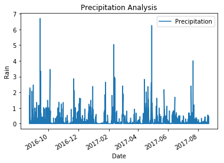
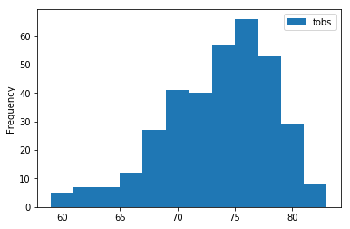
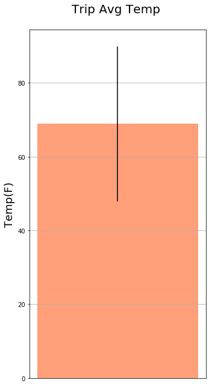
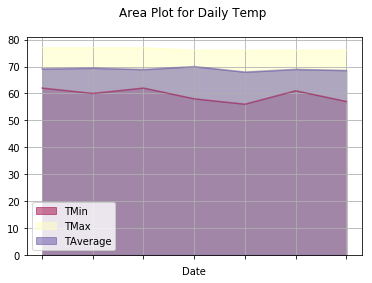

```python
# Python SQL toolkit and Object Relational Mapper
import sqlalchemy
from sqlalchemy.ext.automap import automap_base
from sqlalchemy.orm import Session
from sqlalchemy import create_engine
import pandas as pd
import matplotlib.pyplot as plt
```


```python
engine = create_engine('sqlite:///hawaii.sqlite')
```


```python
# Declare a Base using `automap_base()`
Base = automap_base()
```


```python
# Use the Base class to reflect the database tables
Base.prepare(engine, reflect=True)
```


```python
# Print all of the classes mapped to the Base
Base.classes.keys()
```


    ['measurement', 'station']


```python
# Reference to classes 
Station = Base.classes.station
Measurement = Base.classes.measurement
session = Session(engine)
```

# Precipitation Analysis


```python
#Finding the lastest data value stored in the database
lastestdate = session.query(Measurement.date).order_by(Measurement.date.desc()).first()
lastestdate[0]
```


    '2017-08-23'


```python
from sqlalchemy.sql import func
import datetime as datetime
from dateutil.relativedelta import relativedelta
```


```python
#Finding the last 12 months(a year) based on the lastest date above
last12months = datetime.datetime.strptime(lastestdate[0],"%Y-%m-%d").date()-datetime.timedelta(days=365)
last12months
```


    datetime.date(2016, 8, 23)


```python
#Retrieve data with this period(a year)
yeardata = session.query(Measurement.date,Measurement.prcp).filter(Measurement.date.between(last12months,lastestdate[0])).all()
yeardata
```


    [('2016-08-23', 0.0),
     ('2016-08-24', 0.08),
     ('2016-08-25', 0.08),
     ('2016-08-26', 0.0),
     ('2016-08-27', 0.0),
     ('2016-08-28', 0.01),
     ('2016-08-29', 0.0),
     ('2016-08-30', 0.0),
     ('2016-08-31', 0.13),
     ('2016-09-01', 0.0),
     ('2016-09-02', 0.0),
     ('2016-09-03', 0.0),
     ('2016-09-04', 0.03),
     ('2016-09-05', 0.0),
     ('2016-09-06', 0.0),
     ('2016-09-07', 0.05),
     ('2016-09-08', 0.0),
     ('2016-09-09', 0.03),
     ('2016-09-10', 0.0),
     ('2016-09-11', 0.05),
     ('2016-09-12', 0.0),
     ('2016-09-13', 0.02),
     ('2016-09-14', 1.32),
     ('2016-09-15', 0.42),
     ('2016-09-16', 0.06),
     ('2016-09-17', 0.05),
     ('2016-09-18', 0.0),
     ('2016-09-19', 0.0),
     ('2016-09-20', 0.0),
     ('2016-09-21', 0.0),
     ('2016-09-22', 0.02),
     ('2016-09-23', 0.0),
     ('2016-09-24', 0.0),
     ('2016-09-25', 0.0),
     ('2016-09-26', 0.06),
     ('2016-09-27', 0.02),
     ('2016-09-28', 0.0),
     ('2016-09-29', 0.0),
     ('2016-09-30', 0.0),
     ('2016-10-01', 0.0),
     ('2016-10-02', 0.0),
     ('2016-10-03', 0.0),
     ('2016-10-04', 0.0),
     ('2016-10-05', 0.0),
     ('2016-10-06', 0.0),
     ('2016-10-07', 0.0),
     ('2016-10-08', 0.0),
     ('2016-10-09', 0.0),
     ('2016-10-10', 0.0),
     ('2016-10-11', 0.0),
     ('2016-10-12', 0.0),
     ('2016-10-13', 0.0),
     ('2016-10-14', 0.0),
     ('2016-10-15', 0.0),
     ('2016-10-16', 0.0),
     ('2016-10-17', 0.01),
     ('2016-10-18', 0.0),
     ('2016-10-19', 0.0),
     ('2016-10-20', 0.0),
     ('2016-10-21', 0.05),
     ('2016-10-22', 0.15),
     ('2016-10-23', 0.01),
     ('2016-10-24', 0.0),
     ('2016-10-25', 0.03),
     ('2016-10-26', 0.0),
     ('2016-10-27', 0.0),
     ('2016-10-28', 0.0),
     ('2016-10-29', 0.0),
     ('2016-10-30', 0.24),
     ('2016-10-31', 0.03),
     ('2016-11-01', 0.0),
     ('2016-11-02', 0.0),
     ('2016-11-03', 0.0),
     ('2016-11-04', 0.0),
     ('2016-11-05', 0.0),
     ('2016-11-06', 0.0),
     ('2016-11-07', 0.0),
     ('2016-11-08', 0.07),
     ('2016-11-09', 0.0),
     ('2016-11-10', 0.0),
     ('2016-11-11', 0.0),
     ('2016-11-12', 0.0),
     ('2016-11-13', 0.0),
     ('2016-11-14', 0.0),
     ('2016-11-15', 0.0),
     ('2016-11-16', 0.0),
     ('2016-11-17', 0.0),
     ('2016-11-18', 0.0),
     ('2016-11-19', 0.03),
     ('2016-11-20', 0.05),
     ('2016-11-21', 0.01),
     ('2016-11-22', 0.13),
     ('2016-11-23', 0.14),
     ('2016-11-24', 0.05),
     ('2016-11-25', 0.05),
     ('2016-11-26', 0.05),
     ('2016-11-27', 0.0),
     ('2016-11-28', 0.01),
     ('2016-11-29', 0.0),
     ('2016-11-30', 0.14),
     ('2016-12-01', 0.12),
     ('2016-12-02', 0.03),
     ('2016-12-03', 0.0),
     ('2016-12-04', 0.03),
     ('2016-12-05', 0.43),
     ('2016-12-06', 0.02),
     ('2016-12-07', 0.0),
     ('2016-12-08', 0.03),
     ('2016-12-09', 0.52),
     ('2016-12-10', 0.05),
     ('2016-12-11', 0.04),
     ('2016-12-12', 0.01),
     ('2016-12-13', 0.05),
     ('2016-12-14', 0.03),
     ('2016-12-15', 0.0),
     ('2016-12-16', 0.0),
     ('2016-12-17', 0.01),
     ('2016-12-18', 0.13),
     ('2016-12-19', 0.01),
     ('2016-12-20', 0.0),
     ('2016-12-21', 0.0),
     ('2016-12-22', 0.01),
     ('2016-12-23', 0.01),
     ('2016-12-24', 0.01),
     ('2016-12-25', 0.0),
     ('2016-12-26', 0.02),
     ('2016-12-27', 0.0),
     ('2016-12-28', 0.02),
     ('2016-12-29', 0.04),
     ('2016-12-30', 0.12),
     ('2016-12-31', 0.01),
     ('2017-01-01', 0.0),
     ('2017-01-02', 0.0),
     ('2017-01-03', 0.0),
     ('2017-01-04', 0.0),
     ('2017-01-05', 0.0),
     ('2017-01-06', 0.0),
     ('2017-01-07', 0.0),
     ('2017-01-08', 0.0),
     ('2017-01-09', 0.0),
     ('2017-01-10', 0.0),
     ('2017-01-11', 0.0),
     ('2017-01-12', 0.0),
     ('2017-01-13', 0.0),
     ('2017-01-14', 0.0),
     ('2017-01-15', 0.0),
     ('2017-01-16', 0.0),
     ('2017-01-17', 0.0),
     ('2017-01-18', 0.0),
     ('2017-01-19', 0.0),
     ('2017-01-20', 0.0),
     ('2017-01-21', 0.0),
     ('2017-01-22', 0.16),
     ('2017-01-23', 0.0),
     ('2017-01-24', 0.04),
     ('2017-01-25', 0.03),
     ('2017-01-26', 0.0),
     ('2017-01-27', 0.0),
     ('2017-01-28', 0.0),
     ('2017-01-29', 0.18),
     ('2017-01-30', 0.0),
     ('2017-01-31', 0.0),
     ('2017-02-01', 0.0),
     ('2017-02-02', 0.0),
     ('2017-02-03', 0.0),
     ('2017-02-04', 0.0),
     ('2017-02-05', 0.0),
     ('2017-02-06', 0.0),
     ('2017-02-07', 0.51),
     ('2017-02-08', 0.0),
     ('2017-02-09', 0.0),
     ('2017-02-10', 0.0),
     ('2017-02-11', 0.31),
     ('2017-02-12', 2.62),
     ('2017-02-13', 0.01),
     ('2017-02-14', 0.0),
     ('2017-02-15', 0.0),
     ('2017-02-16', 0.07),
     ('2017-02-17', 0.0),
     ('2017-02-18', 0.0),
     ('2017-02-19', 0.0),
     ('2017-02-20', 0.0),
     ('2017-02-21', 0.06),
     ('2017-02-22', 0.06),
     ('2017-02-23', 0.01),
     ('2017-02-24', 0.0),
     ('2017-02-25', 0.03),
     ('2017-02-26', 0.0),
     ('2017-02-27', 0.0),
     ('2017-02-28', 0.0),
     ('2017-03-01', 1.19),
     ('2017-03-02', 0.73),
     ('2017-03-03', 0.47),
     ('2017-03-04', 0.0),
     ('2017-03-05', 0.35),
     ('2017-03-06', 0.0),
     ('2017-03-07', 0.0),
     ('2017-03-08', 0.0),
     ('2017-03-09', 0.0),
     ('2017-03-10', 0.0),
     ('2017-03-11', 0.0),
     ('2017-03-12', 0.0),
     ('2017-03-13', 0.0),
     ('2017-03-14', 0.0),
     ('2017-03-15', 0.0),
     ('2017-03-16', 0.0),
     ('2017-03-17', 0.0),
     ('2017-03-18', 0.0),
     ('2017-03-19', 0.0),
     ('2017-03-20', 0.0),
     ('2017-03-21', 0.0),
     ('2017-03-22', 0.0),
     ('2017-03-23', 0.0),
     ('2017-03-24', 0.02),
     ('2017-03-25', 0.0),
     ('2017-03-26', 0.0),
     ('2017-03-27', 0.0),
     ('2017-03-28', 0.0),
     ('2017-03-29', 0.0),
     ('2017-03-30', 0.0),
     ('2017-03-31', 0.0),
     ('2017-04-01', 0.0),
     ('2017-04-02', 0.0),
     ('2017-04-03', 0.0),
     ('2017-04-04', 0.0),
     ('2017-04-05', 0.0),
     ('2017-04-06', 0.0),
     ('2017-04-07', 0.0),
     ('2017-04-08', 0.0),
     ('2017-04-09', 0.0),
     ('2017-04-10', 0.0),
     ('2017-04-11', 0.0),
     ('2017-04-12', 0.0),
     ('2017-04-13', 0.0),
     ('2017-04-14', 0.26),
     ('2017-04-15', 0.01),
     ('2017-04-16', 0.0),
     ('2017-04-17', 0.02),
     ('2017-04-18', 0.0),
     ('2017-04-19', 0.02),
     ('2017-04-20', 0.05),
     ('2017-04-21', 0.23),
     ('2017-04-22', 0.32),
     ('2017-04-23', 0.03),
     ('2017-04-24', 0.0),
     ('2017-04-25', 0.0),
     ('2017-04-26', 0.0),
     ('2017-04-27', 0.0),
     ('2017-04-28', 0.0),
     ('2017-04-29', 0.12),
     ('2017-04-30', 0.89),
     ('2017-05-01', 0.26),
     ('2017-05-02', 0.0),
     ('2017-05-03', 0.0),
     ('2017-05-04', 0.0),
     ('2017-05-05', 0.0),
     ('2017-05-06', 0.0),
     ('2017-05-07', 0.0),
     ('2017-05-08', 0.0),
     ('2017-05-10', 0.0),
     ('2017-05-11', 0.01),
     ('2017-05-12', 0.0),
     ('2017-05-13', 0.0),
     ('2017-05-14', 0.0),
     ('2017-05-15', 0.05),
     ('2017-05-16', 0.01),
     ('2017-05-17', 0.0),
     ('2017-05-18', 0.01),
     ('2017-05-19', 0.0),
     ('2017-05-20', 0.0),
     ('2017-05-21', 0.0),
     ('2017-05-22', 0.0),
     ('2017-05-23', 0.08),
     ('2017-05-24', 0.13),
     ('2017-05-25', 0.15),
     ('2017-05-27', 0.01),
     ('2017-05-28', 0.02),
     ('2017-05-29', 0.0),
     ('2017-05-30', 0.26),
     ('2017-05-31', 0.02),
     ('2017-06-01', 0.0),
     ('2017-06-02', 0.0),
     ('2017-06-03', 0.02),
     ('2017-06-04', 0.0),
     ('2017-06-05', 0.0),
     ('2017-06-06', 0.0),
     ('2017-06-07', 0.0),
     ('2017-06-08', 0.0),
     ('2017-06-09', 0.0),
     ('2017-06-10', 0.04),
     ('2017-06-11', 0.08),
     ('2017-06-12', 0.02),
     ('2017-06-13', 0.0),
     ('2017-06-14', 0.0),
     ('2017-06-15', 0.0),
     ('2017-06-16', 0.0),
     ('2017-06-17', 0.0),
     ('2017-06-18', 0.05),
     ('2017-06-19', 0.0),
     ('2017-06-20', 0.02),
     ('2017-06-21', 0.0),
     ('2017-06-22', 0.0),
     ('2017-06-23', 0.0),
     ('2017-06-24', 0.06),
     ('2017-06-25', 0.0),
     ('2017-06-26', 0.0),
     ('2017-06-27', 0.0),
     ('2017-06-28', 0.0),
     ('2017-06-29', 0.0),
     ('2017-06-30', 0.08),
     ('2017-07-01', 0.02),
     ('2017-07-02', 0.02),
     ('2017-07-03', 0.04),
     ('2017-07-04', 0.04),
     ('2017-07-05', 0.0),
     ('2017-07-06', 0.0),
     ('2017-07-07', 0.0),
     ('2017-07-08', 0.0),
     ('2017-07-09', 0.0),
     ('2017-07-10', 0.0),
     ('2017-07-11', 0.0),
     ('2017-07-12', 0.0),
     ('2017-07-13', 0.07),
     ('2017-07-14', 0.02),
     ('2017-07-15', 0.0),
     ('2017-07-16', 0.02),
     ('2017-07-17', 0.03),
     ('2017-07-18', 0.05),
     ('2017-07-20', 0.03),
     ('2017-07-21', 0.0),
     ('2017-07-22', 0.03),
     ('2017-07-23', 0.0),
     ('2017-07-24', 0.05),
     ('2017-07-25', 0.0),
     ('2017-07-26', 0.0),
     ('2017-07-27', 0.0),
     ('2017-07-28', 0.0),
     ('2017-07-29', 0.0),
     ('2017-07-30', 0.0),
     ('2017-07-31', 0.0),
     ('2017-08-01', 0.02),
     ('2017-08-02', 0.0),
     ('2017-08-03', 0.0),
     ('2017-08-04', 0.02),
     ('2017-08-05', 0.0),
     ('2017-08-06', 0.0),
     ('2017-08-07', 0.0),
     ('2017-08-08', 0.0),
     ('2017-08-09', 0.0),
     ('2017-08-10', 0.0),
     ('2017-08-11', 0.0),
     ('2017-08-12', 0.0),
     ('2017-08-13', 0.0),
     ('2017-08-14', 0.0),
     ('2017-08-15', 0.02),
     ('2017-08-18', 0.0),
     ('2017-08-19', 0.0),
     ('2017-08-20', 0.0),
     ('2017-08-21', 0.0),
     ('2017-08-22', 0.0),
     ('2017-08-23', 0.0),
     ('2016-08-23', 0.15),
     ('2016-08-24', 2.15),
     ('2016-08-25', 0.08),
     ('2016-08-26', 0.03),
     ('2016-08-27', 0.18),
     ('2016-08-28', 0.14),
     ('2016-08-29', 0.17),
     ('2016-08-30', 0.0),
     ('2016-08-31', 0.1),
     ('2016-09-01', 0.0),
     ('2016-09-02', 0.02),
     ('2016-09-03', 0.07),
     ('2016-09-04', 0.03),
     ('2016-09-05', 0.11),
     ('2016-09-06', 0.05),
     ('2016-09-07', 0.1),
     ('2016-09-08', 0.22),
     ('2016-09-09', 0.01),
     ('2016-09-10', 0.01),
     ('2016-09-11', 0.18),
     ('2016-09-12', 0.04),
     ('2016-09-13', 0.37),
     ('2016-09-14', 0.9),
     ('2016-09-15', 0.12),
     ('2016-09-16', 0.01),
     ('2016-09-17', 0.04),
     ('2016-09-18', 0.0),
     ('2016-09-19', 0.01),
     ('2016-09-20', 0.09),
     ('2016-09-21', 0.06),
     ('2016-09-22', 0.09),
     ('2016-09-23', 0.15),
     ('2016-09-24', 0.0),
     ('2016-09-25', 0.02),
     ('2016-09-26', 0.06),
     ('2016-09-27', 0.12),
     ('2016-09-28', 0.08),
     ('2016-09-29', 0.49),
     ('2016-09-30', 0.31),
     ('2016-10-01', 0.14),
     ('2016-10-02', 0.02),
     ('2016-10-03', 0.04),
     ('2016-10-04', 0.0),
     ('2016-10-05', 0.0),
     ('2016-10-06', 0.05),
     ('2016-10-07', 0.0),
     ('2016-10-08', 0.0),
     ('2016-10-09', 0.0),
     ('2016-10-10', 0.0),
     ('2016-10-11', 0.02),
     ('2016-10-12', 0.03),
     ('2016-10-13', 0.0),
     ('2016-10-14', 0.0),
     ('2016-10-15', 0.0),
     ('2016-10-16', 0.0),
     ('2016-10-17', 0.03),
     ('2016-10-18', 0.05),
     ('2016-10-19', 0.06),
     ('2016-10-20', 0.0),
     ('2016-10-21', 0.15),
     ('2016-10-22', 0.1),
     ('2016-10-23', 0.01),
     ('2016-10-24', 0.0),
     ('2016-10-25', 0.04),
     ('2016-10-26', 0.06),
     ('2016-10-27', 0.11),
     ('2016-10-28', 0.02),
     ('2016-10-29', 0.02),
     ('2016-10-30', 0.1),
     ('2016-10-31', 0.03),
     ('2016-11-01', 0.01),
     ('2016-11-02', 0.0),
     ('2016-11-03', 0.0),
     ('2016-11-04', 0.0),
     ('2016-11-05', 0.02),
     ('2016-11-06', 0.02),
     ('2016-11-07', 0.0),
     ('2016-11-08', 0.14),
     ('2016-11-09', 0.08),
     ('2016-11-10', 0.0),
     ('2016-11-11', 0.0),
     ('2016-11-12', 0.0),
     ('2016-11-13', 0.0),
     ('2016-11-14', 0.06),
     ('2016-11-15', 0.0),
     ('2016-11-16', 0.14),
     ('2016-11-17', 0.03),
     ('2016-11-18', 0.01),
     ('2016-11-19', 0.11),
     ('2016-11-20', 0.11),
     ('2016-11-21', 0.02),
     ('2016-11-22', 0.41),
     ('2016-11-23', 0.03),
     ('2016-11-24', 0.2),
     ('2016-11-25', 0.05),
     ('2016-11-26', 0.05),
     ('2016-11-27', 0.06),
     ('2016-11-28', 0.02),
     ('2016-11-29', 0.04),
     ('2016-11-30', 0.05),
     ('2016-12-01', 0.33),
     ('2016-12-02', 0.3),
     ('2016-12-03', 0.04),
     ('2016-12-04', 0.1),
     ('2016-12-05', 0.34),
     ('2016-12-06', 0.02),
     ('2016-12-07', 0.17),
     ('2016-12-08', 0.03),
     ('2016-12-09', 0.34),
     ('2016-12-10', 0.02),
     ('2016-12-11', 0.02),
     ('2016-12-12', 0.01),
     ('2016-12-13', 0.1),
     ('2016-12-14', 0.05),
     ('2016-12-15', 0.02),
     ('2016-12-16', 0.01),
     ('2016-12-17', 0.11),
     ('2016-12-18', 0.29),
     ('2016-12-19', 0.21),
     ('2016-12-20', 0.02),
     ('2016-12-21', 0.03),
     ('2016-12-22', 0.17),
     ('2016-12-23', 0.1),
     ('2016-12-24', 0.14),
     ('2016-12-25', 0.03),
     ('2016-12-26', 0.26),
     ('2016-12-27', 0.03),
     ('2016-12-28', 0.09),
     ('2016-12-29', 0.18),
     ('2016-12-30', 0.21),
     ('2016-12-31', 0.62),
     ('2017-01-01', 0.29),
     ('2017-01-02', 0.0),
     ('2017-01-03', 0.0),
     ('2017-01-04', 0.0),
     ('2017-01-05', 0.0),
     ('2017-01-06', 0.0),
     ('2017-01-07', 0.06),
     ('2017-01-08', 0.0),
     ('2017-01-09', 0.0),
     ('2017-01-10', 0.0),
     ('2017-01-11', 0.0),
     ('2017-01-12', 0.0),
     ('2017-01-13', 0.0),
     ('2017-01-14', 0.0),
     ('2017-01-15', 0.0),
     ('2017-01-16', 0.0),
     ('2017-01-17', 0.0),
     ('2017-01-18', 0.0),
     ('2017-01-19', 0.0),
     ('2017-01-20', 0.0),
     ('2017-01-21', 0.04),
     ('2017-01-22', 0.01),
     ('2017-01-23', 0.08),
     ('2017-01-24', 0.15),
     ('2017-01-25', 0.12),
     ('2017-01-26', 0.0),
     ('2017-01-27', 0.0),
     ('2017-01-28', 0.14),
     ('2017-01-29', 0.0),
     ('2017-01-30', 0.0),
     ('2017-01-31', 0.0),
     ('2017-02-01', 0.0),
     ('2017-02-02', 0.0),
     ('2017-02-03', 0.0),
     ('2017-02-04', 0.0),
     ('2017-02-05', 0.0),
     ('2017-02-06', 0.16),
     ('2017-02-07', 1.08),
     ('2017-02-08', 1.08),
     ('2017-02-09', 0.02),
     ('2017-02-10', 0.0),
     ('2017-02-11', 1.0),
     ('2017-02-12', 1.07),
     ('2017-02-13', 2.9),
     ('2017-02-14', 0.0),
     ('2017-02-15', 0.0),
     ('2017-02-16', 0.0),
     ('2017-02-17', 0.8),
     ('2017-02-18', 0.0),
     ('2017-02-19', 0.0),
     ('2017-02-20', 0.0),
     ('2017-02-21', 0.0),
     ('2017-02-22', 0.06),
     ('2017-02-23', 0.0),
     ('2017-02-24', 0.0),
     ('2017-02-25', 0.0),
     ('2017-02-26', 0.0),
     ('2017-02-27', 0.0),
     ('2017-02-28', 0.16),
     ('2017-03-01', 2.2),
     ('2017-03-02', 1.45),
     ('2017-03-03', 0.54),
     ('2017-03-04', 0.0),
     ('2017-03-05', 0.1),
     ('2017-03-06', 0.51),
     ('2017-03-07', 0.0),
     ('2017-03-08', 0.0),
     ('2017-03-09', 0.8),
     ('2017-03-10', 0.13),
     ('2017-03-11', 0.03),
     ('2017-03-12', 0.0),
     ('2017-03-13', 0.0),
     ('2017-03-14', 0.0),
     ('2017-03-15', 0.0),
     ('2017-03-16', 0.0),
     ('2017-03-17', 0.19),
     ('2017-03-18', 0.0),
     ('2017-03-19', 0.0),
     ('2017-03-20', 0.0),
     ('2017-03-21', 0.0),
     ('2017-03-22', 0.0),
     ('2017-03-23', 0.0),
     ('2017-03-24', 0.6),
     ('2017-03-25', 0.13),
     ('2017-03-26', 0.0),
     ('2017-03-27', 0.0),
     ('2017-03-28', 0.03),
     ('2017-03-29', 0.0),
     ('2017-03-30', 0.08),
     ('2017-03-31', 0.0),
     ('2017-04-01', 0.0),
     ('2017-04-02', 0.0),
     ('2017-04-03', 0.08),
     ('2017-04-04', 0.04),
     ('2017-04-05', 0.04),
     ('2017-04-06', 0.0),
     ('2017-04-07', 0.0),
     ('2017-04-08', 0.0),
     ('2017-04-09', 0.0),
     ('2017-04-10', 0.01),
     ('2017-04-11', 0.03),
     ('2017-04-12', 0.03),
     ('2017-04-13', 0.27),
     ('2017-04-14', 0.69),
     ('2017-04-15', 0.45),
     ('2017-04-16', 0.49),
     ('2017-04-17', 0.41),
     ('2017-04-18', 0.08),
     ('2017-04-19', 0.02),
     ('2017-04-20', 0.33),
     ('2017-04-21', 1.16),
     ('2017-04-22', 1.01),
     ('2017-04-23', 0.02),
     ('2017-04-24', 0.0),
     ('2017-04-25', 0.0),
     ('2017-04-26', 0.0),
     ('2017-04-27', 0.1),
     ('2017-04-28', 2.6),
     ('2017-04-29', 0.35),
     ('2017-04-30', 1.21),
     ('2017-05-01', 0.07),
     ('2017-05-02', 0.03),
     ('2017-05-03', 0.01),
     ('2017-05-04', 0.0),
     ('2017-05-05', 0.0),
     ('2017-05-06', 0.0),
     ('2017-05-07', 0.07),
     ('2017-05-08', 0.22),
     ('2017-05-09', 1.62),
     ('2017-05-10', 0.05),
     ('2017-05-11', 0.03),
     ('2017-05-12', 0.04),
     ('2017-05-13', 0.02),
     ('2017-05-14', 0.05),
     ('2017-05-15', 0.08),
     ('2017-05-16', 0.03),
     ('2017-05-17', 0.02),
     ('2017-05-18', 0.09),
     ('2017-05-19', 0.02),
     ('2017-05-20', 0.0),
     ('2017-05-21', 0.0),
     ('2017-05-22', 0.0),
     ('2017-05-23', 0.02),
     ('2017-05-24', 0.58),
     ('2017-05-25', 0.37),
     ('2017-05-26', 0.02),
     ('2017-05-27', 0.0),
     ('2017-05-28', 0.29),
     ('2017-05-29', 0.02),
     ('2017-05-30', 0.2),
     ('2017-05-31', 0.1),
     ('2017-06-01', 0.03),
     ('2017-06-02', 0.1),
     ('2017-06-03', 0.2),
     ('2017-06-04', 0.15),
     ('2017-06-05', 0.0),
     ('2017-06-06', 0.0),
     ('2017-06-07', 0.0),
     ('2017-06-08', 0.02),
     ('2017-06-09', 0.02),
     ('2017-06-10', 0.21),
     ('2017-06-11', 0.24),
     ('2017-06-12', 0.19),
     ('2017-06-13', 0.36),
     ('2017-06-14', 0.27),
     ('2017-06-15', 0.17),
     ('2017-06-16', 0.02),
     ('2017-06-17', 0.35),
     ('2017-06-18', 0.25),
     ('2017-06-19', 0.05),
     ('2017-06-20', 0.05),
     ('2017-06-21', 0.02),
     ('2017-06-22', 0.1),
     ('2017-06-23', 0.0),
     ('2017-06-24', 0.0),
     ('2017-06-25', 0.08),
     ('2017-06-26', 0.02),
     ('2017-06-27', 0.0),
     ('2017-06-28', 0.01),
     ('2017-06-29', 0.03),
     ('2017-06-30', 0.04),
     ('2017-07-01', 0.06),
     ('2017-07-02', 0.05),
     ('2017-07-03', 0.13),
     ('2017-07-04', 0.03),
     ('2017-07-05', 0.0),
     ('2017-07-06', 0.0),
     ('2017-07-07', 0.02),
     ('2017-07-08', 0.02),
     ('2017-07-09', 0.09),
     ('2017-07-10', 0.0),
     ('2017-07-11', 0.01),
     ('2017-07-12', 0.01),
     ('2017-07-13', 0.33),
     ('2017-07-14', 0.05),
     ('2017-07-15', 0.03),
     ('2017-07-16', 0.07),
     ('2017-07-17', 0.12),
     ('2017-07-18', 0.03),
     ('2017-07-19', 0.0),
     ('2017-07-20', 0.12),
     ('2017-07-21', 0.0),
     ('2017-07-22', 0.07),
     ('2017-07-23', 0.06),
     ('2017-07-24', 0.58),
     ('2017-07-25', 0.03),
     ('2017-07-26', 0.06),
     ('2017-07-27', 0.0),
     ('2017-07-28', 0.13),
     ('2017-07-29', 0.06),
     ('2017-07-30', 0.0),
     ('2017-07-31', 0.0),
     ('2016-08-23', 0.05),
     ('2016-08-24', 2.28),
     ('2016-08-25', 0.0),
     ('2016-08-26', 0.02),
     ('2016-08-27', 0.02),
     ('2016-08-28', 0.14),
     ('2016-08-29', 0.04),
     ('2016-08-31', 0.0),
     ('2016-09-01', 0.0),
     ('2016-09-02', 0.19),
     ('2016-09-05', 0.0),
     ('2016-09-06', 0.04),
     ('2016-09-07', 0.23),
     ('2016-09-08', 0.01),
     ('2016-09-09', 0.29),
     ('2016-09-12', 0.0),
     ('2016-09-13', 0.32),
     ('2016-09-14', 1.84),
     ('2016-09-15', 0.07),
     ('2016-09-16', 0.07),
     ('2016-09-19', 0.0),
     ('2016-09-20', 0.25),
     ('2016-09-21', 0.02),
     ('2016-09-22', 0.17),
     ('2016-09-23', 0.15),
     ('2016-09-24', 0.0),
     ('2016-09-25', 0.0),
     ('2016-09-26', 0.02),
     ('2016-09-27', 0.0),
     ('2016-09-28', 0.0),
     ('2016-09-29', 0.2),
     ('2016-09-30', 0.06),
     ('2016-10-01', 0.08),
     ('2016-10-02', 0.03),
     ('2016-10-03', 0.03),
     ('2016-10-04', 0.0),
     ('2016-10-05', 0.0),
     ('2016-10-06', 0.0),
     ('2016-10-07', 0.0),
     ('2016-10-10', 0.0),
     ('2016-10-11', 0.04),
     ('2016-10-12', 0.0),
     ('2016-10-13', 0.02),
     ('2016-10-14', 0.0),
     ('2016-10-15', 0.02),
     ('2016-10-17', 0.0),
     ('2016-10-18', 0.03),
     ('2016-10-19', 0.0),
     ('2016-10-20', 0.01),
     ('2016-10-21', 0.03),
     ('2016-10-23', 0.0),
     ('2016-10-24', 0.01),
     ('2016-10-25', 0.0),
     ('2016-10-27', 0.2),
     ('2016-10-28', 0.07),
     ('2016-10-29', 0.26),
     ('2016-10-30', 0.14),
     ('2016-10-31', 0.0),
     ('2016-11-01', 0.0),
     ('2016-11-02', 0.0),
     ('2016-11-03', 0.0),
     ('2016-11-04', 0.0),
     ('2016-11-05', 0.0),
     ('2016-11-06', 0.0),
     ('2016-11-07', 0.13),
     ('2016-11-08', 0.02),
     ('2016-11-09', 0.17),
     ('2016-11-10', 0.0),
     ('2016-11-11', 0.0),
     ('2016-11-12', 0.0),
     ('2016-11-13', 0.0),
     ('2016-11-14', 0.05),
     ('2016-11-15', 0.0),
     ('2016-11-16', 0.18),
     ('2016-11-17', 0.0),
     ('2016-11-22', 0.0),
     ('2016-11-25', 0.0),
     ('2016-11-26', 0.02),
     ('2016-11-27', 0.03),
     ('2016-11-28', 0.0),
     ('2016-11-29', 0.04),
     ('2016-11-30', 0.03),
     ('2016-12-01', 0.07),
     ('2016-12-02', 0.4),
     ('2016-12-03', 0.26),
     ('2016-12-04', 0.0),
     ('2016-12-05', 0.2),
     ('2016-12-07', 0.0),
     ('2016-12-08', 0.02),
     ('2016-12-09', 0.26),
     ('2016-12-10', 0.0),
     ('2016-12-12', 0.0),
     ('2016-12-13', 0.34),
     ('2016-12-14', 0.12),
     ('2016-12-15', 0.07),
     ('2016-12-16', 0.0),
     ('2016-12-17', 0.0),
     ('2016-12-18', 0.04),
     ('2016-12-19', 0.0),
     ('2016-12-20', 0.0),
     ('2016-12-21', 0.09),
     ('2016-12-22', 0.05),
     ('2016-12-23', 0.03),
     ('2016-12-24', 0.13),
     ('2016-12-26', 0.0),
     ('2016-12-27', 0.02),
     ('2016-12-28', 0.01),
     ('2016-12-29', 0.56),
     ('2016-12-30', 0.29),
     ('2016-12-31', 0.36),
     ('2017-01-01', 0.0),
     ('2017-01-02', 0.01),
     ('2017-01-03', 0.0),
     ('2017-01-04', 0.0),
     ('2017-01-05', 0.0),
     ('2017-01-06', 0.59),
     ('2017-01-07', 0.0),
     ('2017-01-08', 0.03),
     ('2017-01-09', 0.0),
     ('2017-01-10', 0.0),
     ('2017-01-11', 0.0),
     ('2017-01-13', 0.0),
     ('2017-01-14', 0.0),
     ('2017-01-16', 0.0),
     ('2017-01-17', 0.0),
     ('2017-01-18', 0.0),
     ('2017-01-19', 0.0),
     ('2017-01-20', 0.0),
     ('2017-01-21', 0.02),
     ('2017-01-23', 0.0),
     ('2017-01-25', 0.0),
     ('2017-01-26', 0.01),
     ('2017-01-27', 0.0),
     ('2017-01-28', 0.0),
     ('2017-01-30', 0.0),
     ('2017-01-31', 0.0),
     ('2017-02-01', 0.0),
     ('2017-02-02', 0.0),
     ('2017-02-03', 0.0),
     ('2017-02-05', 0.0),
     ('2017-02-06', 0.04),
     ('2017-02-07', 0.9),
     ('2017-02-08', 0.0),
     ('2017-02-09', 0.0),
     ('2017-02-10', 0.0),
     ('2017-02-11', 2.39),
     ('2017-02-12', 1.91),
     ('2017-02-13', 0.0),
     ('2017-02-14', 0.0),
     ('2017-02-15', 0.0),
     ('2017-02-16', 0.62),
     ('2017-02-17', 0.06),
     ('2017-02-20', 0.0),
     ('2017-02-21', 0.0),
     ('2017-02-22', 0.11),
     ('2017-02-23', 0.0),
     ('2017-02-24', 0.0),
     ('2017-02-26', 0.0),
     ('2017-02-27', 0.0),
     ('2017-02-28', 0.04),
     ('2017-03-01', 1.12),
     ('2017-03-03', 0.0),
     ('2017-03-06', 0.0),
     ('2017-03-07', 0.0),
     ('2017-03-08', 0.0),
     ('2017-03-09', 0.5),
     ('2017-03-10', 0.13),
     ('2017-03-12', 0.0),
     ('2017-03-13', 0.0),
     ('2017-03-14', 0.0),
     ('2017-03-16', 0.0),
     ('2017-03-17', 0.06),
     ('2017-03-18', 0.0),
     ('2017-03-20', 0.0),
     ('2017-03-21', 0.0),
     ('2017-03-22', 0.0),
     ('2017-03-23', 0.0),
     ('2017-03-24', 0.15),
     ('2017-03-27', 0.0),
     ('2017-03-28', 0.0),
     ('2017-03-29', 0.03),
     ('2017-03-30', 0.03),
     ('2017-03-31', 0.0),
     ('2017-04-01', 0.0),
     ('2017-04-02', 0.0),
     ('2017-04-03', 0.09),
     ('2017-04-04', 0.0),
     ('2017-04-05', 0.07),
     ('2017-04-06', 0.0),
     ('2017-04-07', 0.0),
     ('2017-04-09', 0.0),
     ('2017-04-10', 0.0),
     ('2017-04-11', 0.16),
     ('2017-04-12', 0.29),
     ('2017-04-13', 0.0),
     ('2017-04-14', 0.29),
     ('2017-04-17', 0.0),
     ('2017-04-18', 0.12),
     ('2017-04-19', 0.0),
     ('2017-04-20', 0.0),
     ('2017-04-21', 1.05),
     ('2017-04-22', 0.7),
     ('2017-04-24', 0.0),
     ('2017-04-25', 0.0),
     ('2017-04-26', 0.14),
     ('2017-04-27', 0.02),
     ('2017-04-28', 0.09),
     ('2017-04-29', 0.95),
     ('2017-04-30', 1.17),
     ('2017-05-01', 0.03),
     ('2017-05-02', 0.01),
     ('2017-05-03', 0.01),
     ('2017-05-04', 0.08),
     ('2017-05-05', 0.28),
     ('2017-05-06', 0.06),
     ('2017-05-08', 0.95),
     ('2017-05-09', 0.52),
     ('2017-05-10', 0.0),
     ('2017-05-12', 0.0),
     ('2017-05-15', 0.0),
     ('2017-05-16', 0.05),
     ('2017-05-17', 0.0),
     ('2017-05-18', 0.16),
     ('2017-05-19', 0.01),
     ('2017-05-20', 0.01),
     ('2017-05-22', 0.0),
     ('2017-05-23', 0.11),
     ('2017-05-24', 0.1),
     ('2017-05-25', 0.07),
     ('2017-05-26', 0.0),
     ('2017-05-27', 0.0),
     ('2017-05-28', 0.02),
     ('2017-05-29', 0.0),
     ('2017-05-30', 0.04),
     ('2017-05-31', 0.0),
     ('2017-06-01', 0.0),
     ('2017-06-02', 0.15),
     ('2017-06-03', 0.16),
     ('2017-06-04', 0.05),
     ('2017-06-05', 0.02),
     ('2017-06-06', 0.0),
     ('2017-06-07', 0.0),
     ('2017-06-08', 0.01),
     ('2017-06-09', 0.0),
     ('2017-06-10', 0.53),
     ('2017-06-11', 0.14),
     ('2017-06-12', 0.35),
     ('2017-06-13', 0.1),
     ('2017-06-14', 0.21),
     ('2017-06-15', 0.3),
     ('2017-06-16', 0.02),
     ('2017-06-17', 0.02),
     ('2017-06-18', 0.18),
     ('2017-06-19', 0.19),
     ('2017-06-20', 0.17),
     ('2017-06-23', 0.0),
     ('2017-06-26', 0.0),
     ('2017-06-29', 0.0),
     ('2017-06-30', 0.0),
     ('2017-07-03', 0.0),
     ('2017-07-05', 0.0),
     ('2017-07-07', 0.0),
     ('2017-07-08', 0.06),
     ('2017-07-09', 0.0),
     ('2017-07-10', 0.0),
     ('2017-07-11', 0.0),
     ('2017-07-12', 0.02),
     ('2017-07-13', 0.3),
     ('2017-07-14', 0.0),
     ('2017-07-15', 0.01),
     ('2017-07-16', 0.12),
     ('2017-07-17', 0.16),
     ('2017-07-18', 0.0),
     ('2017-07-19', 0.09),
     ('2017-07-20', 0.0),
     ('2017-07-21', 0.0),
     ('2017-07-22', 0.12),
     ('2017-07-23', 0.07),
     ('2017-07-24', 1.19),
     ('2017-07-25', 0.12),
     ('2017-07-26', 0.02),
     ('2017-07-27', 0.0),
     ('2017-07-28', 0.14),
     ('2017-07-29', 0.02),
     ('2017-07-31', 0.0),
     ('2017-08-01', 0.12),
     ('2017-08-02', 0.05),
     ('2017-08-03', 0.01),
     ('2017-08-04', 0.04),
     ('2017-08-06', 0.0),
     ('2017-08-07', 0.0),
     ('2017-08-08', 0.1),
     ('2017-08-09', 0.0),
     ('2017-08-10', 0.0),
     ('2017-08-11', 0.0),
     ('2017-08-13', 0.0),
     ...]


```python
#Assignning the data to Dataframe and convert the Date column from String to Date format
df = pd.DataFrame(yeardata)
df['date'] = pd.to_datetime(df['date'])
df.head(20)
```


<div>
<style scoped>
    .dataframe tbody tr th:only-of-type {
        vertical-align: middle;
    }

    .dataframe tbody tr th {
        vertical-align: top;
    }

    .dataframe thead th {
        text-align: right;
    }
</style>
<table border="1" class="dataframe">
  <thead>
    <tr style="text-align: right;">
      <th></th>
      <th>date</th>
      <th>prcp</th>
    </tr>
  </thead>
  <tbody>
    <tr>
      <th>0</th>
      <td>2016-08-23</td>
      <td>0.00</td>
    </tr>
    <tr>
      <th>1</th>
      <td>2016-08-24</td>
      <td>0.08</td>
    </tr>
    <tr>
      <th>2</th>
      <td>2016-08-25</td>
      <td>0.08</td>
    </tr>
    <tr>
      <th>3</th>
      <td>2016-08-26</td>
      <td>0.00</td>
    </tr>
    <tr>
      <th>4</th>
      <td>2016-08-27</td>
      <td>0.00</td>
    </tr>
    <tr>
      <th>5</th>
      <td>2016-08-28</td>
      <td>0.01</td>
    </tr>
    <tr>
      <th>6</th>
      <td>2016-08-29</td>
      <td>0.00</td>
    </tr>
    <tr>
      <th>7</th>
      <td>2016-08-30</td>
      <td>0.00</td>
    </tr>
    <tr>
      <th>8</th>
      <td>2016-08-31</td>
      <td>0.13</td>
    </tr>
    <tr>
      <th>9</th>
      <td>2016-09-01</td>
      <td>0.00</td>
    </tr>
    <tr>
      <th>10</th>
      <td>2016-09-02</td>
      <td>0.00</td>
    </tr>
    <tr>
      <th>11</th>
      <td>2016-09-03</td>
      <td>0.00</td>
    </tr>
    <tr>
      <th>12</th>
      <td>2016-09-04</td>
      <td>0.03</td>
    </tr>
    <tr>
      <th>13</th>
      <td>2016-09-05</td>
      <td>0.00</td>
    </tr>
    <tr>
      <th>14</th>
      <td>2016-09-06</td>
      <td>0.00</td>
    </tr>
    <tr>
      <th>15</th>
      <td>2016-09-07</td>
      <td>0.05</td>
    </tr>
    <tr>
      <th>16</th>
      <td>2016-09-08</td>
      <td>0.00</td>
    </tr>
    <tr>
      <th>17</th>
      <td>2016-09-09</td>
      <td>0.03</td>
    </tr>
    <tr>
      <th>18</th>
      <td>2016-09-10</td>
      <td>0.00</td>
    </tr>
    <tr>
      <th>19</th>
      <td>2016-09-11</td>
      <td>0.05</td>
    </tr>
  </tbody>
</table>
</div>


```python
#Set date as index and plot out 
df.set_index(df['date'], inplace=True)
df.plot('date','prcp') 
plt.xticks(rotation=30)
plt.title("Precipitation Analysis")
plt.legend(["Precipitation"])
plt.xlabel("Date")
plt.ylabel("Rain")
plt.savefig("Precipition.png")
plt.show()

```





# Station Analysis


```python
#Count how many stations in Station table
stationcount = session.query(Station.station).count()
print(stationcount)
```

    9
    


```python
#List out stations with the most active stations in descending order
from sqlalchemy import func
stationcount1 = session.query(Station.station,func.count(Measurement.station)).filter(Measurement.station==Station.station).group_by(Measurement.station).order_by(func.count(Measurement.station).desc()).all()
stationcount1
```


    [('USC00519281', 2772),
     ('USC00519397', 2724),
     ('USC00513117', 2709),
     ('USC00519523', 2669),
     ('USC00516128', 2612),
     ('USC00514830', 2202),
     ('USC00511918', 1979),
     ('USC00517948', 1372),
     ('USC00518838', 511)]


```python
#Reused a year priod includes dates(lastestdate) above to come out list of temperatures for that period
last12temp = session.query(Measurement.station,Measurement.tobs).filter(Measurement.date.between(last12months,lastestdate[0])).filter(Measurement.station == stationcount1[0][0]).all()
last12temp
```


    [('USC00519281', 77),
     ('USC00519281', 77),
     ('USC00519281', 80),
     ('USC00519281', 80),
     ('USC00519281', 75),
     ('USC00519281', 73),
     ('USC00519281', 78),
     ('USC00519281', 77),
     ('USC00519281', 78),
     ('USC00519281', 80),
     ('USC00519281', 80),
     ('USC00519281', 78),
     ('USC00519281', 78),
     ('USC00519281', 78),
     ('USC00519281', 73),
     ('USC00519281', 74),
     ('USC00519281', 80),
     ('USC00519281', 79),
     ('USC00519281', 77),
     ('USC00519281', 80),
     ('USC00519281', 76),
     ('USC00519281', 79),
     ('USC00519281', 75),
     ('USC00519281', 79),
     ('USC00519281', 78),
     ('USC00519281', 79),
     ('USC00519281', 78),
     ('USC00519281', 78),
     ('USC00519281', 76),
     ('USC00519281', 74),
     ('USC00519281', 77),
     ('USC00519281', 78),
     ('USC00519281', 79),
     ('USC00519281', 79),
     ('USC00519281', 77),
     ('USC00519281', 80),
     ('USC00519281', 78),
     ('USC00519281', 78),
     ('USC00519281', 78),
     ('USC00519281', 77),
     ('USC00519281', 79),
     ('USC00519281', 79),
     ('USC00519281', 79),
     ('USC00519281', 79),
     ('USC00519281', 75),
     ('USC00519281', 76),
     ('USC00519281', 73),
     ('USC00519281', 72),
     ('USC00519281', 71),
     ('USC00519281', 77),
     ('USC00519281', 79),
     ('USC00519281', 78),
     ('USC00519281', 79),
     ('USC00519281', 77),
     ('USC00519281', 79),
     ('USC00519281', 77),
     ('USC00519281', 78),
     ('USC00519281', 78),
     ('USC00519281', 78),
     ('USC00519281', 78),
     ('USC00519281', 77),
     ('USC00519281', 74),
     ('USC00519281', 75),
     ('USC00519281', 76),
     ('USC00519281', 73),
     ('USC00519281', 76),
     ('USC00519281', 74),
     ('USC00519281', 77),
     ('USC00519281', 76),
     ('USC00519281', 76),
     ('USC00519281', 74),
     ('USC00519281', 75),
     ('USC00519281', 75),
     ('USC00519281', 75),
     ('USC00519281', 75),
     ('USC00519281', 71),
     ('USC00519281', 63),
     ('USC00519281', 70),
     ('USC00519281', 68),
     ('USC00519281', 67),
     ('USC00519281', 77),
     ('USC00519281', 74),
     ('USC00519281', 77),
     ('USC00519281', 76),
     ('USC00519281', 76),
     ('USC00519281', 75),
     ('USC00519281', 76),
     ('USC00519281', 75),
     ('USC00519281', 73),
     ('USC00519281', 75),
     ('USC00519281', 73),
     ('USC00519281', 75),
     ('USC00519281', 74),
     ('USC00519281', 75),
     ('USC00519281', 74),
     ('USC00519281', 75),
     ('USC00519281', 73),
     ('USC00519281', 75),
     ('USC00519281', 73),
     ('USC00519281', 73),
     ('USC00519281', 74),
     ('USC00519281', 70),
     ('USC00519281', 72),
     ('USC00519281', 70),
     ('USC00519281', 67),
     ('USC00519281', 67),
     ('USC00519281', 69),
     ('USC00519281', 70),
     ('USC00519281', 68),
     ('USC00519281', 69),
     ('USC00519281', 69),
     ('USC00519281', 66),
     ('USC00519281', 65),
     ('USC00519281', 68),
     ('USC00519281', 62),
     ('USC00519281', 75),
     ('USC00519281', 70),
     ('USC00519281', 69),
     ('USC00519281', 76),
     ('USC00519281', 76),
     ('USC00519281', 74),
     ('USC00519281', 73),
     ('USC00519281', 71),
     ('USC00519281', 74),
     ('USC00519281', 74),
     ('USC00519281', 72),
     ('USC00519281', 71),
     ('USC00519281', 72),
     ('USC00519281', 74),
     ('USC00519281', 69),
     ('USC00519281', 67),
     ('USC00519281', 72),
     ('USC00519281', 70),
     ('USC00519281', 64),
     ('USC00519281', 63),
     ('USC00519281', 63),
     ('USC00519281', 62),
     ('USC00519281', 70),
     ('USC00519281', 70),
     ('USC00519281', 62),
     ('USC00519281', 62),
     ('USC00519281', 63),
     ('USC00519281', 65),
     ('USC00519281', 69),
     ('USC00519281', 77),
     ('USC00519281', 70),
     ('USC00519281', 74),
     ('USC00519281', 69),
     ('USC00519281', 72),
     ('USC00519281', 71),
     ('USC00519281', 69),
     ('USC00519281', 71),
     ('USC00519281', 71),
     ('USC00519281', 72),
     ('USC00519281', 72),
     ('USC00519281', 69),
     ('USC00519281', 70),
     ('USC00519281', 66),
     ('USC00519281', 65),
     ('USC00519281', 69),
     ('USC00519281', 68),
     ('USC00519281', 68),
     ('USC00519281', 68),
     ('USC00519281', 59),
     ('USC00519281', 60),
     ('USC00519281', 70),
     ('USC00519281', 73),
     ('USC00519281', 75),
     ('USC00519281', 64),
     ('USC00519281', 59),
     ('USC00519281', 59),
     ('USC00519281', 62),
     ('USC00519281', 68),
     ('USC00519281', 70),
     ('USC00519281', 73),
     ('USC00519281', 79),
     ('USC00519281', 75),
     ('USC00519281', 65),
     ('USC00519281', 70),
     ('USC00519281', 74),
     ('USC00519281', 70),
     ('USC00519281', 70),
     ('USC00519281', 71),
     ('USC00519281', 71),
     ('USC00519281', 71),
     ('USC00519281', 69),
     ('USC00519281', 61),
     ('USC00519281', 67),
     ('USC00519281', 65),
     ('USC00519281', 72),
     ('USC00519281', 71),
     ('USC00519281', 73),
     ('USC00519281', 72),
     ('USC00519281', 77),
     ('USC00519281', 73),
     ('USC00519281', 67),
     ('USC00519281', 62),
     ('USC00519281', 64),
     ('USC00519281', 67),
     ('USC00519281', 66),
     ('USC00519281', 81),
     ('USC00519281', 69),
     ('USC00519281', 66),
     ('USC00519281', 67),
     ('USC00519281', 69),
     ('USC00519281', 66),
     ('USC00519281', 68),
     ('USC00519281', 65),
     ('USC00519281', 74),
     ('USC00519281', 69),
     ('USC00519281', 72),
     ('USC00519281', 73),
     ('USC00519281', 72),
     ('USC00519281', 71),
     ('USC00519281', 76),
     ('USC00519281', 77),
     ('USC00519281', 76),
     ('USC00519281', 74),
     ('USC00519281', 68),
     ('USC00519281', 73),
     ('USC00519281', 71),
     ('USC00519281', 74),
     ('USC00519281', 75),
     ('USC00519281', 70),
     ('USC00519281', 67),
     ('USC00519281', 71),
     ('USC00519281', 67),
     ('USC00519281', 74),
     ('USC00519281', 77),
     ('USC00519281', 78),
     ('USC00519281', 67),
     ('USC00519281', 70),
     ('USC00519281', 69),
     ('USC00519281', 69),
     ('USC00519281', 74),
     ('USC00519281', 78),
     ('USC00519281', 71),
     ('USC00519281', 67),
     ('USC00519281', 68),
     ('USC00519281', 67),
     ('USC00519281', 76),
     ('USC00519281', 69),
     ('USC00519281', 72),
     ('USC00519281', 76),
     ('USC00519281', 68),
     ('USC00519281', 72),
     ('USC00519281', 74),
     ('USC00519281', 70),
     ('USC00519281', 67),
     ('USC00519281', 72),
     ('USC00519281', 60),
     ('USC00519281', 65),
     ('USC00519281', 75),
     ('USC00519281', 70),
     ('USC00519281', 75),
     ('USC00519281', 70),
     ('USC00519281', 79),
     ('USC00519281', 75),
     ('USC00519281', 70),
     ('USC00519281', 67),
     ('USC00519281', 74),
     ('USC00519281', 70),
     ('USC00519281', 75),
     ('USC00519281', 76),
     ('USC00519281', 77),
     ('USC00519281', 74),
     ('USC00519281', 74),
     ('USC00519281', 74),
     ('USC00519281', 69),
     ('USC00519281', 68),
     ('USC00519281', 76),
     ('USC00519281', 74),
     ('USC00519281', 71),
     ('USC00519281', 71),
     ('USC00519281', 74),
     ('USC00519281', 74),
     ('USC00519281', 74),
     ('USC00519281', 74),
     ('USC00519281', 80),
     ('USC00519281', 74),
     ('USC00519281', 72),
     ('USC00519281', 75),
     ('USC00519281', 80),
     ('USC00519281', 76),
     ('USC00519281', 76),
     ('USC00519281', 77),
     ('USC00519281', 75),
     ('USC00519281', 75),
     ('USC00519281', 75),
     ('USC00519281', 75),
     ('USC00519281', 72),
     ('USC00519281', 74),
     ('USC00519281', 74),
     ('USC00519281', 74),
     ('USC00519281', 76),
     ('USC00519281', 74),
     ('USC00519281', 75),
     ('USC00519281', 73),
     ('USC00519281', 79),
     ('USC00519281', 75),
     ('USC00519281', 72),
     ('USC00519281', 72),
     ('USC00519281', 74),
     ('USC00519281', 72),
     ('USC00519281', 72),
     ('USC00519281', 77),
     ('USC00519281', 71),
     ('USC00519281', 73),
     ('USC00519281', 76),
     ('USC00519281', 77),
     ('USC00519281', 76),
     ('USC00519281', 76),
     ('USC00519281', 79),
     ('USC00519281', 81),
     ('USC00519281', 76),
     ('USC00519281', 78),
     ('USC00519281', 77),
     ('USC00519281', 74),
     ('USC00519281', 75),
     ('USC00519281', 78),
     ('USC00519281', 78),
     ('USC00519281', 69),
     ('USC00519281', 72),
     ('USC00519281', 74),
     ('USC00519281', 74),
     ('USC00519281', 76),
     ('USC00519281', 80),
     ('USC00519281', 80),
     ('USC00519281', 76),
     ('USC00519281', 76),
     ('USC00519281', 76),
     ('USC00519281', 77),
     ('USC00519281', 77),
     ('USC00519281', 77),
     ('USC00519281', 82),
     ('USC00519281', 75),
     ('USC00519281', 77),
     ('USC00519281', 75),
     ('USC00519281', 76),
     ('USC00519281', 81),
     ('USC00519281', 82),
     ('USC00519281', 81),
     ('USC00519281', 76),
     ('USC00519281', 77),
     ('USC00519281', 82),
     ('USC00519281', 83),
     ('USC00519281', 77),
     ('USC00519281', 77),
     ('USC00519281', 77),
     ('USC00519281', 76),
     ('USC00519281', 76),
     ('USC00519281', 79)]


```python
#Fetching the date into dataframe
dftemp = pd.DataFrame(last12temp)
dftemp.head()
```


<div>
<style scoped>
    .dataframe tbody tr th:only-of-type {
        vertical-align: middle;
    }

    .dataframe tbody tr th {
        vertical-align: top;
    }

    .dataframe thead th {
        text-align: right;
    }
</style>
<table border="1" class="dataframe">
  <thead>
    <tr style="text-align: right;">
      <th></th>
      <th>station</th>
      <th>tobs</th>
    </tr>
  </thead>
  <tbody>
    <tr>
      <th>0</th>
      <td>USC00519281</td>
      <td>77</td>
    </tr>
    <tr>
      <th>1</th>
      <td>USC00519281</td>
      <td>77</td>
    </tr>
    <tr>
      <th>2</th>
      <td>USC00519281</td>
      <td>80</td>
    </tr>
    <tr>
      <th>3</th>
      <td>USC00519281</td>
      <td>80</td>
    </tr>
    <tr>
      <th>4</th>
      <td>USC00519281</td>
      <td>75</td>
    </tr>
  </tbody>
</table>
</div>


```python
#Plot out with a histogram with `bins=12`
dftemp.plot.hist(bins=12)
plt.ylabel("Frequency")
plt.savefig("Histogramtemp.png")
plt.show()
```





# Temperature Analysis


```python
#Defining a function to calculate the minimum, average, and maximum temperatures for a specific range of dates.
def calc_temps(startday,endday):
    return session.query(func.min(Measurement.tobs),func.max(Measurement.tobs),func.avg(Measurement.tobs)).filter(Measurement.date.between(startday,endday)).all()
```


```python
#Set range of dates for the trip (only ta 3-15 days)
triptemp=calc_temps('2017-01-01','2017-01-17')
triptemp
```


    [(60, 81, 68.89108910891089)]


```python
#Plot out with bar chart with an errorbar is range of Max temperature and Min temp
fig, ax = plt.subplots(figsize=(5,9))
ax.bar(0,triptemp[0][2], yerr=triptemp[0][1]-triptemp[0][0], align='center', color='lightsalmon')
ax.set_title('Trip Avg Temp \n',fontsize=20)
ax.set_ylabel('Temp(F)',fontsize=18)
plt.xticks([])
plt.grid()
plt.tight_layout()
plt.savefig('triptemp.png')
plt.show()
```





# Optional Recommended Analysis


```python
#The rainfall per weather station using the previous year's matching dates
def rainfall_dates(givendatestart,givendateend):
    previousyeardatestart = datetime.datetime.strptime(givendatestart,"%Y-%m-%d").date()-datetime.timedelta(days=365)
    previousyeardateend = datetime.datetime.strptime(givendateend,"%Y-%m-%d").date()-datetime.timedelta(days=365)
    rainfalldates = session.query(Measurement.station,Measurement.prcp).filter(Measurement.date.between(previousyeardatestart,previousyeardateend)).group_by(Measurement.station).all()   
    return rainfalldates
```


```python
#Calculating function the daily normals for a specific date
def daily_normals(givendate):
    listtempdaily = session.query(func.min(Measurement.tobs),func.max(Measurement.tobs),func.round(func.avg(Measurement.tobs),2)).filter(Measurement.date.like('%'+givendate+'%')).all()
    listtemp=[]
    for x in listtempdaily:
        listtemp.append(x[0])
        listtemp.append(x[1])
        listtemp.append(x[2])
    return listtemp
```


```python
givendate = ["01-01","01-02","01-03","01-04","01-05","01-06","01-07"]
plotli = []
for x in range(len(givendate)):
    b=daily_normals(givendate[x])
    plotli.append(b)
plotli
```


    [[62, 77, 69.15],
     [60, 77, 69.4],
     [62, 77, 68.91],
     [58, 76, 70.0],
     [56, 76, 67.96],
     [61, 76, 68.96],
     [57, 76, 68.54]]


```python
mintemp = []
maxtemp=[]
avgtemp=[]
for i in plotli:
    mintemp.append(i[0])
    maxtemp.append(i[1])
    avgtemp.append(i[2])
    
dfdaily= pd.DataFrame({"Date":givendate,"TMin":mintemp,"TMax":maxtemp,"TAverage":avgtemp})
dfdaily["Date"] = "2018-"+dfdaily["Date"]
dfdaily.set_index('Date',inplace=True)
dfdaily
```


<div>
<style scoped>
    .dataframe tbody tr th:only-of-type {
        vertical-align: middle;
    }

    .dataframe tbody tr th {
        vertical-align: top;
    }

    .dataframe thead th {
        text-align: right;
    }
</style>
<table border="1" class="dataframe">
  <thead>
    <tr style="text-align: right;">
      <th></th>
      <th>TMin</th>
      <th>TMax</th>
      <th>TAverage</th>
    </tr>
    <tr>
      <th>Date</th>
      <th></th>
      <th></th>
      <th></th>
    </tr>
  </thead>
  <tbody>
    <tr>
      <th>2018-01-01</th>
      <td>62</td>
      <td>77</td>
      <td>69.15</td>
    </tr>
    <tr>
      <th>2018-01-02</th>
      <td>60</td>
      <td>77</td>
      <td>69.40</td>
    </tr>
    <tr>
      <th>2018-01-03</th>
      <td>62</td>
      <td>77</td>
      <td>68.91</td>
    </tr>
    <tr>
      <th>2018-01-04</th>
      <td>58</td>
      <td>76</td>
      <td>70.00</td>
    </tr>
    <tr>
      <th>2018-01-05</th>
      <td>56</td>
      <td>76</td>
      <td>67.96</td>
    </tr>
    <tr>
      <th>2018-01-06</th>
      <td>61</td>
      <td>76</td>
      <td>68.96</td>
    </tr>
    <tr>
      <th>2018-01-07</th>
      <td>57</td>
      <td>76</td>
      <td>68.54</td>
    </tr>
  </tbody>
</table>
</div>


```python
#dfdaily.plot(kind='area', stacked=False, alpha=0.5, colormap='Spectral',
 #       title='Area Plot for Daily Temp \n')
    
#Dont know how to disply Date.Tried a lot of ways to plot.Maybe Matplotlib get Mad :)
dfdaily.plot.area(stacked=False, alpha=0.5, colormap='Spectral',
        title='Area Plot for Daily Temp \n')
plt.xticks(rotation=30)
plt.grid()
plt.savefig("areplottemp.png")
plt.show()
```





# Step 4 - Climate App


```python
!pip install flask
```

    Requirement already satisfied: flask in c:\users\vpdinh\anaconda3\lib\site-packages (0.12.2)
    Requirement already satisfied: Werkzeug>=0.7 in c:\users\vpdinh\anaconda3\lib\site-packages (from flask) (0.14.1)
    Requirement already satisfied: Jinja2>=2.4 in c:\users\vpdinh\anaconda3\lib\site-packages (from flask) (2.10)
    Requirement already satisfied: itsdangerous>=0.21 in c:\users\vpdinh\anaconda3\lib\site-packages (from flask) (0.24)
    Requirement already satisfied: click>=2.0 in c:\users\vpdinh\anaconda3\lib\site-packages (from flask) (6.7)
    Requirement already satisfied: MarkupSafe>=0.23 in c:\users\vpdinh\anaconda3\lib\site-packages (from Jinja2>=2.4->flask) (1.0)
    


```python
#Designning a Flask API based on the queries that you have just developed
from flask import Flask, jsonify

app = Flask(__name__)


# Flask Routes 
#"""List all available api routes."""
@app.route("/") 
def welcome():
    return ( 
         f"/List all available api routes.</br>"
         f"/api/v1.0/precipitation<br/>" 
         f"- List of last year's temperature from all stations<br/>" 
         f"/api/v1.0/stations<br/>" 
         f"- List of stations <br/>" 
         f"/api/v1.0/tobs<br/>" 
         f"- List of Temperature Observations (tobs) for the previous year<br/>" 
         f"/api/v1.0/start<br/>" 
         f"- With start date, come out the MAX, MIN and AVG temperature for all dates from that date of last year  to greater than and equal to that date<br/>" 
         f"/api/v1.0/start/end<br/>" 
         f"- With start date and the end date, come out the MAX, MIN and AVG temperature in between of those dates<br/>" 
           ) 

@app.route("/api/v1.0/precipitation")
def precipitation():
    lastestdate = session.query(Measurement.date).order_by(Measurement.date.desc()).first()
    last12months = datetime.datetime.strptime(lastestdate[0],"%Y-%m-%d").date()-datetime.timedelta(days=365)
    yeartemp = session.query(Measurement.date,Measurement.tobs).filter(Measurement.date.between(last12months,lastestdate[0])).all()
    dictionary = {}
    for x in yeartemp:
        dictionary[x[0]]=x[1]
    """Return the justice league data as json"""
    return jsonify(dictionary)

@app.route("/api/v1.0/stations")
def stations():
    station = session.query(Station.station).all()
    liststation = []
    for i in station:
        liststation.append(i[0])
    return jsonify(liststation)

@app.route("/api/v1.0/tobs")
def tobs():
    lastestdate = session.query(Measurement.date).order_by(Measurement.date.desc()).first()
    last12months = datetime.datetime.strptime(lastestdate[0],"%Y-%m-%d").date()-datetime.timedelta(days=365)
    temp = session.query(Measurement.tobs).filter(Measurement.date.between(last12months,lastestdate[0])).all()
    listtemp = []
    for i in temp:
        listtemp.append(i[0])
    return jsonify(listtemp)

@app.route("/api/v1.0/<start>")
def start(startdate):
    starttemp=session.query(func.min(Measurement.tobs),func.max(Measurement.tobs),func.avg(Measurement.tobs)).filter(Measurement.date >= startdate).all()
    listtemp=[]
    for x in starttemp:
        listtemp.append(x[0])
        listtemp.append(x[1])
        listtemp.append(x[2])
    return jsonify(listtemp)

@app.route("/api/v1.0/<start>/<end>")
def startend(startdate,enddate):
    startendtemp = session.query(func.min(Measurement.tobs),func.max(Measurement.tobs),func.avg(Measurement.tobs)).filter(Measurement.date.between(startdate,enddate)).all()
    listtemp=[]
    for x in startendtemp:
        listtemp.append(x[0])
        listtemp.append(x[1])
        listtemp.append(x[2])
    return jsonify(listtemp)

if __name__ == "__main__":
    app.run(debug=True)
```
